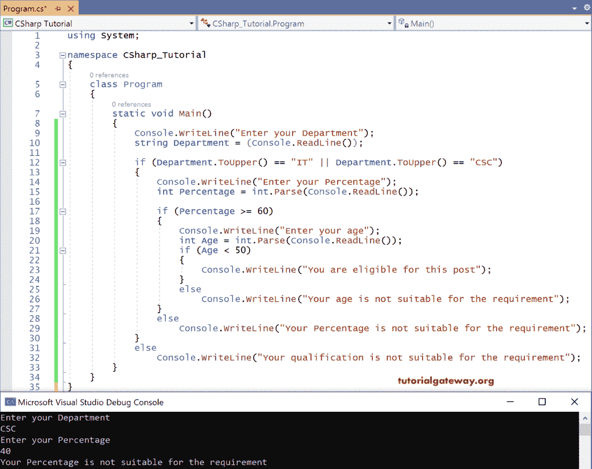
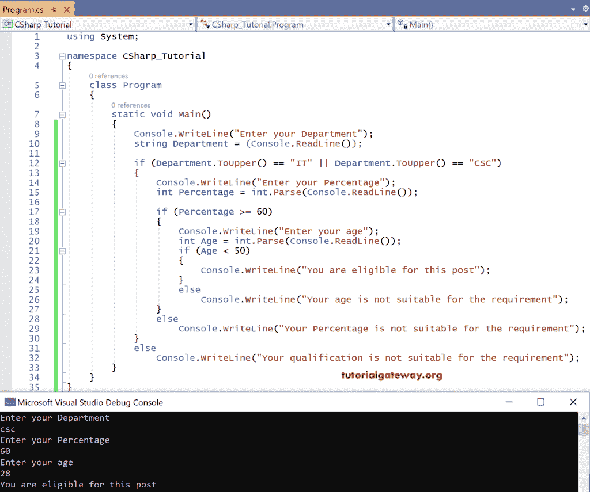
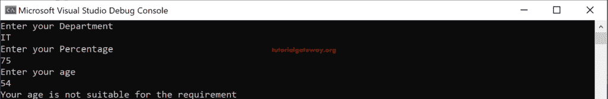
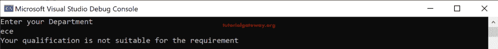

# C#嵌套 If 语句

> 原文:[https://www.tutorialgateway.org/csharp-nested-if-statement/](https://www.tutorialgateway.org/csharp-nested-if-statement/)

实时地，我们可以遇到这样的场景:我们必须通过检查多个条件来做出一个决定。使用 C#嵌套 if 语句，我们可以在一个 if 或 else if 条件中编写几个 if 或 else if 条件。

C#嵌套 If 语句的语法是

```
If <condition>
{

   If <condition>
   {
     Statements;
   }
  else if<condition>
  {
    Statements;
  }
  else
   Default statements
}
else
Default statements;
```

## C#嵌套 If 语句示例

例如，让我们假设对于特定的工作要求。工作简介如下:

*   候选人应该来自 it 或 csc 部门。
*   学术百分比> = 60
*   年龄< 50 岁

如果上述所有条件都满足，那么这个人就有资格担任这个职位。让我们为上述场景编写 [C#](https://www.tutorialgateway.org/csharp-tutorial/) 代码。

```
using System;

namespace CSharp_Tutorial
{
    class Program
    {
        static void Main()
        {
            Console.WriteLine("Enter your Department");
            string Department = (Console.ReadLine());

            if (Department.ToUpper() == "IT" || Department.ToUpper() == "CSC")
            {
                Console.WriteLine("Enter your Percentage");
                int Percentage = int.Parse(Console.ReadLine());

                if (Percentage >= 60)
                {
                    Console.WriteLine("Enter your age");
                    int Age = int.Parse(Console.ReadLine());
                    if (Age < 50)
                    {
                        Console.WriteLine("You are eligible for this post");
                    }
                    else
                        Console.WriteLine("Your age is not suitable for the requirement");
                }
                else
                    Console.WriteLine("Your Percentage is not suitable for the requirement");
            }
            else
                Console.WriteLine("Your qualification is not suitable for the requirement");
        }
    }
}

```

输出



在这个 C#嵌套 If 语句的例子中，我们给出了部门名称“csc”。因为它满足条件，所以它进入了内部 if

接下来，它要求百分比。

百分比表示为 40。

因为百分比条件失败，因为百分比应该> = 60 才能进入内部 if，即年龄条件。

编译器退出循环并打印 else 部分，即，

您的百分比不符合要求。

让我试试百分比为 60，年龄为 28，你会得到不同的结果。



在这里，我们给出了好的百分比但是内部如果陈述条件年龄< 50 fails. So, inner else block statement printed.



这一次，我们给了错误的部门，因此它产生了主要的 else block 语句。

