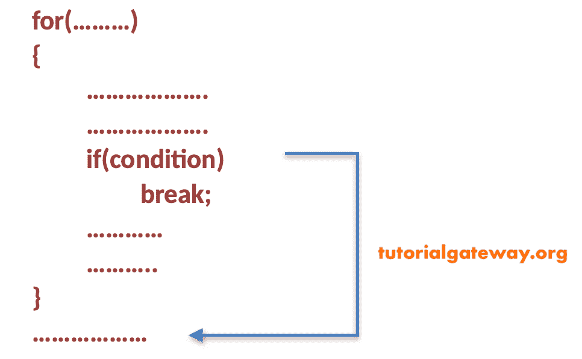
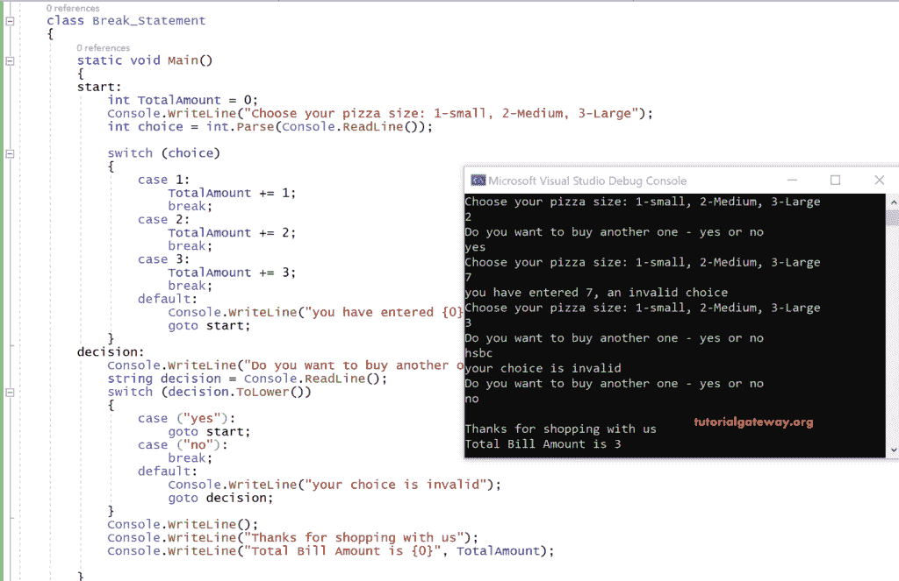

# C#`break`语句

> 原文:[https://www.tutorialgateway.org/csharp-break-statement/](https://www.tutorialgateway.org/csharp-break-statement/)

C#`break`语句:C#中的跳转语句允许控件在程序执行过程中从一个地方移动到另一个地方。一般来说，C#支持以下跳转语句。

1.  破裂
2.  [转到](https://www.tutorialgateway.org/csharp-goto-statement/)
3.  [继续](https://www.tutorialgateway.org/csharp-continue-statement/)

## C#`break`语句介绍

众所周知，C#`break`语句会让控制在匹配案例执行后从开关中出来(终止)，而不会继续执行案例直到结束。除此之外，C#`break`语句帮助您退出循环。从循环的嵌套中退出编译器非常有帮助。

让我们看看 C#`break`语句示例代码。



### C#`break`语句示例

在这个例子中，我们使用的是[开关盒](https://www.tutorialgateway.org/csharp-switch-case/)内部的 C#语句。

```
using System;
class Program
{
  static void Main()
  {
    start:
    int TotalAmount = 0;
    Console.WriteLine("Choose your pizza size: 1-small, 2-Medium, 3-Large");
    int choice = int.Parse(Console.ReadLine());

    switch (choice)
    {
      case 1:
        TotalAmount += 1;
        break;
      case 2:
        TotalAmount += 2;
        break;
      case 3:
        TotalAmount += 3;
        break;
      default:
        Console.WriteLine("you have entered {0}, an invalid choice", choice);
        goto start;
    }
    decision:
    Console.WriteLine("Do you want to buy another one - yes or no");
    string decision = Console.ReadLine();

    switch(decision.ToLower())
    {
      case ("yes"):
        goto start;
      case ("no"):
        break;
      default:
        Console.WriteLine("your choice is invalid");
        goto decision;
    }

    Console.WriteLine();
    Console.WriteLine("Thanks for shopping with us");
    Console.WriteLine("Total Bill Amount is {0}", TotalAmount);

    }
  }
```



上面的 C#`break`语句代码是用来取披萨订单和计算账单金额的。选择是一个整数变量，用于存储用户选择的比萨饼大小，即是小-1、中-2 还是大-3。

这里 TotalAmount 是一个用 0 初始化的整数变量。

[C#](https://www.tutorialgateway.org/csharp-tutorial/)`break`语句 Switch cases 用于计算账单金额。这个数量取决于用户的订单。

如果用户给出了一个不在任何情况下的选择，那么将执行默认语句。它再次进入标签 startand 并从头开始执行。

在用户给出任何订单后，标签决定将允许用户下一个订单。而如果用户想给出另一个订单，那么就执行切换案例决策。

如果是，它将开始，如果不是，它退出开关，并打印以下行。

谢谢你和我们一起购物

它给出了总数。

这里选择了 2 号披萨。

它要求下一个订单。是的，已经给了。

所以这一次，选择了 7 号披萨，这在任何情况下都不是。所以消息“你输入了 7，一个无效的选择”。

它会再次要求选择你的比萨饼尺寸，并给出 3。

现在它会要求另一个订单，

作为“hdbd”给出，它是垃圾数据，而不是“是”或“否”

所以它在说“你的选择是无效的”。

由于没有给出相关输入，会再次要求下单，这次给出的是“否”。所以它将退出开关并执行这些行。

“谢谢你和我们一起购物。”

“账单总金额为 5