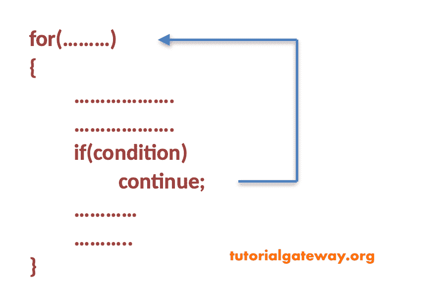
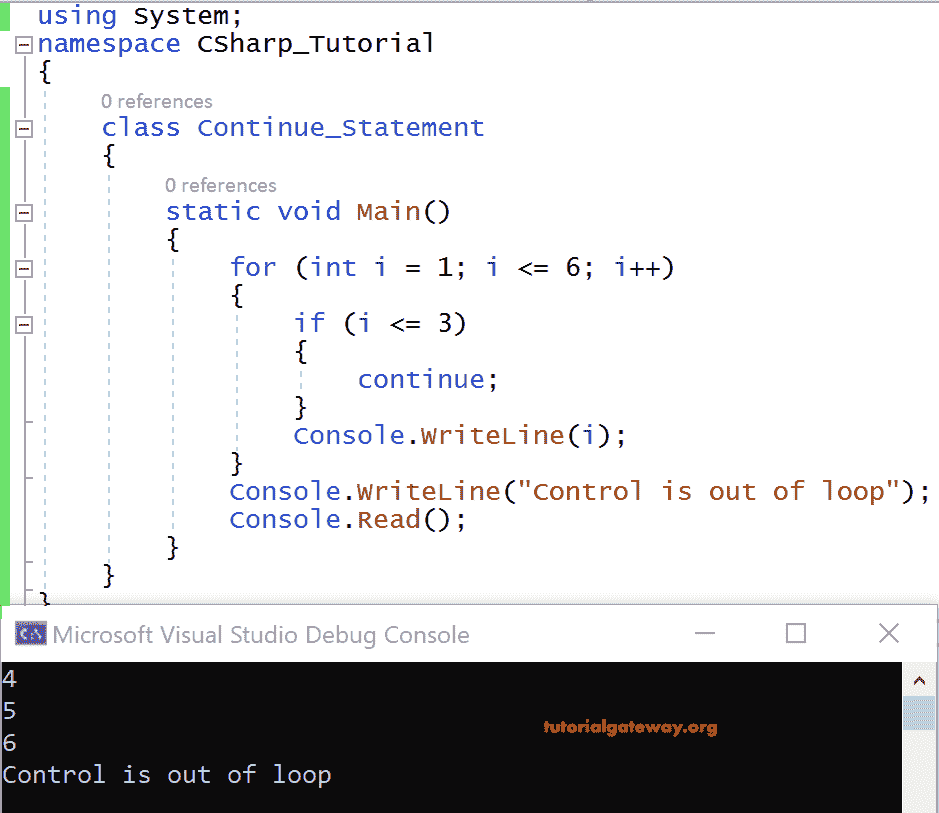

# C#继续语句

> 原文:[https://www.tutorialgateway.org/csharp-continue-statement/](https://www.tutorialgateway.org/csharp-continue-statement/)

每当程序控件找到 C# Continue 语句时，它都会跳过代码中剩余的语句，并将指针设置为下一次迭代的循环开始。



让我们看看这个例子。

## C#继续语句示例

```
using System;

 public class Program
 {
   static void Main()
   {
     for (int i = 1; i <= 6; i++)
     {
       if (i <= 3)
       {
         continue;
       }
       Console.WriteLine(i);
     }
     Console.WriteLine("Control is out of loop");
     Console.Read();
   }
 }
```



### C#中断和继续语句之间的区别

Break 允许控件从执行中脱离循环。而 continue 语句只跳过当前迭代，并在 [C#](https://www.tutorialgateway.org/csharp-tutorial/) 循环中继续下一次迭代。