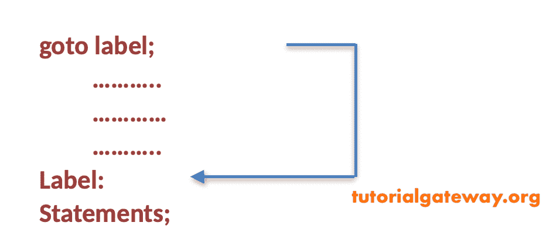
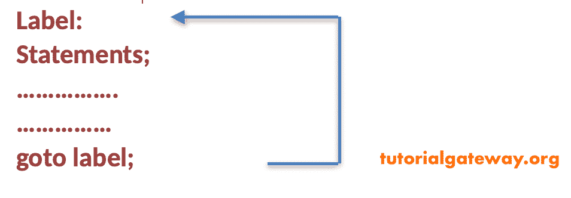

# C#`goto`语句

> 原文:[https://www.tutorialgateway.org/csharp-goto-statement/](https://www.tutorialgateway.org/csharp-goto-statement/)

C#`goto`语句是一个无条件语句，它让控件转到语句中提到的特定标签。

在某些情况下，C#`goto`语句对于摆脱深度嵌套的循环非常有用。

## C#`goto`语句语法

```
goto start;
```

其中 goto 是关键字，start 是标签名。

`goto`语句有两种形式。

C#向前跳跃



向后跳



一般来说，不建议在实时环境中使用 goto，因为在 [C#](https://www.tutorialgateway.org/csharp-tutorial/) 程序执行过程中很难跟踪控件。