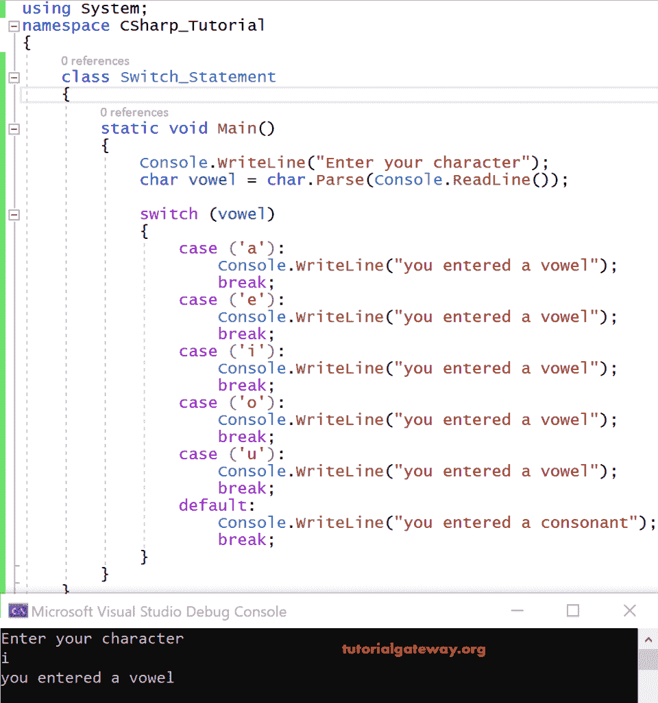
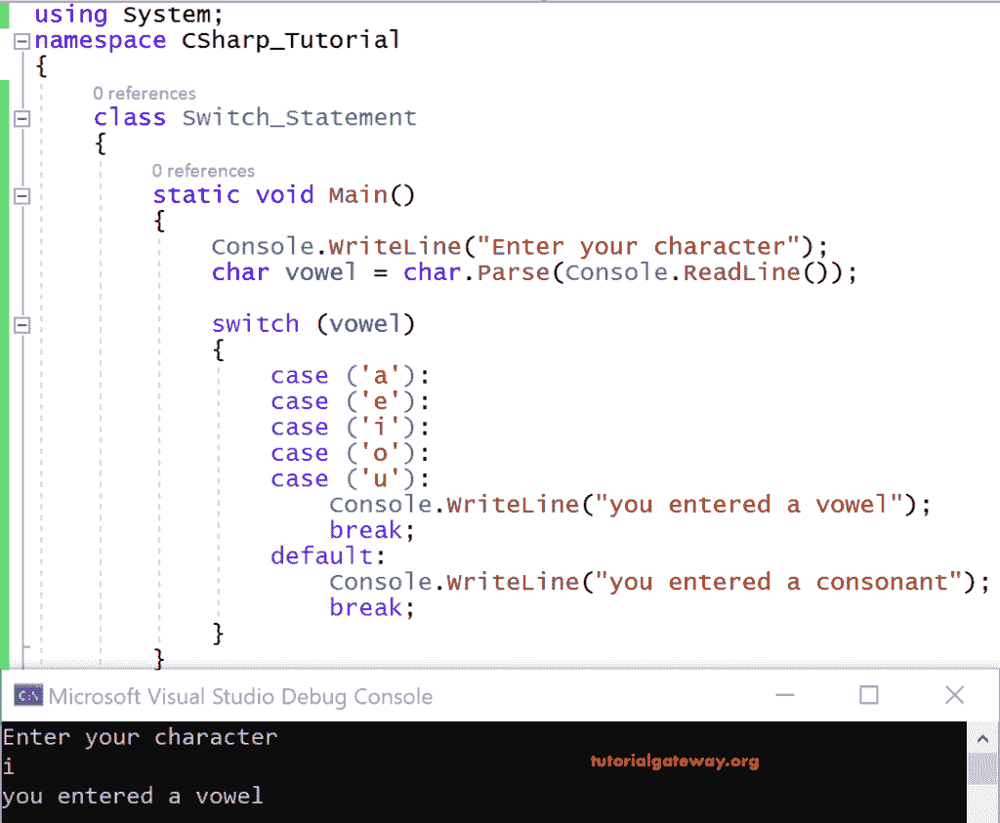
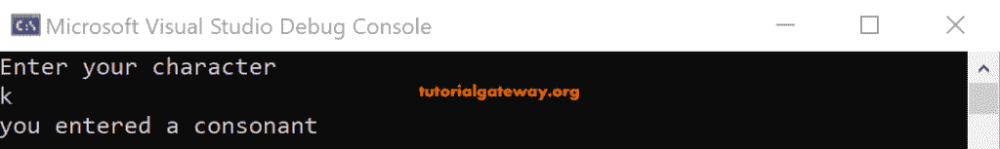

# C#开关盒

> 原文:[https://www.tutorialgateway.org/csharp-switch-case/](https://www.tutorialgateway.org/csharp-switch-case/)

C# Switch 案例或语句对于从切换部分列表中选择单个部分来执行非常有用，这取决于与匹配表达式的匹配。

一般来说，switch 语句代替 if else 语句是有用的，因为 C# switch 比 if-else 更快。

正如我们前面所说的，C#开关比 if-else 更快。因为与 if else 不同，它在编译时准备一个查找表来找出匹配项，并直接执行该语句，而不比较列表中的每个条件。

## C#开关案例语法

C# switch 语句的基本语法是

```
switch(expression)
{
 case value 1:
 statements;
 break;

 case value 2:
 statements;
 break;
 .
 .
 default:
 statements;
}
```

让我们看一个使用 C#开关情况的示例代码。

```
using System;
class Switch_Statement
{
     static void Main()
     {
         Console.WriteLine("Enter your character");
         char vowel = char.Parse(Console.ReadLine());

         switch(vowel)
         {
             case ('a'):
                 Console.WriteLine("you entered a vowel");
                 break;
             case ('e'):
                 Console.WriteLine("you entered a vowel");
                 break;
             case ('i'):
                 Console.WriteLine("you entered a vowel");
                 break;
             case ('o'):
                 Console.WriteLine("you entered a vowel");
                 break;
             case ('u'):
                 Console.WriteLine("you entered a vowel");
                 break;
             default:
                 Console.WriteLine("you entered a consonant");
                 break;
         }
     }
}
```

输出



分析

这里我们使用了一个 char 变量元音来存储用户输入的字符。

一旦我们输入 I 作为输入。编译器将字符 I 与大小写进行比较，大小写 I 将导致匹配，因此它将输出打印为

你输入了一个元音

下一次，我们输入 k 作为输入，这两种情况都不匹配，因此它打印默认语句。

你输入了一个辅音。

### C#交换机案例示例

在这个例子中，我们为多个值创建了一个单独的 C# Switch 案例。

当 case 语句之间没有代码或者所有代码都有公共代码时，我们可以为多个值创建一个 case。

没有代码的案例将自动进入下一个案例。

让我们看看上面看到的同一个 switch 语句示例的编码方式。

```
using System;
 class Program
 {
   static void Main()
   {
     Console.WriteLine("Enter your character");
     char vowel = char.Parse(Console.ReadLine());

     switch(vowel)
     {
       case ('a'):
       case ('e'):
       case ('i'):
       case ('o'):
       case ('u'):
         Console.WriteLine("you entered a vowel");
         break;
       default:
         Console.WriteLine("you entered a consonant");
         break;
     }
   }
 }
```

输出



分析

因为 a、e、I、o、u 都是元音，必须对所有这些值执行相同的代码。

来到 [C#](https://www.tutorialgateway.org/csharp-tutorial/) 切换用例执行，我们给出了 I 作为 char 变量元音的输入

它检查案例 I，因为没有 I 的代码，所以它会在没有代码可用的地方出错。最后，它通过 u 找到代码并打印输出。

你输入了一个元音



接下来，我们输入 k 作为输入，在任何情况下都找不到匹配。因此，它打印默认语句。

你输入了一个辅音