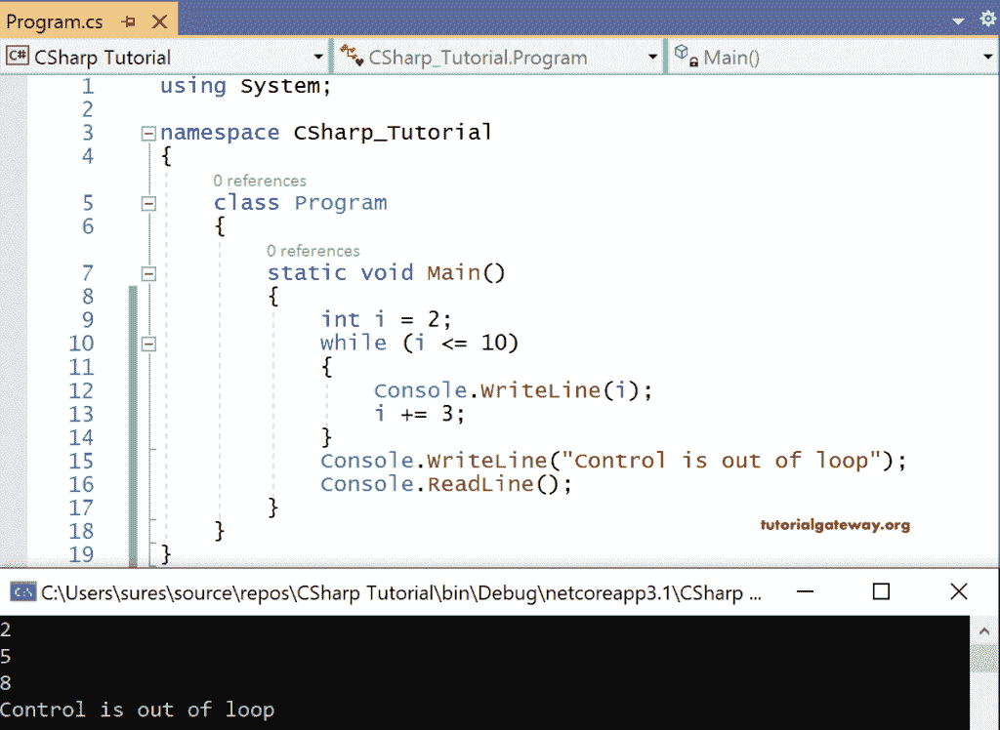

# C# `while`循环

> 原文：<https://www.tutorialgateway.org/csharp-while-loop/>

C# While 是一个基于条件的循环，它将在执行代码块之前检查条件。C# `while`循环语法如下。

```cs
while(<Boolean expression>)
{
      Statements;
}
```

这里，表达式返回一个布尔值。当表达式返回真时，控件进入块，其语句将执行。一旦块中的语句被执行，控制再次返回到该条件。

这个过程一直持续到条件返回 false。一旦布尔表达式返回 false， [C# ](https://www.tutorialgateway.org/csharp-tutorial/) 控件将跳过`while`循环中的代码块。它在右大括号后开始执行语句。

在块内编写语句时，我们应该确保更新与表达式相关联的变量，以便循环在我们想要的时候结束，以避免在其中无限迭代。

## C# `while`循环示例

让我们演示使用`while`循环打印从 2 到 10 的 I 值的代码，直到通过用 3 递增 I 来满足条件 i <=10。

```cs
using System;

namespace CSharp_Tutorial
{
    class Program
    {
        static void Main()
        {
            int i = 2;
            while (i <= 10)
            {
                Console.WriteLine(i);
                i += 3;
            }
            Console.WriteLine("Control is out of loop");
            Console.ReadLine();
        }
    }
}
```

输出



在这个 C# `while`循环的例子中，我用 2 初始化。

布尔表达式 i <= 10，即 2 <= 10，返回 true。因此，控制进入块并执行语句，即打印 2。

然后我加 3。所以，i = 2 + 3 = 5

再次进行条件检查，5<=10 返回真。所以，印了 5 张。

i = 5+3 = 8

同样，8<=10 返回真。所以印了 8 个。

i = 8+3 = 11

同样，11<= 10 返回假。控件从其中出来，并在右大括号后执行语句，即控件不在迭代中。