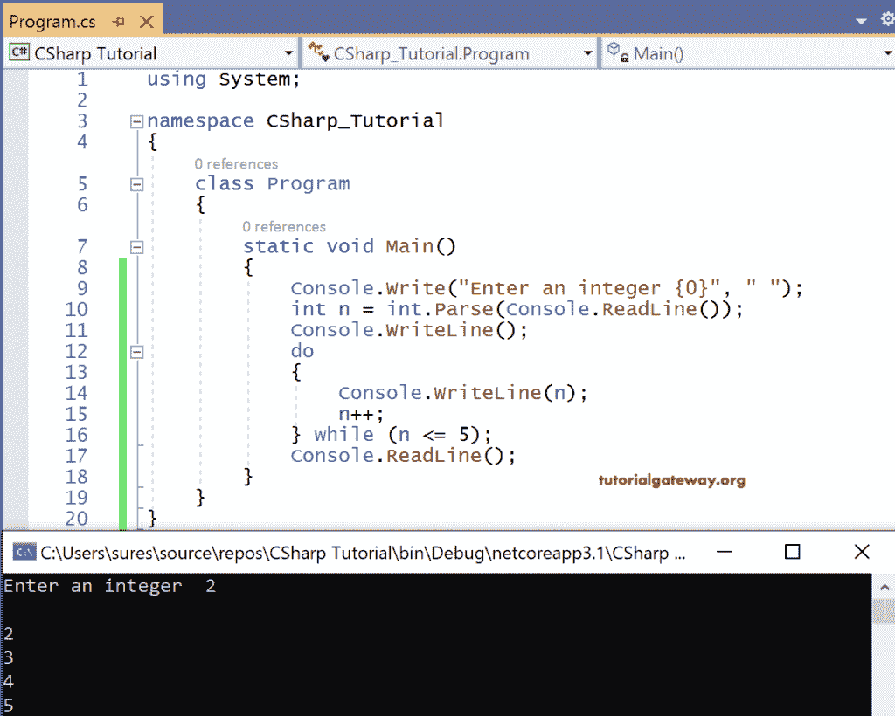
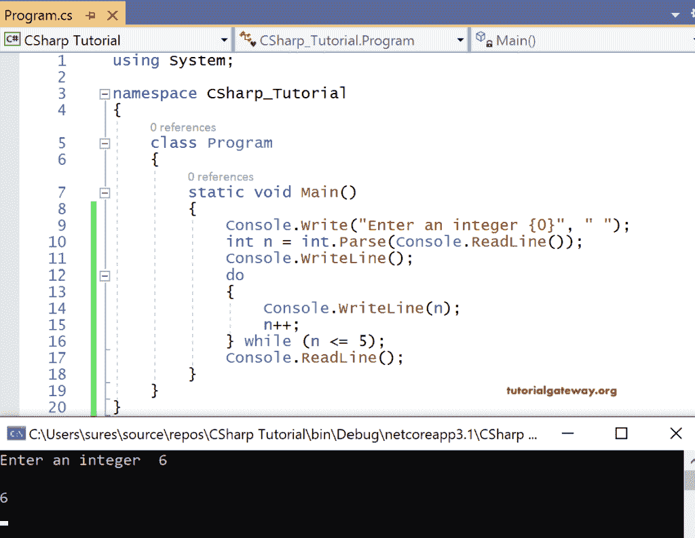

# C#边循环边做

> 原文:[https://www.tutorialgateway.org/csharp-do-while-loop/](https://www.tutorialgateway.org/csharp-do-while-loop/)

C# Do while 循环与 while 循环非常相似，除了一点。在 do while 循环中，其中的语句执行一次，然后检查条件。这样做，同时保证至少执行一次迭代的语句。

C# Do while 循环的语法是

```
do
{
   statements;
} while<boolean expression>
```

## C#边循环边做示例

让我们看一个使用 do while 循环从用户处读取整数 n 的值并打印整数直到 n <= 5 返回 true 的示例代码。

```
using System;

namespace CSharp_Tutorial
{
    class Program
    {
        static void Main()
        {
            Console.Write("Enter an integer {0}", " ");
            int n = int.Parse(Console.ReadLine());
            Console.WriteLine();
            do
            {
                Console.WriteLine(n);
                n++;
            } while (n <= 5);
            Console.ReadLine();
        }
    }
}

```

第一个输出:输入为 2



在这里，控件要求用户输入某个整数，而输入给出了 2。

现在它输出整数 2。

2++,也就是 3

它将检查条件 2 <= 5，返回真。再次通过打印 n 值，即 3，重复迭代

3++，也就是 4。

它将检查条件 3 <= 5，返回真…

..

直到 n 值为 5，才会重复。当 n = 5 时，控件打印值 5，然后递增

5++ = 6

现在条件 6 <= 5 returns false. So the [C#](https://www.tutorialgateway.org/csharp-tutorial/) 控制退出循环

第二输出:输入为 6



这里，在这种情况下，像往常一样，控制读取输入六并进入 do 循环。

编译器打印值 6 并递增，即 6++ = 7。

现在它检查条件 7 <= 5，返回 false。所以它退出迭代，打印 6 作为输出。