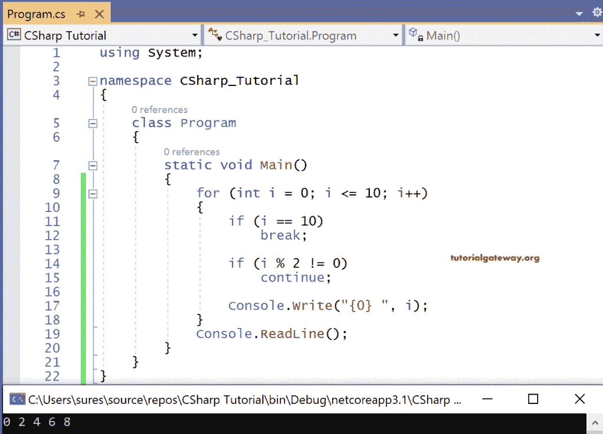

# C# `for`循环

> 原文：<https://www.tutorialgateway.org/csharp-for-loop/>

C# 中的循环是一种机制，其中一些指令重复执行，直到达到特定的条件。C# 支持循环机制，如 while、do while、`for`循环、foreach。

在 C# 编程中，`for`循环是基于范围的循环，其中 as while 和 do while 是基于条件的循环。

如果我们知道循环应该执行多少次，那么我们就使用`for`循环。如果我们不知道范围，我们用一个[当](https://www.tutorialgateway.org/csharp-while-loop/)和[当](https://www.tutorialgateway.org/csharp-do-while-loop/)做。例如，如果我们想打印从 1 到 10 的奇数。我们知道迭代应该执行十次，所以我们选择`for`循环。

但是会有这样一种情况，我们必须从数据库中获取特定的数据。在这种情况下，我们不知道数据库中有多少记录可用。因此，我们必须使用 while 或 do while 来迭代表，直到获取数据。

在 C# 中，每个`for`循环将有三个部分

初始化:只不过是给变量赋值。

语法:

```
<Datatype> <variable name> = value;
```

ex:int I = 10；

条件:这个条件比较两个或多个值或表达式，它将返回一个布尔值。

例:5 < = 7–2；这是真的。

递增/递减:递增或递减变量值。

例如:

int I = 5；

i++；它将 I 增加 1。

I = I–2；它会将 I 减 2。

## C# `for`循环

C# `for`循环是一个基于范围的循环，也就是说，当我们知道迭代必须重复的频率时，我们可以使用`for`循环。在 C# `for`循环语法中，所有三个部分初始化、条件检查和增量/减量将在同一行中，用逗号分隔。

```
for(<initialization>; <boolean expression>; <increment/decrement>)
{
    Statements;
}
```

除了 C# `for`循环语法之外，工作方式与 while 相同。这意味着一旦变量被初始化，它将检查布尔表达式。如果布尔表达式的计算结果为真，它将进入迭代。然后，它执行循环中的语句以及该变量的下一个增量/减量。再次检查条件。

重复这个过程，直到布尔表达式的计算结果为真。一旦返回 false，控制就脱离了循环。然后，它在右大括号之后继续执行语句。

### C# `for`循环示例

让我们看一个使用`for`循环打印从 0 到 10 的偶数的示例代码。

```
using System;

namespace CSharp_Tutorial
{
    class Program
    {
        static void Main()
        {
            for (int i = 0; i <= 10; i++)
            {
                if (i == 10)
                    break;

                if (i % 2 != 0)
                    continue;

                Console.Write("{0} ", i);
            }
            Console.ReadLine();
        }
    }
}
```

输出



在这个 C# `for`循环的例子中，I 是一个用 0 初始化的整数变量。控件进入迭代并检查 i==10，返回 false。

它检查 0 % 2！=0 为假，因此不执行 continue 并打印 0。

I 递增，即 i = 1。控制进入并检查 i ==10 是否返回 false。

它检查 1 % 2！=0，即真，因此执行[继续](https://www.tutorialgateway.org/csharp-continue-statement/)并跳过打印语句。

I 递增，即 i = 2。 [C# ](https://www.tutorialgateway.org/csharp-tutorial/) 控件进入并检查 i==10，返回 false。接下来，它检查 2 % 2！=0 为假，因此不执行 continue 并打印 2。

……..

当 I 递增 10 时，控件进入并检查 i == 10，返回 true。于是执行 [`break`语句](https://www.tutorialgateway.org/csharp-break-statement/)，控制就出来了。