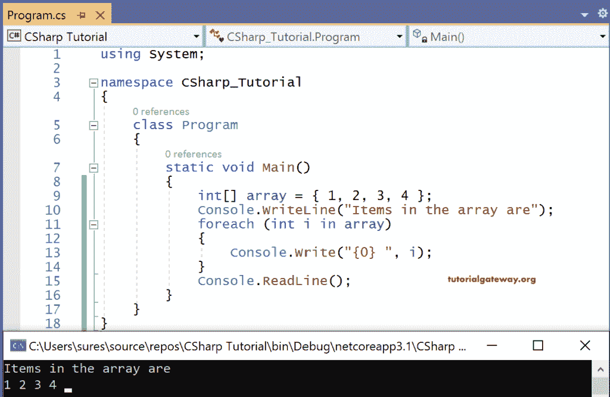

# C# Foreach 循环

> 原文:[https://www.tutorialgateway.org/csharp-foreach-loop/](https://www.tutorialgateway.org/csharp-foreach-loop/)

C# Foreach 循环对于遍历集合中的每一项都很有用。通常，这个 foreach 循环对数组列表、泛型等很有帮助。C# foreach 循环的语法是

```
foreach(<datatype> <variable> in <list>)
{
   statements;
}
```

这里<datatype>只不过是列表中出现的项目类型。例如，列表的类型是 int[]，那么<datatype>将是整数或 int。</datatype></datatype>

变量可以是任何人，但我们建议一个有意义的变量。

in 是强制关键字。

列表是一个数组，甚至是一个集合。

这里，foreach 语法变量是一个只读变量，只要它返回值，就会从列表中读取值。让我们看看使用这个循环的示例代码。

## C# Foreach 循环示例

我们通过定义一个包含四个值的整数数组来编写 [C#](https://www.tutorialgateway.org/csharp-tutorial/) 代码。使用 foreach 循环，我们将打印整数[数组](https://www.tutorialgateway.org/csharp-array/)中的所有项目。

```
using System;

class program
{
  public static void Main()
  {
    int[] array= { 1, 2, 3, 4 };
    Console.WriteLine("Items in the array are");
    foreach (int i in array)
    {
      Console.Write("{0} ", i);
    }
    Console.ReadLine();
  }
}
```



在这个 C# foreach 循环示例中，数组是一个包含四个值 1、2、3、4 的整数数组。如语法所示，我们刚刚从列表数组[]中取了一个整型变量 I 来读取值或项。

我一次从列表中读取一个项目，foreach 循环重复，直到返回列表中的最后一个项目。

这里我们打印变量 I 从数组[]中读取的所有值。