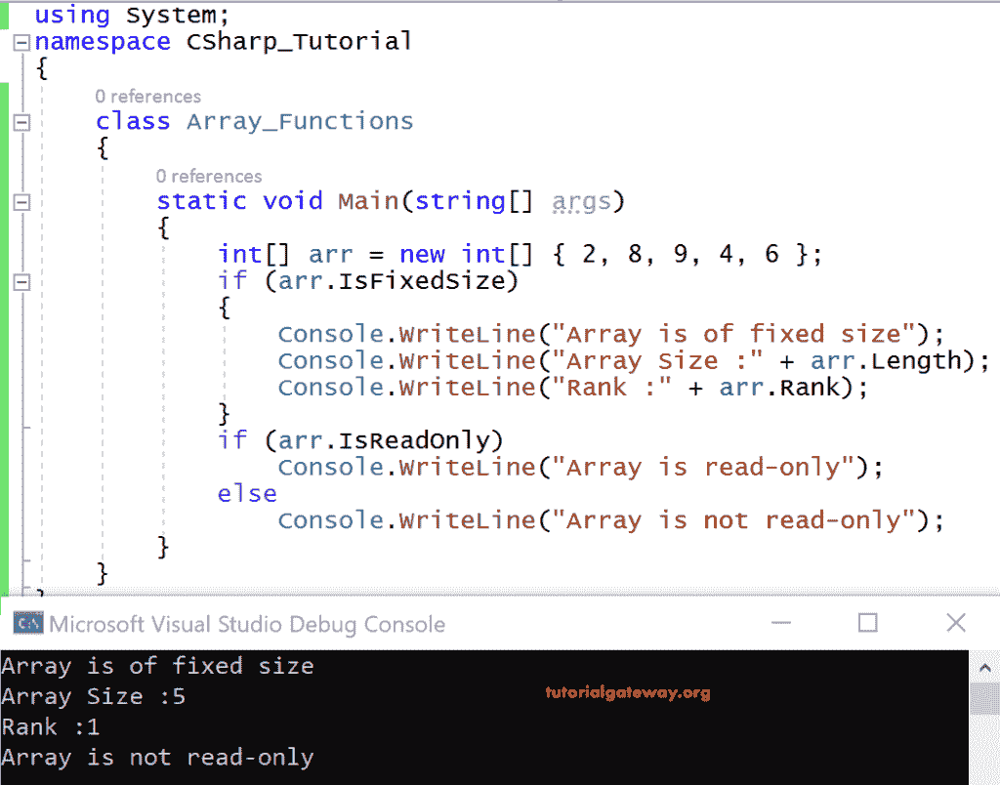
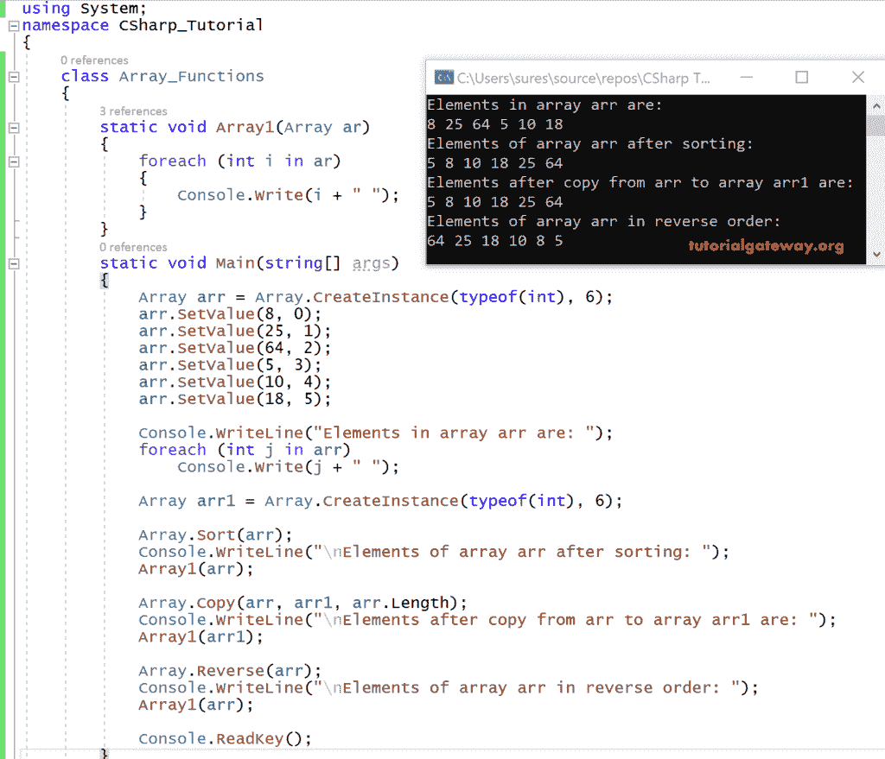

# C#数组函数

> 原文：<https://www.tutorialgateway.org/csharp-array-functions/>

数组类是所有数组的基类，从系统命名空间定义。C#数组类提供了创建、操作、排序和搜索数组的函数。

C#数组类具有以下属性。

| 财产 | 使用 |
| 固定大小 | 根据数组是否为固定大小获取一个值。 |
| IsReadOnly | 根据数组是否为只读获取值。 |
| 长度 | 获取一个 32 位整数，它表示数组在所有维度中的元素。 |
| 长长度 | 获取 64 位整数，它表示数组在所有维度中的元素。 |
| 军阶 | 它获取数组中的总维数。 |

让我们看一个演示数组类属性的 C#代码示例。

```
using System;
class Program
{
  static void Main(string[] args)
  {
    int[] arr = new int[] { 2, 8, 9, 4, 6 };

    if (arr.IsFixedSize)
    {
      Console.WriteLine("Array is of fixed size");
      Console.WriteLine("Array Size :" + arr.Length);
      Console.WriteLine("Rank :" + arr.Rank);
    }

    if (arr.IsReadOnly)
      Console.WriteLine("Array is read-only");
    else
      Console.WriteLine("Array is not read-only");
  }
}
```

输出



分析

arr 是一个用一些值初始化的整数数组。

由…改编 IsFixedSize 返回 true，因为它已经给定了固定数量的值。

由…改编 Length 将给出 [C#](https://www.tutorialgateway.org/csharp-tutorial/) 数组中的元素总数，为 5。

由…改编 Rank 将给出维数，在本例中为 1。

### C#数组类函数

DotNet 框架在 Array 类中提供了各种方法。让我们看看一些最常用的 C#数组函数。

#### 创建实例(<datatype>元素类型，整数长度)</datatype>

CreateInstance()用于构造数组。

C#中创建一维数组的语法

公共静态数组创建实例(类型为(<element type="">)，整数长度)</element>

其中 typeof 是关键字，元素类型是要创建的数组的类型。长度是数组的大小

C#中创建二维数组的语法

公共静态数组创建实例(类型为(<element type="">)，int length1，int length2)</element>

元素类型是要创建的数组的类型

长度 1 是数组的第一维

长度 1 是数组的第二维

#### getlowerbound(内部维)

GetLowerBound()获取数组中指定维度的第一个元素的索引。C#数组函数语法如下所示

```
GetLowerBound(int dimension)
```

#### GetUpperBound（int dimension）

GetUpperBound()获取数组中指定维度的最后一个元素的索引。这个 C#数组函数的语法是

```
GetUpperBound(int dimension)
```

#### GetValue（int32）

它获取一维数组中指定位置的值。指定的索引是 32 位整数。

#### GetValue（int32， int32）

它获取二维数组中指定位置的值。指定的索引是 32 位整数。

#### 排序(数组)

静态方法 Sort()对于对数组中的项进行排序很有用。

数组。Sort()有许多重载形式。最简单的形式是采用单个参数的形式，即要排序的数组。

#### SetValue（object， int32）

这个 C#数组函数对于在一维数组的指定位置为元素设置值非常有用。

#### 反向(阵列)

Reverse()将数组作为参数，并在一维中反转项目的顺序。

#### 清除()

这个 C#数组函数移除它的所有项，并且它的长度设置为零。

#### 初始化()

通过调用值类型的默认构造函数，此方法对于初始化数组元素(值类型)非常有用。

#### 最终确定()

此方法允许对象在进行垃圾收集之前释放其资源来执行清理等操作。

#### 复制(源数组、目标、整数长度)

这个 C#数组函数将把指定长度的元素数量从源数组复制到目标数组。

目标数组中的维数必须等于源数组中的维数。除此之外，目的地必须已经标注了尺寸。以及足够数量的元素来容纳从源数组复制的数据。

### C#数组函数示例

在这个例子中，我们演示了一些 C#数组函数，如 createinstance、setvalue、copy、sort 和 reverse。

```
using System;

class Program
  {
    static void Array1(Array ar)
    {
      foreach (int i in ar)
      {
        Console.Write(i + " ");
      }
    }
    static void Main(string[] args)
    {
      Array arr = Array.CreateInstance(typeof(int), 6);
      arr.SetValue(8, 0);
      arr.SetValue(25, 1);
      arr.SetValue(64, 2);
      arr.SetValue(5, 3);
      arr.SetValue(10, 4);
      arr.SetValue(18, 5);

      Console.WriteLine("Elements in array arr are: ");
      foreach(int j in arr)
        Console.Write(j + " ");

      Array arr1 = Array.CreateInstance(typeof(int), 6);

      Array.Sort(arr);
      Console.WriteLine("\nElements of array arr after sorting: ");
      Array1(arr);

      Array.Copy(arr, arr1, arr.Length);
      Console.WriteLine("\nElements after copy from arr to array arr1 are: ");
      Array1(arr1);

      Array.Reverse(arr);
      Console.WriteLine("\nElements of array arr in reverse order: ");
      Array1(arr);

      Console.ReadKey();
    }
  }
```

输出



分析学

通过使用 CreateInstance()方法，创建了一个整数类型和大小为六的 arr。

使用 SetValue()方法，用整数类型的六个元素初始化 arr。

arr 的元素使用 foreach 循环打印到控制台上。

我们在 Main()方法之外声明了一个名为 Array1 的方法，其中一个参数的类型为 Array。

此方法是使用 foreach 循环来定义的，该循环打印数组中作为参数传递给它的所有元素。

Sort(arr)将对 arr 中的所有元素进行排序。

Array1(arr)，这里 arr 作为参数传递给 Array1()方法，这样它将打印 arr 中的所有元素。

```
Array.Copy(arr, arr1, arr.Length)
```

这个 C#数组函数将 arr 的所有元素复制到 arr1 中，现在 arr1 正在从 arr 中复制元素。

arr y1(arr1)，这里，arr1 作为参数传递给 arr y1()方法，这样它将打印 arr 1 中的所有元素。

反转(arr)-它将反转 arr 中所有元素的顺序。现在 arr 中有一个反向的项目序列。

Array1(arr)，这里 arr 作为参数传递给 Array1()方法，这样它将打印 arr 中的所有元素。