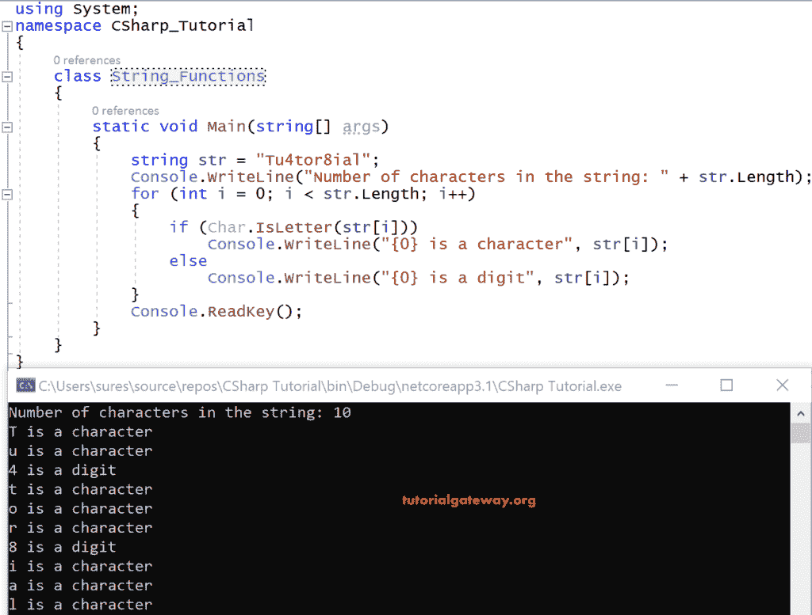
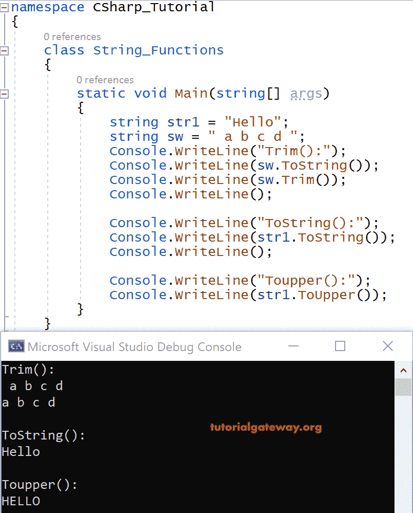
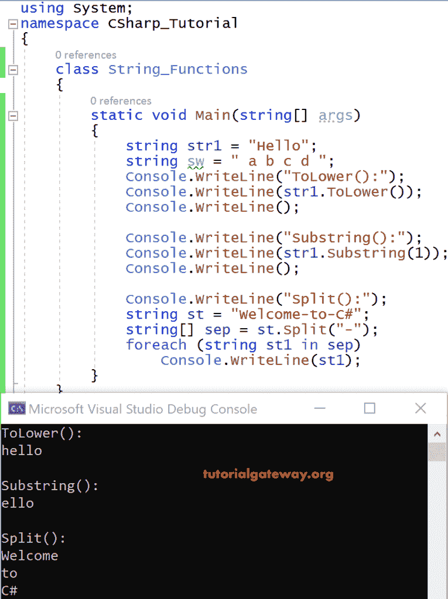
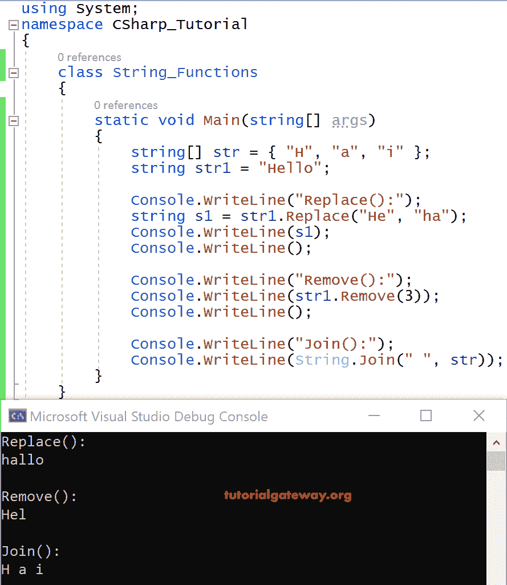
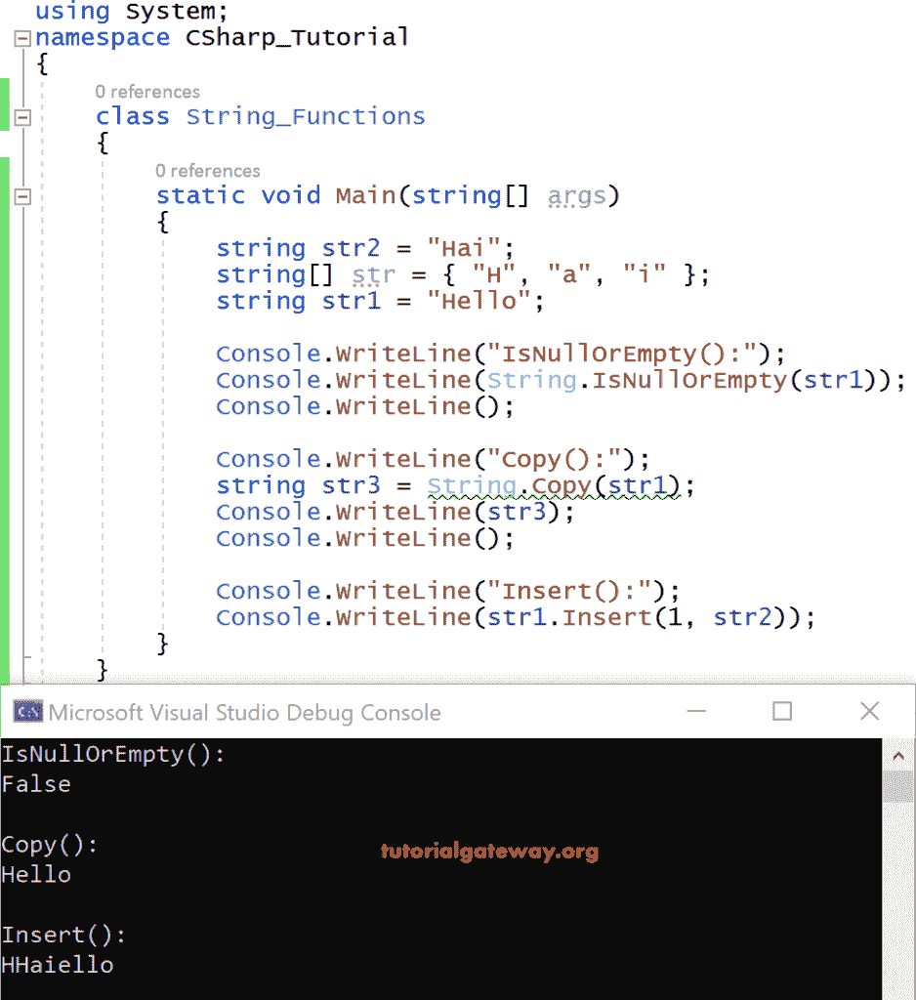
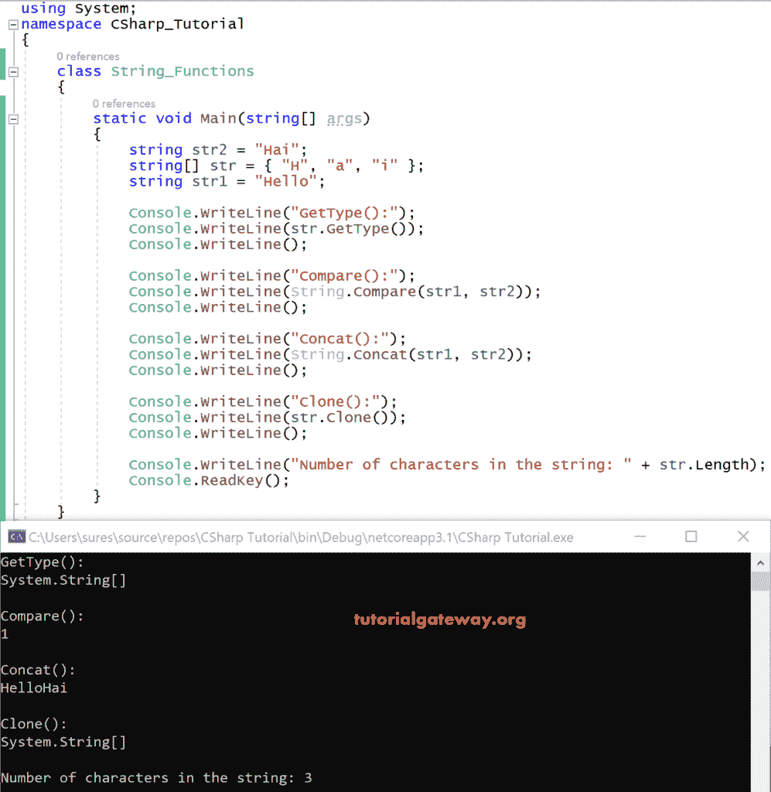
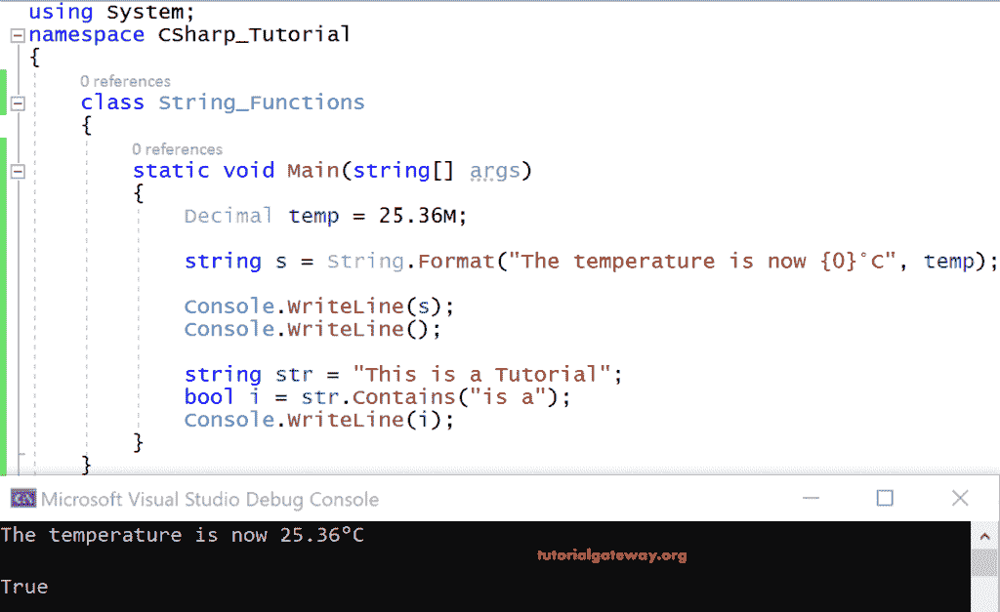

# C#字符串函数

> 原文:[https://www.tutorialgateway.org/csharp-string-functions/](https://www.tutorialgateway.org/csharp-string-functions/)

我们已经知道字符串是引用类型。C#为我们提供了大量用于操作字符串的字符串函数。

在我们进入 C#字符串函数之前，让我向您展示可用的属性。以下是 C#字符串属性:

| 财产 | 描述 |
| 字符(国际 32) | 它返回当前字符串中指定位置的 char 对象 |
| 长度 | 它返回字符串的长度(即字符串对象中的字符数) |

## C#字符串函数示例

让我们看一个演示属性的例子。

```
using System;
  class Program
  {
    static void Main(string[] args)
    {
    string str = "Tu4tor8ial";
    Console.WriteLine("Number of characters in the string: " +str.Length);
    for (int i = 0; i < str.Length; i++)
    {
      if (Char.IsLetter(str[i]))
        Console.WriteLine("{0} is a character", str[i]);
      else
        Console.WriteLine("{0} is a digit", str[i]);
    }
    Console.ReadKey();
    }
  }
```

输出



分析

声明了一个字符串变量 str，并用一些字符(包括字母和数字)初始化了它。

Str。Length 将给出字符串中的字符数，在本例中是 10，因此它在控制台上打印 10。

接下来，为了演示 Chars(int32)属性，我们编写了一个循环，其中整数变量 I 用零初始化，并被迭代，直到 I < str。长度返回假。

并且对于每个 I 值，如果 char 的方法 IsLetter(str[i])返回 true，即 T 是一个字母。因此，它返回 true，以便打印语句

t 是字符
被执行
。

同理，当 i=2 时，则为 Char。IsLetter(str[i])返回 false，因为它不是字母，而是数字 4，是一个数字。所以它会打印声明。

“4 是一个数字”

一些最常用的 [C#](https://www.tutorialgateway.org/csharp-tutorial/) 字符串函数有:

字符串 str，str1，str 2；//声明的字符串变量

str = "教程"

str1 =“欢迎”

字符串[] sarray = {"Hello "，" hai " }；

以下是可用的 C#字符串函数列表及其说明。

| C#字符串函数 | 描述 |
| 假发戴上 | 它通过将当前字符串转换为大写字母，将副本返回给当前字符串。
Str。ToUpper() |
| ToLower（） | 它通过将当前字符串转换为小写字母将副本返回给当前字符串。
Str。ToLower() |
| 插入(int32，String) | 它返回一个新字符串，其中指定的字符串插入到当前实例中指定的索引位置。
str2 = String。插入(1，字符串) |
| 拆分(字符[]) | 它根据数组中的字符将字符串拆分为子字符串。
str 1 =“Hello _ this _ is _ tutorial _ on _ c#”String[]s = str 1。拆分(" _ ") |
| 子串(int32) | 这个 C#字符串函数从指定的位置开始检索子字符串，直到当前实例的最后一个位置。
str。子字符串(1) |
| 移除(int32) | 它将通过删除从指定位置开始直到当前位置的最后一个位置的所有字符来返回一个新字符串。
str。移除(5)； |
| 联接(字符串，字符串[]) | 它将字符串[]的所有元素与指定的字符串连接起来。
弦。加入("，"，sarray[]) |
| 格式(字符串、对象) | 它用指定对象的字符串表示形式替换指定字符串中的一个或多个格式项。
字符串 s =字符串。格式(字符串、对象) |
| 复制(字符串) | 它创建一个字符串的新实例，其字符串值与指定的字符串值相同。
str1 =字符串。副本(字符串)； |
| Concat（String， String） | 它连接两个字符串实例。
弦。Concat(str，str1) |
| 比较(字符串，字符串) | 它返回一个整数，该整数指示两个字符串对象比较时排序顺序中的位置。
弦。比较(字符串，str1) |
| 克隆() | 它返回对字符串实例字符串的引用。
str。克隆() |
| GetType() | 它获取当前对象或实例的类型。
str。Gettype() |
| IsNullOrEmpty(字符串) | 通过返回布尔值来指示指定的字符串是空值还是空值。
弦。IsNullOrEmpty(字符串)； |
| 替换(字符串，字符串) | 它用指定的字符串替换当前字符串实例的指定子字符串。
字符串 s1 = str。替换为(“图”、“Tw”) |
| ToString() | 它返回当前字符串的实例。
Str。Tostring() |
| 修剪() | 它通过从当前实例中删除所有前导空格和尾随空格来返回一个新字符串。
Str。修剪() |
| 包含(字符串) | 它返回一个布尔值，该值指示字符串是否具有指定的子字符串 substr。
bool I = str。包含(substr)； |

### C#字符串函数修剪、跳转和跳转示例

让我们看一个在 Trim()，ToString()，ToUpper()上演示的 C#代码示例

```
using System;
    class Program
    {
        static void Main(string[] args)
        {
        string str2 = "Hai";
        string[] str = { "H","a","i" };
        string str1 = "Hello";
        string sw = " a b c d ";
        Console.WriteLine("Trim():");
        Console.WriteLine(sw.ToString());
        Console.WriteLine(sw.Trim());
        Console.WriteLine();

        Console.WriteLine("ToString():");
        Console.WriteLine(str1.ToString());
        Console.WriteLine();

        Console.WriteLine("Toupper():");
        Console.WriteLine(str1.ToUpper());
       }
}
```



分析

ToString()将返回当前实例中的引用值，即“a b c d”

Sw。修剪()从“a b c d”中修剪前导空格和尾随空格。因此，它删除了“a”前的空白，并打印“a b c d”。

str1。ToString()将像当前实例一样返回中的引用值，即“Hello”。

str1。ToUpper 会将 str1 中的所有元素转换为大写，并打印“HELLO”。

### C#字符串函数向下、子字符串和拆分示例

让我们看一个 C#代码示例，演示 ToLower()，SubString()，Split()

```
using System;
  class Program
  {
    static void Main(string[] args)
    {
    string str2 = "Hai";
    string[] str = { "H","a","i" };
    string str1 = "Hello";
    string sw = " a b c d ";
    Console.WriteLine("ToLower():");
    Console.WriteLine(str1.ToLower());
    Console.WriteLine();

    Console.WriteLine("Substring():");
    Console.WriteLine(str1.Substring(1));
    Console.WriteLine();

    Console.WriteLine("Split():");
    string st = "Welcome-to-C#";
    string[] sep = st.Split("-");
    foreach (string st1 in sep)
    Console.WriteLine(st1);
   }
}
```



分析

Str1 =“你好”；

str1。ToLower()将 str1 转换为小写，并打印“hello”。

str1。Substring(1)从索引位置 1 开始输出 str1 中的所有元素，即从 Hello 中的 e 开始，因此它输出“ello”。

这里，语句字符串[]sep = ST . Split(“-”)；是说根据作为参数传递给 split 方法的文本来拆分 string 对象 st 中的文本值，并将新字符串存储在数组 sep[]中。

即“欢迎使用 C#”是基于“-”分隔的，这导致以下输出。

欢迎使用
到
C#

### C#字符串函数替换、移除和连接示例

让我们看一个例子 [C#](https://www.tutorialgateway.org/csharp-tutorial/) 字符串函数代码演示关于 Replace()，Remove()，Join()

```
using System;
  class Program
  {
    static void Main(string[] args)
    {
    string str2 = "Hai";
    string[] str = { "H","a","i" };
    string str1 = "Hello";
    string sw = " a b c d ";
    Console.WriteLine("Replace():");
    string s1 = str1.Replace("He", "ha");
    Console.WriteLine(s1);
    Console.WriteLine();

    Console.WriteLine("Remove():");
    Console.WriteLine(str1.Remove(3));
    Console.WriteLine();

    Console.WriteLine("Join():");
    Console.WriteLine(String.Join(" ", str));
      }
}
```



分析

s1 = str1。替换为(“何”、“哈”)

表示新字符串 s1，它是将“hello”中的“He”替换为“Ha”的结果，如下所示

“你好”

str1。Remove(3)会在移除 str1 中的所有元素后形成一个新的字符串，即 Hello，从索引位置 3 开始，直到结束，这会产生它。

赫尔

Join("，str ")用空格("")连接 str[]中数组的元素，结果是

H a i

### C#是空、复制和插入示例

让我们看一个演示 C#字符串函数 IsNullOrEmpty()、Copy()和 Insert()的例子。

```
using System;
  class Program
  {
    static void Main(string[] args)
    {
    string str2 = "Hai";
    string[] str = { "H","a","i" };
    string str1 = "Hello";
    string sw = " a b c d ";
    Console.WriteLine("IsNullOrEmpty():");
    Console.WriteLine(String.IsNullOrEmpty(str1));
    Console.WriteLine();

    Console.WriteLine("Copy():");
    string str3 = String.Copy(str1);
    Console.WriteLine(str3);
    Console.WriteLine();

    Console.WriteLine("Insert():");
    Console.WriteLine(str1.Insert(1, str2));
    }
}
```



分析

IsNullOrEmpty(str1)结果为 false，因为字符串实例 str1 不为空。

str3 =字符串。复制(str1)创建对象 str1 的副本，并将其存储在另一个对象 str3 中，从而产生“Hello”。

str1。Insert(1，str2)将 str2 的值插入字符串值 str1 的索引位置 1，即 HHaiello

### C#字符串函数获取类型、比较、连接和克隆示例

在本例中，我们将演示 C#字符串函数 GetType()、Compare()、Concat()和 Clone()，并给出每个函数的示例。

```
using System;
  class Program
  {
    static void Main(string[] args)
    {
    string str2 = "Hai";
    string[] str = { "H","a","i" };
    string str1 = "Hello";
    string sw = " a b c d ";
    Console.WriteLine("GetType():");
    Console.WriteLine(str.GetType());
    Console.WriteLine();

    Console.WriteLine("Compare():");
    Console.WriteLine(String.Compare(str1, str2));
    Console.WriteLine();

    Console.WriteLine("Concat():");
    Console.WriteLine(String.Concat(str1, str2));
    Console.WriteLine();

    Console.WriteLine("Clone():");
    Console.WriteLine(str.Clone());
    Console.WriteLine();

    Console.WriteLine("Number of characters in the string: " + str.Length);
    Console.ReadKey();
  }
  }
```



分析

字符串。GetType()返回当前实例的类型，即输出的字符串。

系统。字符串[]

比较(str1，str 2)–c#比较函数将根据下表给出一个结果。

| 价值 | 情况 |
| 小于 0 | 在排序顺序中，第一个子字符串后跟第二个子字符串 |
| 零 | 子字符串出现在排序顺序中的相同位置(或)长度为 0 |
| 大于 0 | 第二个子字符串后面是排序顺序中的第一个子字符串 |

在这个场景中，输出是 1。

Concat(str1，str2)会将两者连接起来，从而产生“HelloHai”。

字符串。Clone()返回对字符串的引用，即系统。字符串[]

### C#格式和包含示例

还有两个 C#字符串函数 Format()和 Contains()。在这个例子中，我们将解释两者。

```
using System;
  class Program
  {
  static void Main(string[] args)
  {
    Decimal temp = 25.36M;
    string s = String.Format("The temperature is now {0}°C", temp);
    Console.WriteLine(s);
    Console.WriteLine();

    string str = "This is a Tutorial";
    bool i = str.Contains("is a");
    Console.WriteLine(i);
  } 
}
```



分析

格式(“温度现在是{0}摄氏度”，temp)将字符串对象 temp(25.36)的十进制值插入指定的中，并将其显示为一句话。

也就是说，现在的温度是 25.36 摄氏度

字符串。Contains("is a ")检查字符串对象 str 中是否存在指定的文本，其中 str = "这是教程"并相应地返回布尔值。在这种情况下，它返回真。