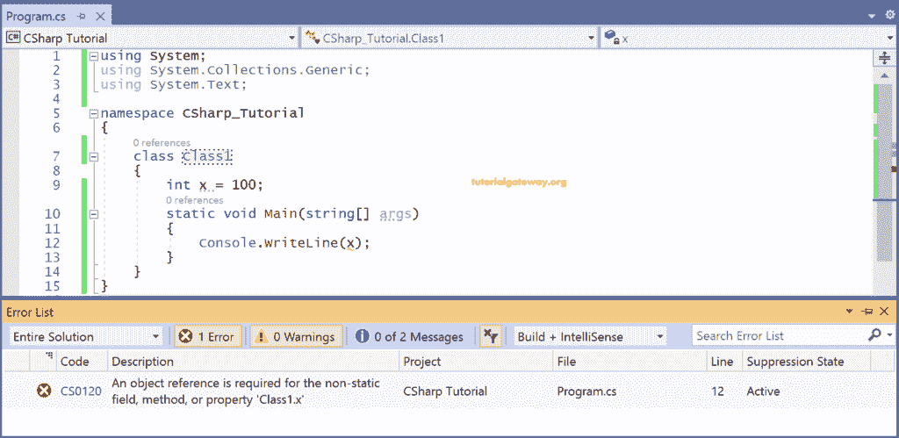
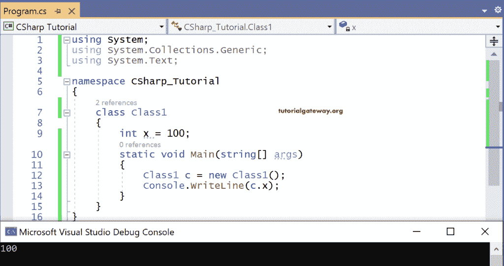
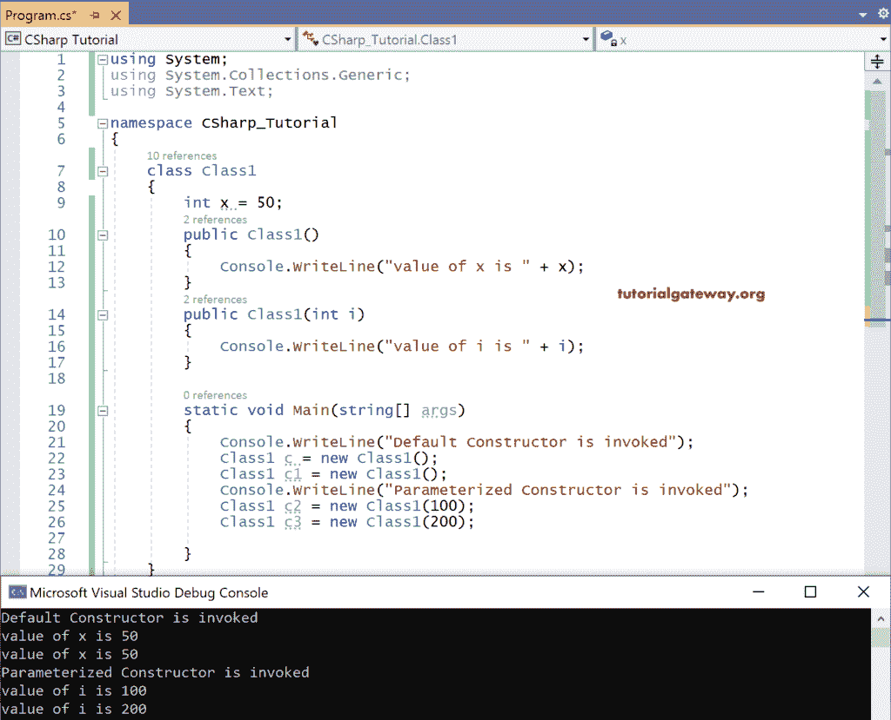
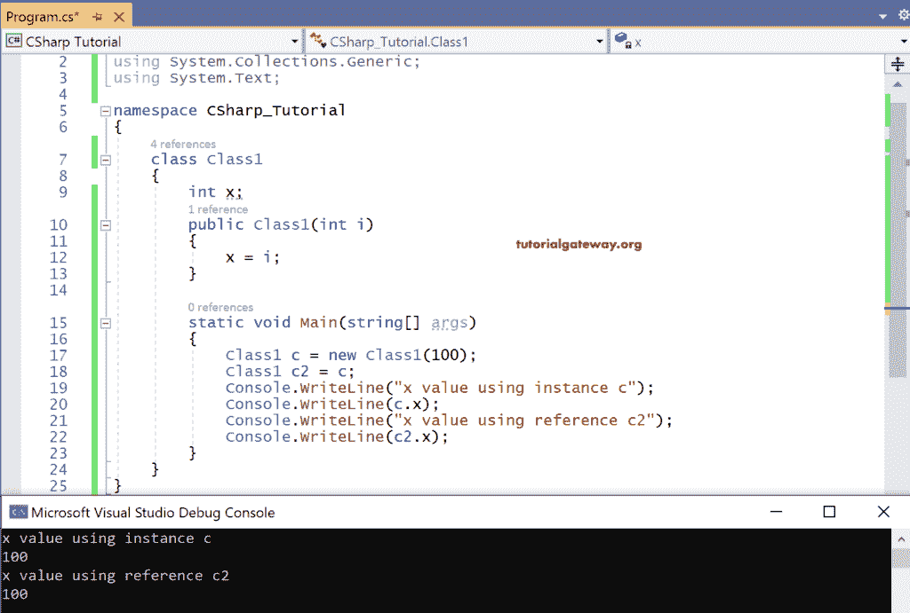

# C# 中的 OOPS 概念

> 原文：<https://www.tutorialgateway.org/oops-concept-in-csharp/>

C# 中的面向对象编程或 OOPS 概念是一种包含对象集合的编程类型。每个对象都包含数据字段和数据成员。不像 C、FORTRAN、BASIC 等过程编程语言。，C# 面向对象编程语言可以轻松升级。

在这里，我们将学习 C# OOPS(面向对象编程)的概念，如类、对象、封装、继承、多态等。这里，封装、继承和多态是实现 C# 面向对象编程模型的有用机制。

## C# 类

类是用户定义的类型，它是 C# OOPS 或面向对象编程的主要概念。

类就像创建对象的蓝图或模板。C# 类没有分配任何内存。但是只为创建的类实例分配内存。C# 类的语法是

```
class <classname>
{

}
```

### C# 对象

C# 对象被称为类的实例，对象保存数据字段、成员函数(数据成员)。

实际上，在实时环境中，一切都被说成是一个对象。这同样适用于这种 C# 面向对象编程。

*   物体是可以看见或想象的实体。
*   该对象有一些属性用于标识其当前状态和验证。
*   用于说明其功能或行为的数据成员或成员函数。
*   用于表示其状态变化的事件。

因此，我们可以说，对象可以根据它们的状态、功能和事件来相互区分。例如，如果我们把一个旋转的风扇看作一个物体，

*   一个由叶片包围的 nob，它的品牌，它的颜色描绘了旋转风扇的状态。
*   风扇产生的气流据说是它的功能。
*   而旋转时叶片位置的变化代表其状态的变化。

在 C# 面向对象术语中，我们说要访问 C# 类中的数据字段和成员函数，就要为该类创建一个对象。

#### C# 类实例语法

```
<ClassName> <ObjectName> = new <ConstructorName(<parameter list>)
```

这里，new 是为 C# 类创建对象时使用的关键字。

## C# 变量、实例(对象)和引用之间的区别

本节介绍 C# 变量、实例(对象)和引用。通过看每一个例子，会帮助你发现它们之间的区别。

### C# 变量

例如，C# 变量只不过是一个未初始化的类的副本。

int x；x 是 int 类型的副本。

字符串 s；String 是一个类，s 是类字符串的副本。

在这里，数据类型为 int，类字符串是一个没有任何内存分配的蓝图。但是对于变量 x 和 s，内存是分配的。

所以一个变量是一个特定数据类型的副本，它保存了一些内存。相比之下， [C# ](https://www.tutorialgateway.org/csharp-tutorial/) 数据类型是一个逻辑数据类型，或者是一个没有分配内存的蓝图。

比方说，一个房屋计划就像数据类型一样，基于该计划构建的实际房屋就是变量。即在上面的上下文中，int 或 string 没有任何内存，而变量有物理内存。

```
using System;
using System.Collections.Generic;
using System.Text;

namespace CSharp_Tutorial
{
    class Class1
    {
        int x = 100;
        static void Main(string[] args)
        {
            Console.WriteLine(x);
        }
    }
}
```

输出



在上面的 C# OOPS 程序中，当我们试图在 main 方法中打印变量 x 时，它显示错误。该错误表示您试图在静态 main 方法中打印非静态类变量。

在 C# 面向对象编程中，我们必须为该类创建一个实例来初始化变量或打印主方法中的任何值。并使用该实例打印值，否则将引发错误，如下面的代码所示。

```
using System;
using System.Collections.Generic;
using System.Text;

namespace CSharp_Tutorial
{
    class Class1
    {
        int x = 100;
        static void Main(string[] args)
        {
            Class1 c = new Class1();
            Console.WriteLine(c.x);
        }
    }
}
```

输出



原因是面向对象编程中的 C# 变量是未初始化的类的副本。

### C# 实例

OOPS 概念中的 C# 实例只不过是类的副本，它有助于使用关键字 new 初始化变量。每个实例都有自己的内存。

为一个 C# 实例分配的内存从不与另一个实例共享。它意味着创建了多少个实例；在没有内存共享的情况下，为许多实例分配的内存分配。

```
using System;
using System.Collections.Generic;
using System.Text;

namespace CSharp_Tutorial
{
    class Class1
    {
        int x = 50;
        public Class1()
        {
            Console.WriteLine("value of x is " + x);
        }
        public Class1(int i)
        {
            Console.WriteLine("value of i is " + i);
        }

        static void Main(string[] args)
        {
            Console.WriteLine("Default Constructor is invoked");
            Class1 c = new Class1();
            Class1 c1 = new Class1();
            Console.WriteLine("Parameterized Constructor is invoked");
            Class1 c2 = new Class1(100);
            Class1 c3 = new Class1(200);

        }
    }
}
```

输出



在上面的 C# oops 程序中，已经为类 1 创建了四个实例，

实例 c，c1 使用默认或无参数构造器 Class1()创建。而实例 c2、c3 是使用参数化构造器 Class1(int i)创建的。

无论使用何种构造器创建的所有实例都将分配单独的内存位置。

### C# 引用

C# 中的引用也是类的一个副本，它与一个已经存在的实例一起初始化。但是，引用没有分配任何内存。相反，它是为了共享实例的内存而创建的。

对 C# 类的引用也可以说是指向实例的指针。使用引用所指向的实例对字段和成员函数执行的每个操作都会反映该引用。反之亦然(使用 Reference 进行的更改反映了它所创建的实例)。

```
using System;
using System.Collections.Generic;
using System.Text;

namespace CSharp_Tutorial
{
    class Class1
    {
        int x;
        public Class1(int i)
        {
            x = i;
        }

        static void Main(string[] args)
        {
            Class1 c = new Class1(100);
            Class1 c2 = c;
            Console.WriteLine("x value using instance c");
            Console.WriteLine(c.x);
            Console.WriteLine("x value using reference c2");
            Console.WriteLine(c2.x);
        }
    }
}
```

输出



在上面编写的 C# OOPS 代码中，C 是类 1 的实例，而 c2 是为 C 创建的引用

当我们尝试使用实例 c 打印 x 的值时，引用 c2 是相同的。输出，即也使用参考 c2 打印的 100，是因为它指向实例 c。