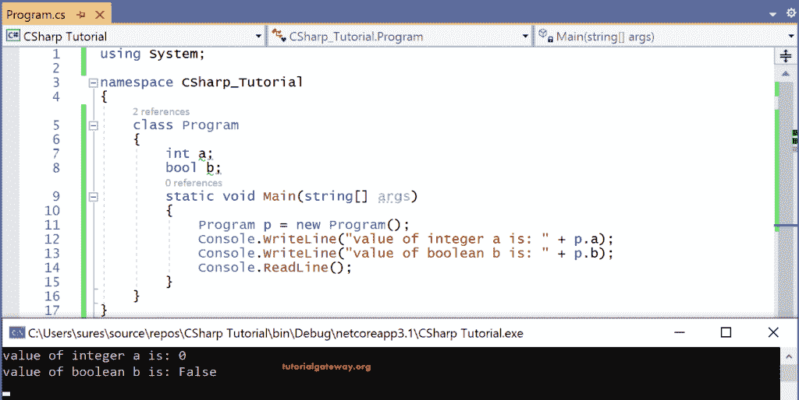
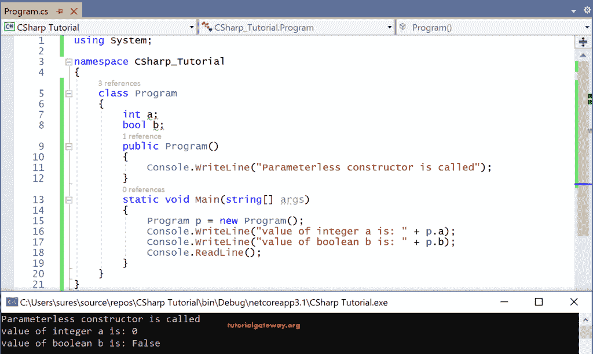
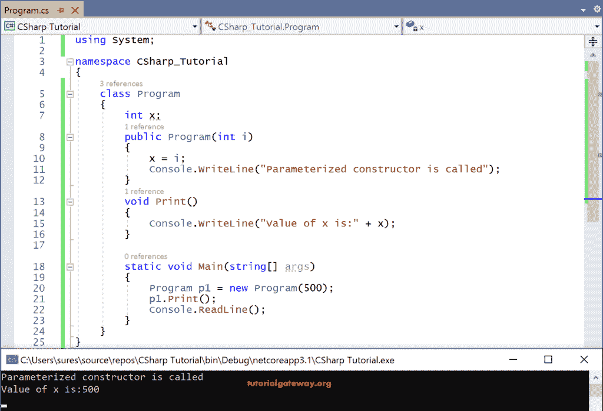
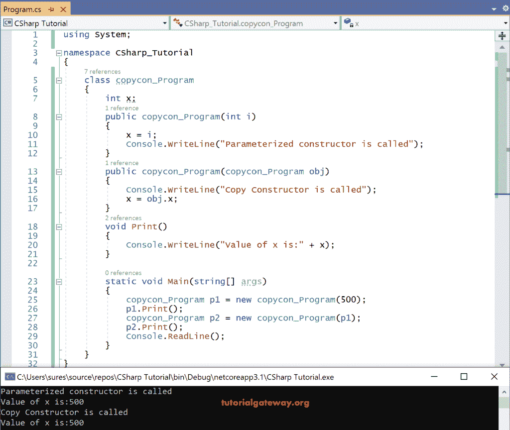
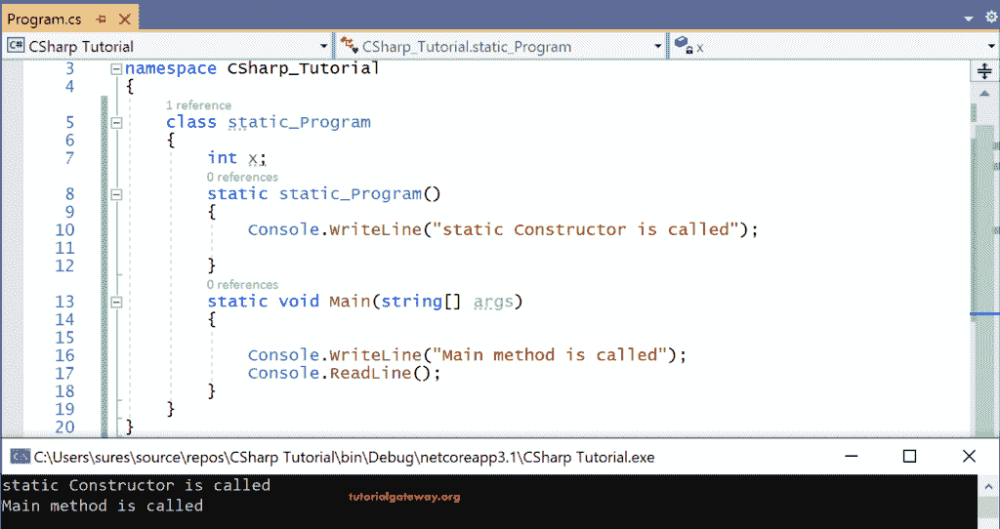
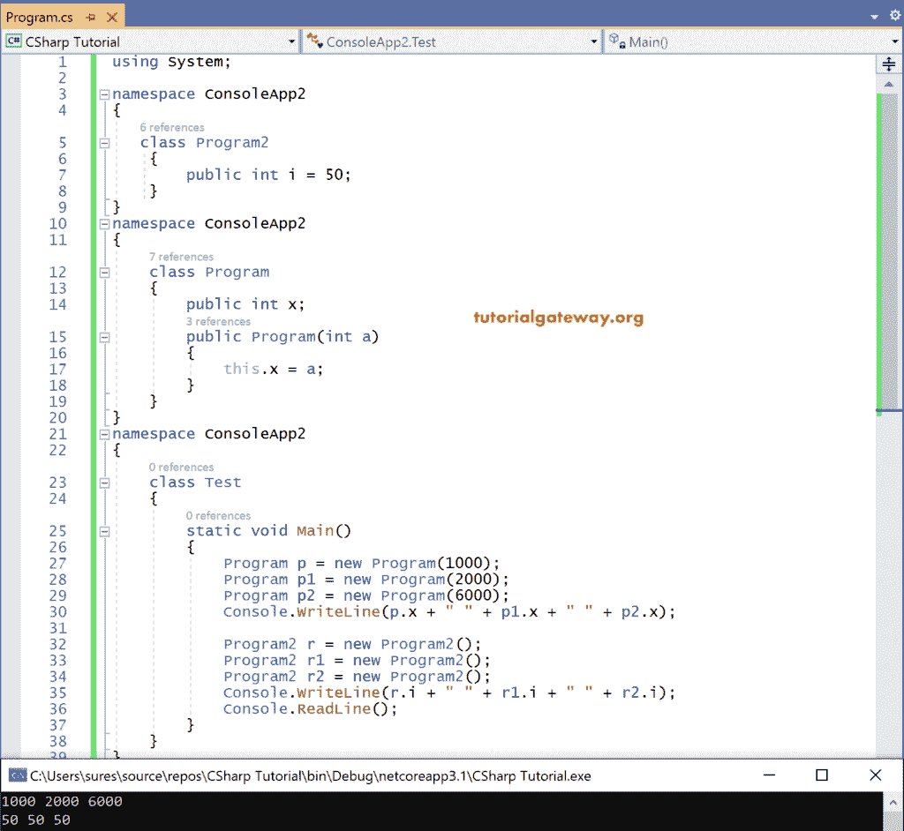

# C#构造函数

> 原文:[https://www.tutorialgateway.org/csharp-constructor/](https://www.tutorialgateway.org/csharp-constructor/)

C#构造函数是在类中定义的一种方法，用于初始化该类的变量。通常，构造函数的名称应该与类名相同。C#构造函数不返回值，因此被称为非值返回方法。

一般来说，每个类都包含一些字段或变量。执行 C#类所需的值使用构造函数发送给它。C#构造函数的语法如下所示

```
[<Access specifier>] <ConstructorName>([<parameter list>])
{
   Statements;
}
```

正如我们已经说过的，创建对象是为了访问 C#类的字段和成员函数。相比之下，C#构造函数对于创建类的实例或对象非常有用。

程序员必须在类中显式定义构造函数。否则，在执行时，C#编译器默认创建一个构造函数。我们称之为隐式或默认构造函数。

C#构造函数要么是静态的，要么是非静态的。除了用访问说明符 static 定义的构造函数之外，所有构造函数都是非静态的。

让我们看看当 C#默认构造函数没有在类中定义时，它是如何被调用来初始化变量的。

```
using System;

namespace CSharp_Tutorial
{
    class Program
    {
        int a;
        bool b;
        static void Main(string[] args)
        {
            Program p = new Program();
            Console.WriteLine("value of integer a is: " + p.a);
            Console.WriteLine("value of boolean b is: " + p.b);
            Console.ReadLine();
        }
    }
}
```

输出



在上面的示例程序中，a 是整数，b 是分别定义的布尔变量。这里，我们没有定义构造函数来初始化这些变量，而是要求打印它们的值。

执行时，编译器创建一个隐式构造函数来初始化变量 a、b，并打印默认值。即整数变量 a = 0，布尔变量 b 的值为假。

注意:即使类中没有定义构造函数。当我们试图调用它时，编译器默认会调用无参数构造函数。因此，编译器调用的未显式定义的函数称为隐式构造函数。

## C#中构造函数的类型

以下是 C#编程语言中不同类型的构造函数。

*   默认或无参数。
*   参数化的
*   收到。
*   静态的。

### C#默认无参数构造函数

任何不接受任何值(或)的方法，如果该方法没有任何被称为无参数或默认构造函数的参数。

C#默认或无参数构造函数的语法如下所示。

```
using System;

public Class_name ()
{
       --statements--
}
```

让我们看看前面执行的相同的示例程序，只是显式地定义了构造函数。

```
using System;

namespace CSharp_Tutorial
{
    class Program
    {
        int a;
        bool b;
        public Program()
        {
            Console.WriteLine("Parameterless constructor is called");
        }
        static void Main(string[] args)
        {
            Program p = new Program();
            Console.WriteLine("value of integer a is: " + p.a);
            Console.WriteLine("value of boolean b is: " + p.b);
            Console.ReadLine();
        }
    }
}
```



执行时，编译器将调用我们显式定义的 C#无参数构造函数。

Program()是显式创建的无参数构造函数。通过使用这个，我们创建了一个对象 p，并尝试打印整数变量 a 和布尔变量 b 的值。由于我们没有初始化变量，编译器将打印默认值，并将它们分配给整数和布尔变量。

### C#参数化构造函数

用参数(或)定义的构造函数取值的构造函数称为参数化构造函数。C#程序员应该显式定义参数化构造函数。

C#参数化构造函数的语法是

```
public Class_name (<parameter_list>)
{
       --statements--
}
```

让我们看一个参数化的例子

```
using System;

namespace CSharp_Tutorial
{
    class Program
    {
        int x;
        public Program(int i)
        {
            x = i;
            Console.WriteLine("Parameterized constructor is called");
        }
        void Print()
        {
            Console.WriteLine("Value of x is:" + x);
        }

        static void Main(string[] args)
        {
            Program p1 = new Program(500);
            p1.Print();
            Console.ReadLine();
        }
    }
}
```



这里，程序(int i)是一个参数化的构造函数，它是用一个整数变量参数 I 创建的。接下来，用这个 I 初始化整数类型的全局变量 x。通过使用这个构造函数，在将参数 500 传递给参数 I 时创建了一个对象 p1

当我们试图调用 Print()方法时，它通过将参数 500 传递给 x 来执行方法内部的语句，因为 x 是用 I 初始化的。

### C#复制构造函数

将一个对象的数据复制到另一个对象中的方法称为复制构造函数。为了创建具有相同值的多个对象，我们通常使用复制构造函数。

复制构造函数是参数化的，它将同一个类作为参数。复制构造函数的语法是

```
public class_name(class_name <instance of a class>)
{
     --Statements--
}
```

下面的示例向您展示了编写复制构造函数程序的方法

```
using System;

namespace CSharp_Tutorial
{
    class Program
    {
        int a;
        bool b;
        public Program()
        {
            Console.WriteLine("Parameterless constructor is called");
        }
        static void Main(string[] args)
        {
            Program p = new Program();
            Console.WriteLine("value of integer a is: " + p.a);
            Console.WriteLine("value of boolean b is: " + p.b);
            Console.ReadLine();
        }
    }
}
```



copycon_Program 是 [C#](https://www.tutorialgateway.org/csharp-tutorial/) 类名。这里，使用参数 obj 作为实例创建的复制构造函数

P2 是在复制构造函数的帮助下创建的实例。为此，参数化构造函数的实例，即作为参数传递的 p1。

由于对象 p1 作为参数传递给了对象 p2，因此对象 p1 中的数据将被复制到 p2 中并打印出来。

### C#静态构造函数

用访问说明符 static 定义的是 C#中的静态构造函数。到目前为止，我们讨论的都是非静态构造函数。

正如我们已经看到的，当我们不在类中定义任何构造函数时，非静态函数将隐式调用。然而，说到静态构造函数，如果一个类包含任何静态变量，那么编译器将调用隐式静态构造函数。否则，我们需要明确定义一个静态的。C#静态构造函数的语法如下所示

```
static class_name()
{
   --statements—
}
```

让我们看一个 C#静态构造函数的例子

```
using System;

namespace CSharp_Tutorial
{
    class static_Program
    {
        int x;
        static static_Program()
        {
            Console.WriteLine("static Constructor is called");

        }
        static void Main(string[] args)
        {

            Console.WriteLine("Main method is called");
            Console.ReadLine();
        }
    }
}
```

输出



当我们执行程序时，由于静态构造函数是第一个运行的，编译器首先执行静态构造函数。接下来是执行其中代码的主要方法。

### C#静态与非静态构造函数

| 静态 | 非静态 |
| C#静态构造函数用于初始化静态变量。 | 非静态构造函数用于初始化非静态变量。 |
| 因为静态构造函数是在每个类中执行的第一个代码块，所以没有显式调用它们。一旦类开始执行，这些构造函数将立即执行，并且在类的生命周期中只执行一次。 | 但是对于非静态构造函数，如果没有创建实例，它们根本不会执行。但是如果创建了 n 个实例，它们将被执行 n 次。 |
| C#静态构造函数不能参数化，因为它不能接受参数，因为它是第一个要执行的代码块。因此这些构造函数不能重载。 | 它们可以参数化，因此可以重载。 |

## C#中显式构造函数的实际需求？

编译器将调用隐式构造函数来创建类的实例，即使我们没有显式定义它。然而，当我们创建一个类的多个实例时，一个类的变量用相同的值初始化。这是因为在 C#编程语言中，隐式构造函数总是无参数的。

因此，如果我们想通过创建多个实例来为一个类的变量分配不同的值，那么 C#参数化构造函数必须显式定义。

最后，我们可以说，如果我们的类变量需要一些值来执行，那么显式构造函数应该定义为传递多个值。所以每次创建新的对象，我们都有机会传递新的值。

```
using System;

namespace ConsoleApp2
{
  class Program2
  {
   public int i = 50;
  } 
}
namespace ConsoleApp2
{
  class Program
  {
    public int x;
    public Program(int a)
    {
      this.x = a;
    }
  }
}
namespace ConsoleApp2
{
  class Test
  {  
    static void Main()
    {
      Program p = new Program(1000);
      Program p1 = new Program(2000);
      Program p2 = new Program(6000);
      Console.WriteLine(p.x + " " + p1.x + " " + p2.x);
      Program2 r = new Program2();
      Program2 r1 = new Program2();
      Program2 r2 = new Program2();
      Console.WriteLine(r.i + " " + r1.i + " " + r2.i);
      Console.ReadLine();
    }
  }
}
```

输出



在上面的示例 C#构造函数程序中，在单个命名空间 ConsoleApp2 下创建了三个类，

第一个是班级计划 2，第二个是班级计划，第三个是班级测试。主要的方法写在 Test 类中。

在程序 2 中，整数变量 I 用 50 初始化，并在 Test 类中创建了三个实例 r、r1 和 r2。

由于它没有任何构造函数，编译器调用 default one 来创建实例 r、r1 和 r2。当我们试图将 I 值写入控制台时，由于 C#隐式构造函数是无参数的，所以每次都会打印相同的 I 值，即 50。不能使用任何参数来更改该值。

用参数化程序(int a)创建的类程序。

因此，对于创建的每个新实例，构造函数将采用不同的整数值(即 1000、2000、6000)，因为它是用整数变量作为参数进行参数化的。