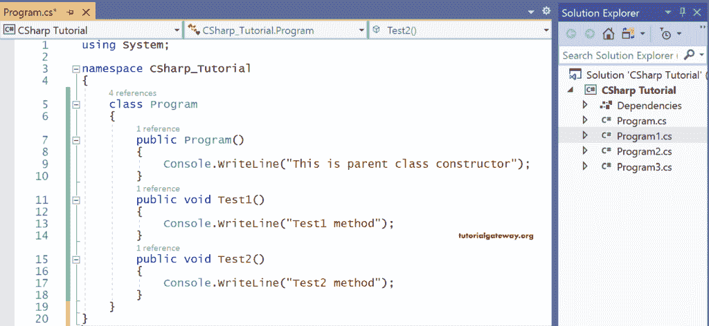
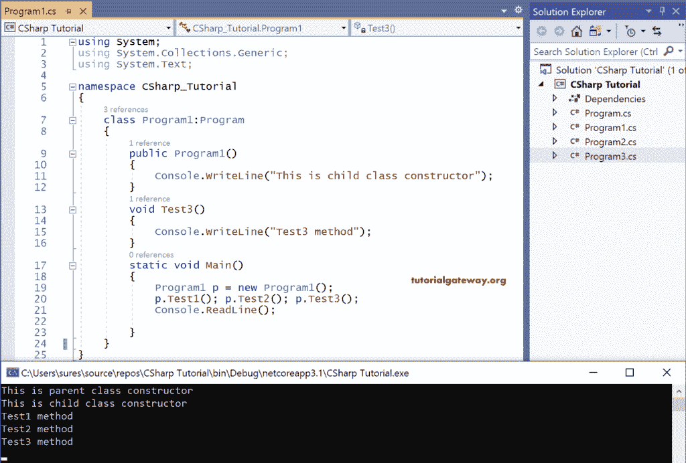
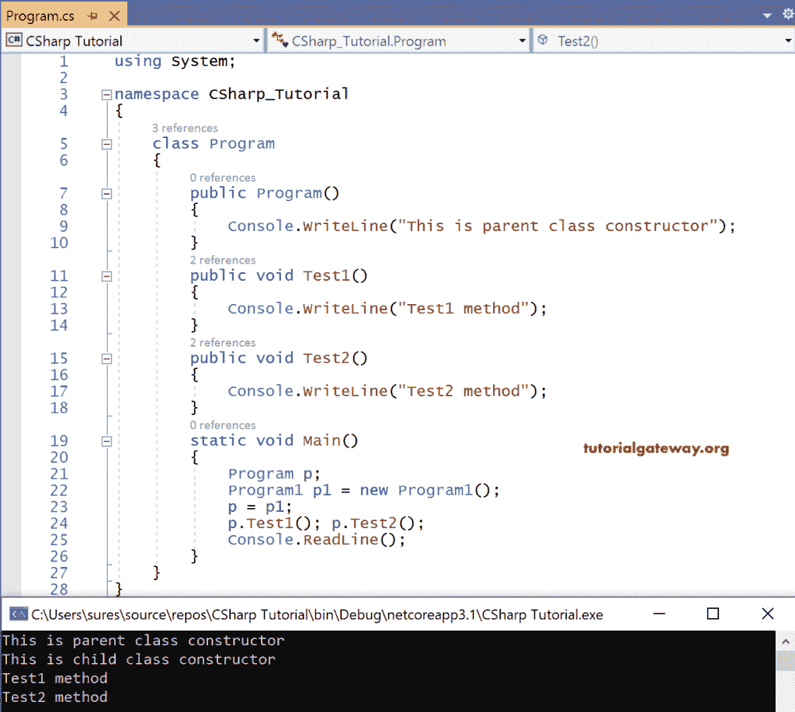
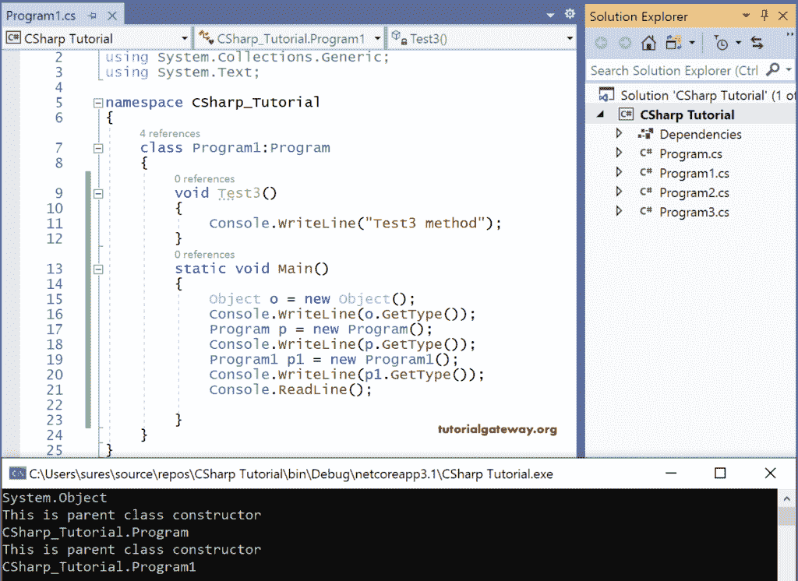
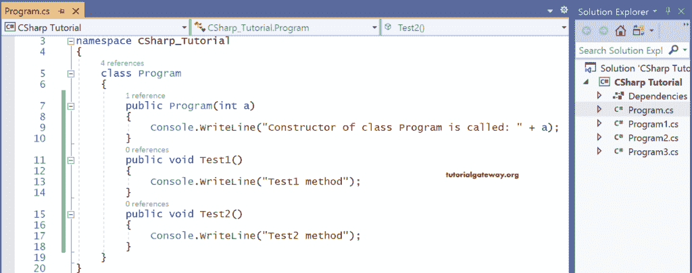
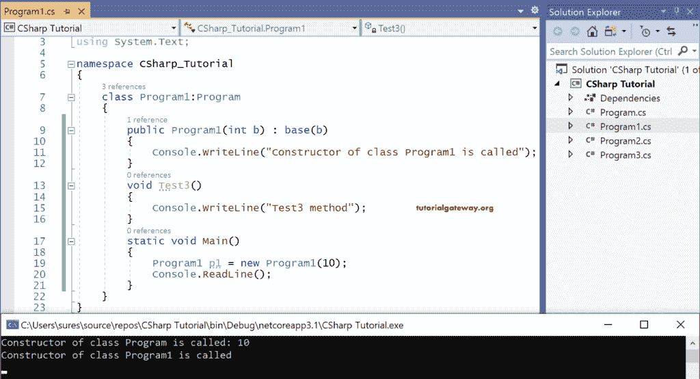
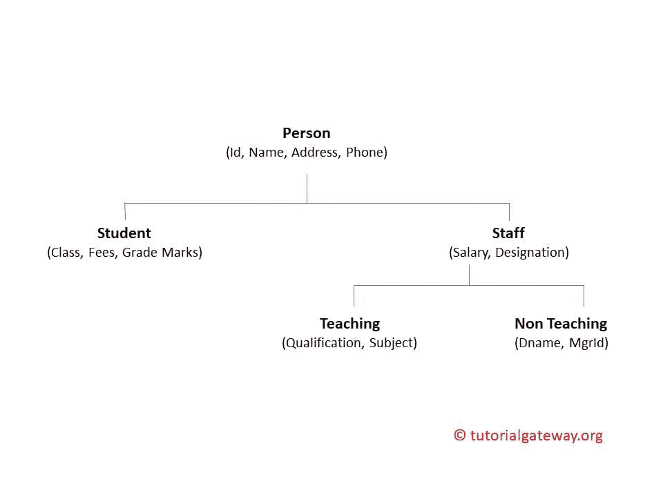

# C# 继承

> 原文：<https://www.tutorialgateway.org/csharp-inheritance/>

C# 继承是一种可重用机制，其中一个类的成员可以由另一个类使用父子关系来访问。C# 编程语言中继承的语法如下所示。

```cs
<Access modifier> Class <child class> : <parent class>

Class A // A is a parent class.
{
    Class members
}
Class B: Class A // B is a child class
{
    Members of A can be accessed here
}
```

父类也称为基类或超类，而子类也可以作为派生类或子类调用。

## C# 继承示例

C# 中的继承机制允许子类访问父成员(除了它的私有成员)，就好像它是成员的所有者一样。

要在 C# 中实现继承，父类构造器必须能够被子类访问。这意味着我们必须将父构造器定义为公共的，因为没有任何修饰符的构造器在默认情况下是私有的。

让我们看一个实现 C# 继承的例子。

```cs
using System;

namespace CSharp_Tutorial
{
    class Program
    {
        public Program()
        {
            Console.WriteLine("This is parent class constructor");
        }
        public void Test1()
        {
            Console.WriteLine("Test1 method");
        }
        public void Test2()
        {
            Console.WriteLine("Test2 method");
        }
    }
}
```

输出



```cs
using System;
using System.Collections.Generic;
using System.Text;

namespace CSharp_Tutorial
{
    class Program1:Program
    {
        public Program1()
        {
            Console.WriteLine("This is child class constructor");
        }
        void Test3()
        {
            Console.WriteLine("Test3 method");
        }
        static void Main()
        {
            Program1 p = new Program1();
            p.Test1(); p.Test2(); p.Test3();
            Console.ReadLine();

        }
    }
}
```

输出



在这个 C# 继承示例中，Program 是一个父类，其中创建了一个构造器以及两个方法 Test1()和 Test2()。接下来，程序 1 也有一个构造器和一个方法 Test3()。但是在 cProgram1 中，程序的成员也是继承的。

现在当我们试图执行 Program1 时，C# 编译器首先调用子类中的构造器。同时，子构造器隐式调用父构造器来初始化父变量，这样子构造器就可以使用父成员。

因此，执行的顺序是父类构造器，子构造器后面是子继承的方法和纯粹在其中定义的方法。

注意:如果父类也有父类，为子类创建的实例将调用其构造器。同时，它的构造器将调用父构造器。并且这个父构造器将调用这个父的父构造器，以此类推。执行从顶层的父类开始，一直到子类。

请记住，父类不能访问纯粹在子类本身中定义的子成员。

### 创建对父类中子类的引用

C# Parent 类不能访问子成员，但是我们可以在父类中创建一个子引用。

我们之前已经了解到，引用只是指向实例的指针变量，也就是说，引用没有任何分配给它的内存。尽管如此，它仍然指向实例的内存。即使我们可以使用父类引用来创建对子类的引用，我们也不能访问子成员，子成员纯粹是在子类中定义的。

```cs
using System;

namespace CSharp_Tutorial
{
    class Program
    {
        public Program()
        {
            Console.WriteLine("This is parent class constructor");
        }
        public void Test1()
        {
            Console.WriteLine("Test1 method");
        }
        public void Test2()
        {
            Console.WriteLine("Test2 method");
        }
        static void Main()
        {
            Program p;
            Program1 p1 = new Program1();
            p = p1;
            p.Test1(); p.Test2();
            Console.ReadLine();
        }
    }
}
```

输出



这里，p 是 Program 的局部变量，它是父变量。接下来，p 用 Program1 的实例 p1 初始化，它是一个子实例。

现在 p 是一个未初始化的父变量，没有任何内存分配给它，而 p1 是一个子实例。显然，实例将总是分配内存。

p 用 p1 初始化。这意味着 p 是对实例 p1 的引用，我们使用它来访问父类成员，但不能纯粹访问子成员。

最后，我们可以说，在不创建父类实例的情况下，我们可以使用指向子实例的引用来访问父成员。

### 位于父层次结构顶部的对象类

由库中或用户中的预定义类定义的每个类都有一个父类，即系统命名空间中的对象。

对象类的成员有等号、GetHashCode、GetType、ToString

因此，对象的所有成员都可以从任何。

```cs
using System;
using System.Collections.Generic;
using System.Linq;
using System.Text;
using System.Threading.Tasks;

namespace ConsoleApp3
{
  class Program1:Program
  {
    void Test3()
    {
      Console.WriteLine("Test3 method");
    }
    static void Main()
    {
      Object o = new Object();
      Console.WriteLine(o.GetType());
      Program p = new Program();
      Console.WriteLine(p.GetType());
      Program1 p1 = new Program1();
      Console.WriteLine(p1.GetType());
      Console.ReadLine();

    }
  }
}
```

输出



GetType 是一个可以从任何类访问的对象成员。GetType 将获取特定实例的完全限定名。

这里，o 是系统命名空间中对象的一个实例。接下来，p 和 p1 分别是来自 ConsoleApp3 命名空间的 Program 和 Program1 的实例，因此

控制台 p3。程序

控制台 p3。方案 1

## 继承的类型

C# 继承有两种类型，这取决于子类的直接父类的数量或父类的直接子类的数量。

*   单一继承
*   多重继承

如果一个类有一个直接的父类，那么它属于 C# Single 继承。相比之下，如果一个类有多个直接父类，那么它就属于 C# 多重继承。但是 C# 只支持单一继承，不支持类的多重继承。

### 如果父类构造器是参数化构造器？

我们已经知道，当创建子类实例时，子构造器隐式调用父构造器。只有当父构造器无参数时，才会发生这种情况。

但是如果 [C# ](https://www.tutorialgateway.org/csharp-tutorial/) 父类构造器是参数化的，子类构造器就不能调用父类的构造器。为了克服这个问题，我们应该从子类构造器中显式调用它，并使用 base 关键字传递参数。

```cs
using System;

namespace CSharp_Tutorial
{
    class Program
    {
        public Program(int a)
        {
            Console.WriteLine("Constructor of class Program is called: " + a);
        }
        public void Test1()
        {
            Console.WriteLine("Test1 method");
        }
        public void Test2()
        {
            Console.WriteLine("Test2 method");
        }
    }
}
```

输出



```cs
using System;
using System.Collections.Generic;
using System.Linq;
using System.Text;
using System.Threading.Tasks;

namespace ConsoleApp3
{
  class Program1:Program
  {
    public Program1(int b):base(b)
    {
      Console.WriteLine("Constructor of class Program1 is called");
    }
    void Test3()
    {
      Console.WriteLine("Test3 method");
    }
    static void Main()
    {
      Program1 p1 = new Program1(10);
      Console.ReadLine();
    }
  }
}
```

输出



在子程序 1 中，关键字 base 代表父类。

当创建实例 p1 时，它调用 Program1 [构造器](https://www.tutorialgateway.org/csharp-constructor/)，然后通过传递参数 b(10)调用 Program 构造器。

这里，定义的变量 b 也可以在子类中访问。

### 实时实现 C# 继承

在实时中，我们遇到了实体这个词，它只是一个对象，以及关于该对象收集的数据。实体总是与特定的属性相关联。

应用程序可以通过在不同实体之间建立关系来创建。例如，如果我们需要为学校开发一个应用程序，

学生、教职员工、非教职员工、临时员工通常是实体。

将为每个实体维护一些公共属性。



身份证，姓名，地址，电话是所有实体的共同属性。所以有了这四个实体，我们可以创建一个名为 person 的类，并使它成为所有类的父类。

同样，对于员工来说，工资和职称也是属性。作为家长，教职员工和非教职员工都可以发挥作用。

上图描述了在开发 C# 学校应用程序时实现继承概念的方式。