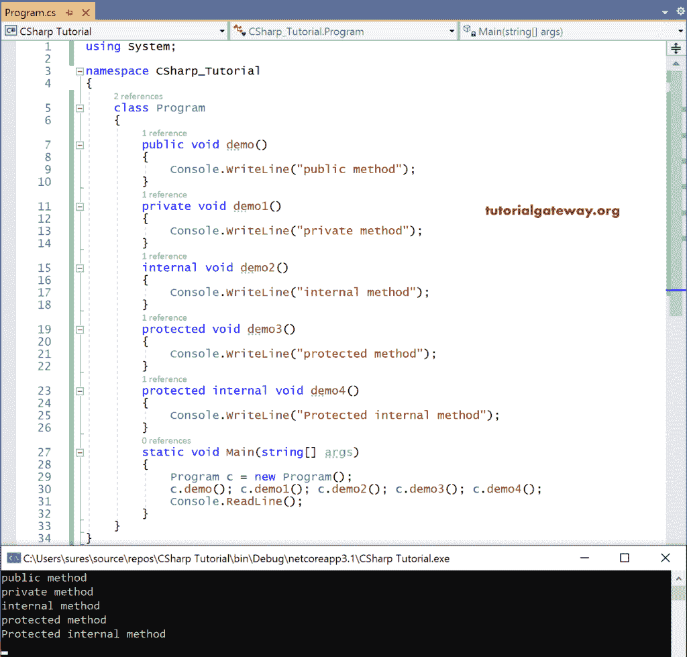
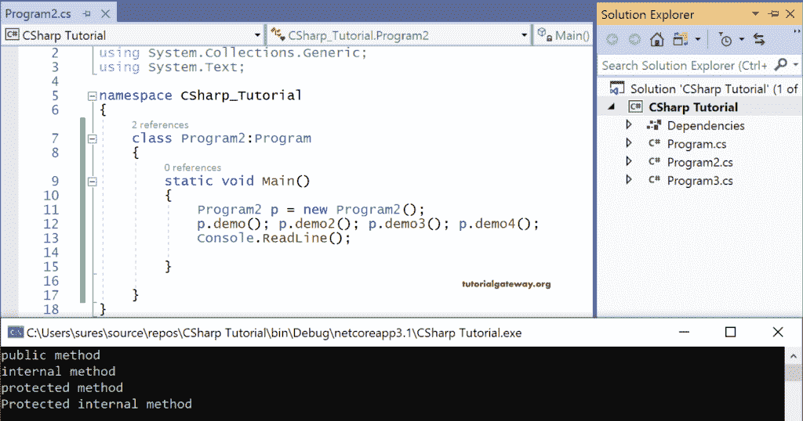
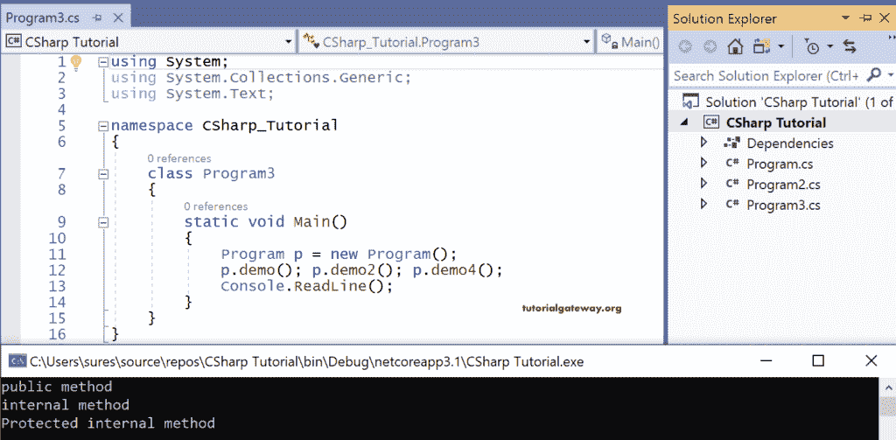
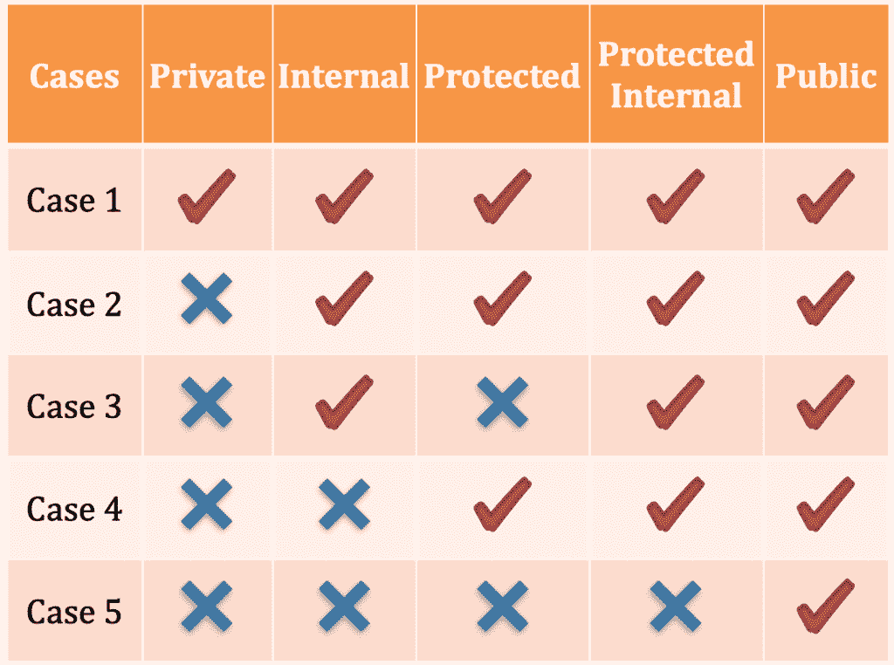

# C# 访问修饰符

> 原文：<https://www.tutorialgateway.org/csharp-access-modifiers/>

C# 访问说明符或访问修饰符可用于定义类型及其成员的范围。一般来说，用任何范围定义的类的成员在类中总是可以访问的。

当我们走出教室时，这些限制将适用。C# 支持五个访问修饰符。他们是

*   私人的
*   公众
*   内部的
*   保护
*   内部受保护。

因此，用上面定义的任何作用域定义的类成员在 C# 类中总是可以访问的。

## C# 访问修饰符案例 1:类的可访问成员

```
using System;

namespace CSharp_Tutorial
{
    class Program
    {
        public void demo()
        {
            Console.WriteLine("public method");
        }
        private void demo1()
        {
            Console.WriteLine("private method");
        }
        internal void demo2()
        {
            Console.WriteLine("internal method");
        }
        protected void demo3()
        {
            Console.WriteLine("protected method");
        }
        protected internal void demo4()
        {
            Console.WriteLine("Protected internal method");
        }
        static void Main(string[] args)
        {
            Program c = new Program();
            c.demo(); c.demo1(); c.demo2(); c.demo3(); c.demo4();
            Console.ReadLine();
        }
    }
}
```

输出



所有具有任何范围的 C# 成员都可以在类中访问。

C# 访问修饰符需要记住的点

*   声明为私有的 C# 成员只能在类中访问。
*   类成员的默认范围是私有的。
*   我们不能将类型声明为私有，也不能对类应用私有。
*   一个类中只能使用公共和内部，而受保护的、受保护的内部和私有不能应用于一个类。
*   如果我们不对一个类应用公共，它就会变成一个内部类。

### C# 访问说明符案例 2:使用子类访问类的成员

现在让我们用类名 Program2 在相同的命名空间 CSharp_Tutorial 中创建另一个类。

```
using System;
using System.Collections.Generic;
using System.Text;

namespace CSharp_Tutorial
{
    class Program2:Program
    {
        static void Main()
        {
            Program2 p = new Program2();
            p.demo(); p.demo2(); p.demo3(); p.demo4();
            Console.ReadLine();

        }

    }
}
```

输出



因为私有方法只能在类中访问，所以我们尝试在子类中访问除私有之外的所有作用域的方法。

### C# 访问说明符案例 3:使用同一项目的非子类访问类的成员

现在让我们在同一个命名空间中创建另一个类程序 3，并尝试通过在类程序 3 中为类程序创建一个实例来访问类程序的方法。

```
using System;
using System.Collections.Generic;
using System.Text;

namespace CSharp_Tutorial
{
    class Program3
    {
        static void Main()
        {
            Program p = new Program();
            p.demo(); p.demo2(); p.demo4();
            Console.ReadLine();
        }
    }
}
```

输出



在这里，我们通过为程序 3 中的程序创建一个实例来访问程序 3 中的程序成员。

但是在这里，我们观察到只有范围为公共、内部、受保护内部的成员才能在程序 3 中被访问，因为它是程序的非子类。

### C# 访问修饰符案例 4:使用不同项目的子类访问类的成员

在这里，在这种情况下，范围为 Public、Protected 和 Protected internal 的 C# 成员可以在项目外部访问。但是，不能访问具有内部作用域的成员。

通过将包含成员的项目引用添加到要访问成员的项目中，可以在项目之外访问 C# 类的成员。

一旦添加了引用，我们就可以通过[继承](https://www.tutorialgateway.org/csharp-inheritance/)或者通过创建实例来访问成员。

请记住，每个类都可以在项目内访问，但在项目外不能访问，直到它被公开。这就是为什么说“类的默认范围是内部的。”

### C# 访问修饰符案例 5

使用不同项目的非子类访问类的 C# 成员。

只能使用不同项目的非子类访问范围为 public 的成员。

也就是说，从案例 1 中讨论的例子来看，只有 demo()可以使用非子类在项目之外访问。

