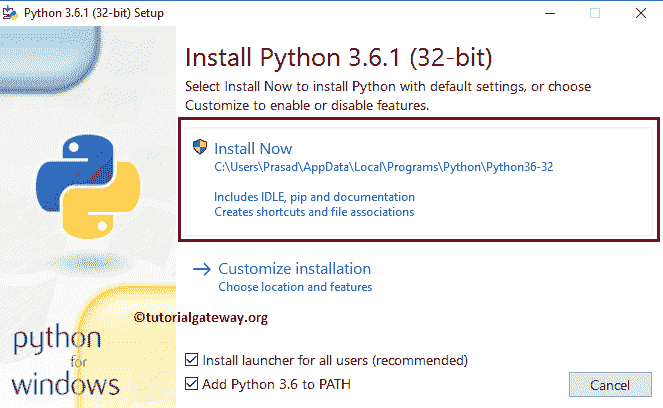

# Python 下载和安装

> 原文：<https://www.tutorialgateway.org/download-and-install-python/>

如何在 Windows 上下载安装 Python(不考虑版本)并截图？。安装集成开发环境包括以下步骤。因此，请按照 Python 的下载和安装步骤进行操作。

## 在窗口中下载和安装 Python 的步骤

在这里，我们正在 windows 上下载并安装 Python。苹果用户也是如此。

### windows 10 下载

要下载 windows Python，首先点击此链接[页面链接](https://www.python.org/downloads/)进入官网。它会显示官方网站的下载页面。

在这里，您可以选择版本。目前，我们正在选择最新版本(即 3.6.1)。点击下载 Python3.6.1 按钮开始该过程。单击按钮后，会弹出一个窗口，将该文件保存在本地驱动器上。请选择保存文件选项。

### windows 10 中的 Python 安装

在 windows 10 中执行 Python 安装的分步方法。

#### 步骤 1:选择 exe 文件

请将您的文件系统导航到我们之前下载的软件，并单击 exe 应用程序(不考虑版本号)在窗口中安装 python IDE。或者，如果您使用 Firefox 下载了该文件，请按照以下所示操作。请记住，在您的情况下，版本号可能不同。

#### 第二步:点击运行按钮

单击安装应用程序后，将打开如下所示的弹出窗口。这是一个安全警告，只有当您有任何安全措施时，它才可能出现。否则，跳过这一步，转到第 3 步。

#### 步骤 3:选择立即安装

我们选择了“立即安装”选项(默认)。它将 python 软件安装在 windows 10 App Data 文件夹中，它包括实际的软件、命令提示符和与之配合使用的默认 IDE。

#### 步骤 windows 10 中的安装过程

等到 windows 上的 [Python](https://www.tutorialgateway.org/python-tutorial/) 安装完成。接下来，单击“关闭”按钮完成或结束。

#### 打开 IDE

让我打开集成开发环境，检查默认集成开发环境是否正常工作。如您所见，它运行良好。

