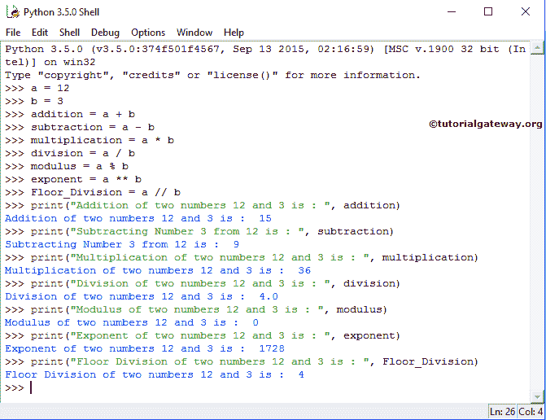
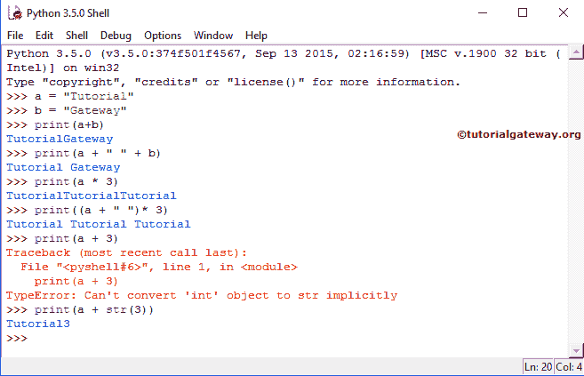

# Python 算术运算符

> 原文：<https://www.tutorialgateway.org/python-arithmetic-operators/>

Python 算术运算符包括加法、减法、乘法、除法、地板除法、指数(或幂)和模数等运算符。Python 中所有这些算术运算符都是二进制运算符，这意味着它们对两个操作数进行操作。下表显示了所有 Python 算术运算符及其示例。

| Python 算术运算符 | 操作 | 例子 |
| + | 添加 | 10 + 2 = 12 |
| – | 减法 | 10 – 2 = 8 |
| * | 增加 | 10 * 2 = 20 |
| / | 分开 | 10 / 2 = 5.0 |
| % | 模数–它返回除法后的余数 | 10 % 2 = 0(此处余数为零)。如果是 10 % 3，那么就是 1。 |
| ** | 指数–它返回一个变量对另一个变量的幂 | 10 ** 2 = 100(表示 10 次方 2 或 10)。 |
| // | 楼层划分–与划分相同，但它将通过对额外的小数进行楼层划分来返回整数值 | 17 // 3 = 5.如果将 17 除以 3，得到 5.667，并且 floor 除法运算符将修剪十进制值并输出整数 |

## Python 算术运算符示例

对于这个 Python 算术运算符示例，我们使用了两个变量 a 和 b，它们的值是 12 和 3。我们将使用这两个变量在 Python 编程中执行各种算术运算

```
a = 12
b = 3
addition = a+b
subtraction = a-b
multiplication = a*b
division = a / b
modulus = a % b
exponent = a**b
Floor_Division = a // b
print("Addition of two numbers 12 and 3 is : ", addition)
print("Subtracting Number 3 from 12 is : ", subtraction)
print("Multiplication of two numbers 12 and 3 is : ", multiplication)
print("Division of two numbers 12 and 3 is : ", division)
print("Modulus of two numbers 12 and 3 is : ", modulus)
print("Exponent of two numbers 12 and 3 is : ", exponent)
print("Floor Division of two numbers 12 and 3 is : ", Floor_Division)
```



下面的 [Python](https://www.tutorialgateway.org/python-tutorial/) 语句会找到指数。意思是 12 次方 3 = 12 * 12 * 12 = 1728

```
exponent = a ** b
```

当我们使用除法(/)运算符时，结果将是浮点或十进制值。如果您想通过取整该值来将输出显示为整数值，请使用 Python Floor 除法(//)

## 字符串上的 Python 算术运算符

在这个 Python 算术运算符示例中，我们使用了字符串数据类型的两个变量 a 和 b。接下来，我们使用这两个变量来显示我们在对字符串数据类型执行算术运算时通常面临的问题。

```
a = "Tutorial"
b = "Gateway"
print(a + b)
print(a + " " + b)
print(a * 3)
print((a + " ")* 3)
print(a + 3)
print(a + str(3))
```

提示:请小心括号，如果你放错了，你会得到错误的结果。



在这个 python 算术运算符的程序中，首先，我们声明了两个字符串类型的变量 a 和 b，它们的值是“教程”和“网关”

```
a = "Tutorial"
b = "Gateway"
```

它将输出显示为“TutorialGateway”，因为当我们在字符串变量之间使用“+”运算符时，python 将会连接这两个字符串

```
print(a+b)
```

在“教程”和“网关”两个词之间插入空格。这意味着输出将是“教程网关”

```
print(a+ " " +b)
```

显示教程三次

```
print(a * 3)
```

在每次迭代之间插入空格

```
print((a + " ")* 3)
```

这是有趣的部分，因为我们在字符串和整数之间使用了“+”符号。

```
print(a + 3)
```

它会抛出一个错误，因为 python 不会隐式地将整数对象转换为字符串对象。为了解决这个问题，我们必须显式转换三个。在[连接字符串](https://www.tutorialgateway.org/python-string-concatenation/)和整数时要小心(类型转换在 Python 算术运算符中起着主要作用)。

```
print(a + str(3))
```