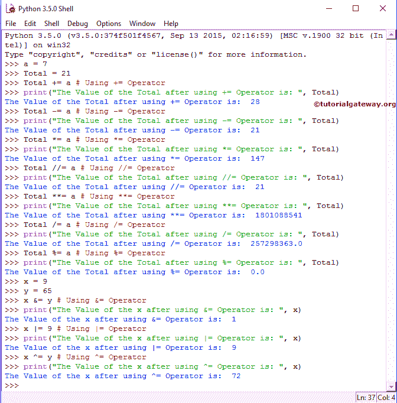

# Python 赋值运算符

> 原文：<https://www.tutorialgateway.org/python-assignment-operators/>

Python 赋值运算符可以方便地将值赋给声明的变量。Equals (=)运算符是 Python 中最常用的赋值运算符。例如:

```
i = 10
```

Python 语言中可用赋值运算符的列表。

| Python 赋值运算符 | 例子 | 说明 |
| = | x= 25 | 值 25 分配给 x |
| += | x += 25 | 这与 x = x + 25 相同 |
| -= | x -= 25 | 与 x = x–25 相同 |
| *= | x *= 25 | 这与 x = x * 25 相同 |
| /= | x /= 25 | 与 x = x / 25 相同 |
| %= | x %= 25 | 这与 x = x % 25 相同 |
| //= | x //= 25 | 与 x = x // 25 相同 |
| **= | x **= 25 | 这与 x = x ** 25 相同 |
| &= | x &= 25 | 这与 x = x & 25 相同 |
| &# 124;= | x &# 124;= 25 | 这与 x = x &# 124; 25 相同 |
| = | 十. ^= 25 | 与 x = x ^ 25 相同 |
| <<= | x <<= 25 | 这与 x = x << 25 相同 |
| >>= | x >>= 25 | 与 x = x >> 25 相同 |

## Python 赋值运算符示例

在这个例子中，我们使用了四个变量 a，Total，x，y，它们的值分别是 7，21，9 和 65。接下来，我们使用它们来展示所有 Python 赋值运算符的工作功能。

```
a = 7
Total = 21

Total += a # Using += Operator
print("The Value of the Total after using += Operator is: ", Total)
Total -= a # Using -= Operator
print("The Value of the Total after using -= Operator is: ", Total)
Total *= a # Using *= Operator
print("The Value of the Total after using *= Operator is: ", Total)
Total //= a # Using //= Operator
print("The Value of the Total after using //= Operator is: ", Total)
Total **= a # Using **= Operator
print("The Value of the Total after using **= Operator is: ", Total)
Total /= a # Using /= Operator
print("The Value of the Total after using /= Operator is: ", Total)
Total %= a # Using %= Operator
print("The Value of the Total after using %= Operator is: ", Total)

x = 9
y = 65
x &= y # Using &= Operator
print("The Value of the x after using &= Operator is: ", x)
x |= 9 # Using |= Operator
print("The Value of the x after using |= Operator is: ", x)
x ^= y # Using ^= Operator
print("The Value of the x after using ^= Operator is: ", x)
```



在这个 Python 赋值运算符示例程序中，我们声明了 2 个整数值 a、Total，并分别赋值 7 和 21。

使用 Python 赋值运算符对和总计进行赋值后，打印语句将显示总计的输出。让我们看看所有 Python 赋值运算符的功能

首次分配运算符功能，

```
 Total += a # Using += Operator
 print("The Value of the Total after using += Operator is: ", Total)
```

总计

总计=总计+a 21+7 = 28

所以，上面提到的 [Python](https://www.tutorialgateway.org/python-tutorial/) 打印语句的输出将是 28

Python 中第二赋值运算符的功能，

```
 Total -= a # Using -= Operator
 print("The Value of the Total after using -= Operator is: ", Total)
```

总计

总计=总计–a 28–7 = 21

因此，输出将是 21

第三赋值运算符功能，

```
 Total *= a # Using *= Operator
 print("The Value of the Total after using *= Operator is: ", Total)
```

总计*=平均值

总计=总计* a 21 * 7 = 147

因此，输出将是 147

`Python()`函数中的第四个赋值运算符，

```
 Total //= a # Using //= Operator
 print("The Value of the Total after using //= Operator is: ", Total)
```

总计/

总计=总计//a 147//7 = 21

因此，上面提到的打印语句的输出将是 21

第五赋值运算符功能，

```
 Total **= a # Using **= Operator
 print("The Value of the Total after using **= Operator is: ", Total)
```

总**=一种手段

合计=合计* * a 21 * 21 * 21 * 21 * 21 * 21 * 21 = 1，801，088，541

因此，上述打印语句的输出将是 1，801，088，541

第六赋值运算符功能，

```
Total /= a # Using /= Operator
>>> print("The Value of the Total after using /= Operator is: ", Total)
```

总计/

总计=总计/a 1，801，088，541 / 7 = 257，298，363

因此，总计/= a 的输出将是 257，298，363

python 中第七赋值运算符的功能是

```
 Total %= a # Using %= Operator
 print("The Value of the Total after using %= Operator is: ", Total)
```

总计%= a 表示

总计=总计% a 257，298，363 % 7 = 0(因为 257，298，363 /7 的余数为= 0)

在下一行中，我们声明了 2 个整数值 x，y，并分别赋值 9 和 65。

```
 x = 9
 y = 65
```

第八个赋值运算符功能，

```
 x &= y # Using &= Operator
 print("The Value of the x after using &= Operator is: ", x)
```

x &= y 表示

x = x&y ⇒ 9 & 65

⇒ 00001001 &01000001 = 00000001 ⇒ 1

所以，x &= y 的输出是 1。请参考 [Python 按位运算符](https://www.tutorialgateway.org/python-bitwise-operators/)

第九个赋值运算符功能，

```
 x |= 9 # Using |= Operator
 print("The Value of the x after using |= Operator is: ", x)
```

x |= 9 表示

x = x |9 ⇒ 1 |9

⇒ 00000001 |00001001 = 00001001 ⇒ 9

因此，输出将是 9

第十赋值运算符的功能，

```
x ^= y # Using ^= Operator
>>> print("The Value of the x after using ^= Operator is: ", x)
```

x ^= y 是指

x = x ^ y ⇒ 9 ^65

⇒ 00001001 ^ 01000001 = 01001000 ⇒ 72

所以，输出将是 72。