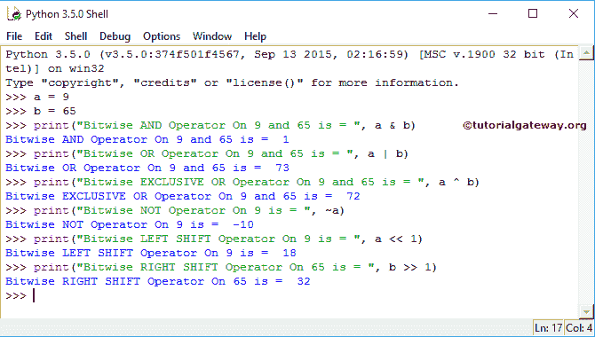

# Python 按位运算符

> 原文:[https://www.tutorialgateway.org/python-bitwise-operators/](https://www.tutorialgateway.org/python-bitwise-operators/)

Python 按位运算符有助于执行位操作。所有十进制值将转换为二进制值(位序列，即 0100、1100、1000、1001 等。).接下来，Python 按位运算符处理这些位，例如从左向右移动或从 0 到 1 转换位值等。

下表显示了不同的 Python 按位运算符及其含义。例如，考虑 x = 6 和 y = 8，它们的二进制形式的值是:x = 0110 和 y = 1000

| Python 按位运算符 | 运算符的含义 | 例子 |
| & | 按位“与” | X & Y = 0000 |
| &#124; | 按位“或” | X &#124; Y = 1110 |
| ^ | 异或 | X ^ Y = 1110 |
| ~ | 补充 | ~X = 00001001 (Not 运算符将所有 0 转换为 1。) |
| << | 左移位 | X << 1 = 00001100(位将向左移动 1 步。如果我们使用 2 或 3，那么它们会相应地移动) |
| >> | 右移 | Y >> 1 = 00000100 |

Python 按位运算符背后的真值表是:

| x | y | x & y | X &#124; y | x ^ y |
| Zero | Zero | Zero | Zero | Zero |
| Zero | one | Zero | one | one |
| one | Zero | Zero | one | one |
| one | one | one | one | Zero |

## Python 按位运算符示例

在这个例子中，我们使用了两个变量 a 和 b，它们的值分别是 9 和 65。接下来，我们使用它们向您展示 Python 编程中的位操作列表

```
a = 9
b = 65
print("Bitwise AND Operator On 9 and 65 is = ", a & b)
print("Bitwise OR Operator On 9 and 65 is = ", a | b)
print("Bitwise EXCLUSIVE OR Operator On 9 and 65 is = ", a ^ b)
print("Bitwise NOT Operator On 9 is = ", ~a)

print("Bitwise LEFT SHIFT Operator On 9 is = ", a << 1)
print("Bitwise RIGHT SHIFT Operator On 65 is = ", b >> 1)
```



在这个按位运算符程序中，我们声明了 2 个整数 a 和 b，并赋值 9 和 65。9 = 00001001 和 65 = 01000001 的二进制形式。

```
>>> a = 9
>>> b = 65
```

让我们看看这些运算符
和运算= a&b
00001001&01000001 = 00000001 = 1 的 [Python](https://www.tutorialgateway.org/python-tutorial/) 计算

或运算= a | b
00001001 | 01000001 = 01001001 = 73

Python 中的异或运算= a^b
00001001 ^ 01000001 = 01001000 = 72

Python 中的右移操作= b > > 1
01000001>>1 = 00100000 = 32