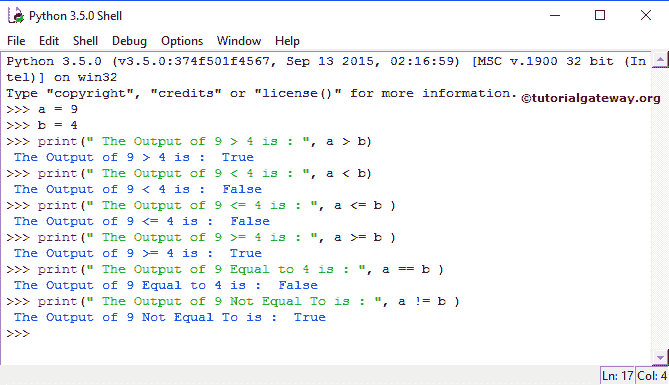

# Python 比较运算符

> 原文：<https://www.tutorialgateway.org/python-comparison-operators/>

Python 比较运算符称为关系运算符，它们主要用于`if`语句或循环中。Python 中的比较运算符通常用于检查两个变量之间的关系。如果关系为真，则返回真，如果关系为假，则返回假输出。下表显示了所有 Python 比较运算符。

| Python 关系运算符 | 使用 | 描述 | 例子 |
| > | a > b | a 大于 b | 7 > 3 返回真(1) |
| < | a < b | a 小于 b | 7 < 3 返回假(0) |
| >= | a >= b | a 大于或等于 b | 7 >= 3 = >真(1) |
| <= | a<=b | a 小于或等于 b | 7 <= 3 返回假(0) |
| == | a==b | a 等于 b | 7 == 3 返回假(0) |
| ！= | a！= b | a 不等于 b | 7 != 3 返回真(1) |

## Python 比较运算符示例

在这个 Python 关系运算符示例中，我们声明了两个变量 a 和 b，它们的值分别是 9 和 4。接下来，我们用 Python 执行各种比较操作。我的意思是，我们对照 Python 中的每个比较或关系运算符检查了这些值

```
a = 9
b = 4
print(" The Output of 9 > 4 is : ", a>b )
print(" The Output of 9 < 4 is : ", a<b )
print(" The Output of 9 <= 4 is : ", a <= b )
print(" The Output of 9 >= 4 is : ", a >= b )
print(" The Output of 9 Equal to 4 is : ", a == b )
print(" The Output of 9 Not Equal To is : ", a != b )
```



## 在`if`语句中使用 Python 比较运算符

在`if`语句中使用 Python 关系运算符。在这个例子中，我们使用了两个变量 x 和 y，它们的值分别是 10 和 25。这里，我们在`if`语句中使用这两个变量，使用一个比较运算符来检查条件。

```
>>> x = 10
>>> y = 25
>>> if x >= y:
	print(" x value is Greater than or Equal to y ")
    else:
	print(" x value is Less than or Equal to y ")
```

```
x value is Less than or Equal to y
```

在这个 Python 实算符示例中，我们分配了 2 个整数值 x，y，并分配了值 10 和 25。

```
>>> x = 10
>>> y = 25
```

如果条件:如果 x 大于或等于 y，那么将执行第一个打印语句

```
print(" x value is Greater than or Equal to y ")
```

如果第一个条件失败，那么第二个条件执行。

```
print(" x value is Less than or Equal to y ")
```

这里，10 既不大于也不等于 25。于是，第二份声明打印出来了。参考 [Python](https://www.tutorialgateway.org/python-tutorial/) 中的 [`if`语句](https://www.tutorialgateway.org/python-if-statement/)和[循环](https://www.tutorialgateway.org/python-for-loop/)。