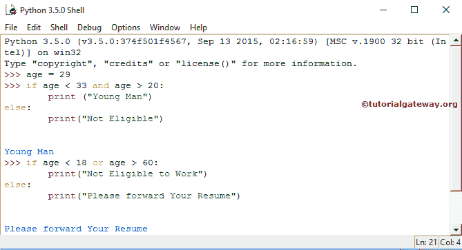

# Python 逻辑运算符

> 原文：<https://www.tutorialgateway.org/python-logical-operators/>

Python 逻辑运算符用于组合两个或多个条件，并使用逻辑与、逻辑或和逻辑非执行逻辑操作。Python 比较运算符用于比较两个变量，如果我们想要匹配多个条件呢？很简单，Python 逻辑运算符会帮你完成这个任务。下表通过示例概述了 Python 和(或)not 运算符。

| 经营者 | 描述 | 例子 |
| 和 | 当两个条件都为真时，它将返回真 | 如果(年龄> 18 岁且年龄< =35 岁) |
| 运筹学 | 当至少一个条件为真时，它将返回真 | 如果(年龄> 35 岁或年龄< 60 岁) |
| 不 | 如果条件为真，逻辑“非”运算符将使其为假 | 如果年龄=真，那么非(年龄)返回假。 |

Python 逻辑运算符的真值表。

Python 逻辑“与”和“或”运算符背后的真值表

| 条件 1 | 条件 2 | 条件 1 和条件 2 | **条件 1 或条件 2** |
| 真实的 | 真实的 | 真实的 | 真实的 |
| 真实的 | 错误的 | 错误的 | 真实的 |
| 错误的 | 真实的 | 错误的 | 真实的 |
| 错误的 | 错误的 | 错误的 | 错误的 |

## Python 逻辑运算符示例

这个例子将向您展示如何实时使用逻辑运算符。对于这个 [Python](https://www.tutorialgateway.org/python-tutorial/) 演示，我们使用的是 [IF Else](https://www.tutorialgateway.org/python-if-else/) 语句。

```
>>> age = 29
# AND Example
>>> if age < 33 and age > 20:
	print ("Young Man")
else:
	print(" Not Eligible ")

# OR Example
>>> if age < 18 or age > 60:
	print(" Not Eligible to Work ")
else:
	print(" Please forward Your Resume ")
```



在这个 Python 逻辑运算符示例程序中，我们创建了一个名为 age 的新变量，并赋值为 29

```
 age = 29
```

在下一行中，我们使用 Python 逻辑 and 运算符使用 [`if-else`语句](https://www.tutorialgateway.org/python-if-else/)检查年龄值是否大于 20 且小于 33。如果两个条件都为真，那么将显示第一个打印语句。意思是年龄必须大于 20 小于 33。

```
print (" Young Man ")
```

如果任何一条语句为假，将显示以下打印语句

```
print(" Not Eligible ")
```

接下来，我们再次使用`if-else`语句。不过，这一次，我们使用 Python 逻辑 OR 运算符来检查年龄值是小于 18 还是大于 60。如果任何一个语句为真，那么下面的打印语句将被打印。

```
print(" Not Eligible to Work ")
```

如果两个条件都为假，将显示第二个打印语句。

```
print(" Please forward Your Resume ")
```

请参考[比较运算符](https://www.tutorialgateway.org/python-comparison-operators/)一文。