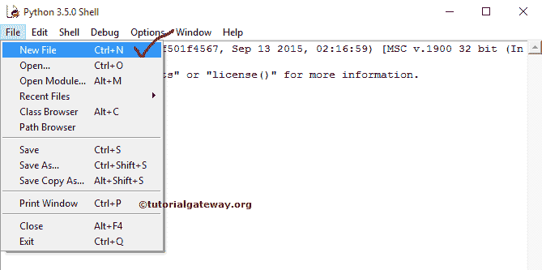
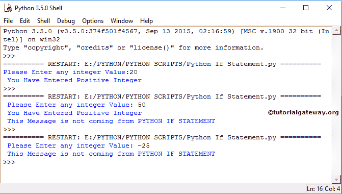

# Python `if`语句

> 原文：<https://www.tutorialgateway.org/python-if-statement/>

Python `if`语句是实时编程中最有用的决策语句之一。Python `if`语句允许编译器首先测试条件，根据结果，它执行代码块。当给定的测试条件为真时，则只有 if 块中的代码执行。

## Python If 语法

Python 编程中的`if`语句结构简单:

```py
if (test condition):
        Statement2
        Statement3
        ………….
        ………….
        Statementn
```

当 Python `if`语句中的测试条件为真时，语句 1，语句 2，…。，Statementn 将执行。否则，它们都会跳过。让我们看看流程图，以便更好地理解。

### Python `if`语句流程图


当测试条件为真时，STATEMENT1 执行，然后是 STATEMENTN。如果为假，STATEMENTN 执行。因为它超出了 if 块，与结果无关。

## Python `if`语句示例

这个程序将使用 Python 检查正数，如果。首先，请打开你最喜欢的 IDLE 来写脚本，这里我们使用的是 Python 3.5.0。打开 IDLE 后，请选择如下图所示的新建文件，否则点击【控制+N】



单击“新建文件”后，将打开一个新文件窗口，为 If 示例编写脚本。请在新文件中添加以下脚本

```py
number = int(input(" Please Enter any integer Value: "))
if number >= 1:
    print(" You Have Entered Positive Integer ")
```

完成后，单击文件，并选择保存选项。请按照您的要求保存文件

让我们通过选择运行菜单并单击运行模块或按 F5 来运行脚本

点击运行模块将弹出 [Python](https://www.tutorialgateway.org/python-tutorial/) 外壳，并显示消息“请输入任意整数值:“”。我们输入了 20，它是一个正整数

```py
 Please Enter any integer Value: 20
 You Have Entered Positive Integer 
```

首先，我们声明了一个数字变量，并要求用户输入任何整数值。int()限制用户不要输入非整数值

```py
number = int(input(" Please Enter any integer Value: "))
```

当您查看下面的 Python `if`语句时，数值变量中存储的值大于或等于 0，则该语句将被执行。

```py
if number >= 1:
    print(" You Have Entered Positive Integer ")
```

这里我们输入了 20，大于 0，这就是为什么它在`if`语句块中打印行的原因。

## Python `if`语句示例 2

在这个 Python `if`语句示例中，我们将通过更改示例 1 向您展示 if 块之外的代码会发生什么。

```py
number = int(input(" Please Enter any integer Value: "))
if number >= 1:
    print(" You Have Entered Positive Integer ")
print(" This Message is not coming from PYTHON IF STATEMENT")
```

这个 Python `if`语句代码与我们在第一个示例中使用的代码相同。但是，这一次，我们在带有消息的 If 块外又添加了一个打印。

```py
 Please Enter any integer Value: 20
 You Have Entered Positive Integer 
 This Message is not coming from PYTHON IF STATEMENT
```

我们输入了 50，这意味着条件为真。因此，它在`if`语句内部和 If 块外部显示`print()`函数

```py
 Please Enter any integer Value: 50
 You Have Entered Positive Integer 
 This Message is not coming from PYTHON IF STATEMENT
```

让我们尝试负值来故意使条件失效。而这里的条件失败了(编号< 1), compiler prints nothing from the If condition block. So, it printed only one print statement, which is outside the block.

