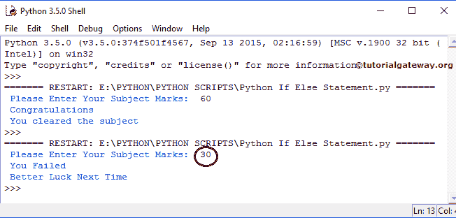

# Python If Else

> 原文:[https://www.tutorialgateway.org/python-if-else/](https://www.tutorialgateway.org/python-if-else/)

Python If Else 语句是 If 的扩展(我们在之前的文章中讨论过)。如果条件为真，则只执行代码块，如果条件为假，则不执行语句。

在现实世界中，当条件失败时，执行一些东西是很好的。为此，使用了 Python If else 语句。这里，当条件失败时，Else 块将执行代码。

## Python If Else 语法

Python If Else 语句的语法是

```
if (Test condition):
     # The condition is TRUE then these statements will be executed
     True statements
else
     # When the condition evaluates to FALSE then these statements will execute
     False statements
```

如果上述 Python If else 结构中的测试条件被评估为真，则执行 true 语句。当它返回 false 时，将执行 False 代码。

## Python If Else 语句示例

在这个 Python If Else 程序中，我们将放置 4 个不同的行。如果条件满足为真，它将显示 2 个不同的语句，如果条件表达式计算为假，我们将使用这个 else 块代码显示另外 2 个语句。

```
marks = int(input(" Please Enter Your Subject Marks:  "))
if marks >= 50:
    print(" Congratulations ") #s1
    print(" You cleared the subject ") #s2
else:
    print(" You Failed") #s3
    print(" Better Luck Next Time") #s4
```

请保存此 [Python](https://www.tutorialgateway.org/python-tutorial/) 文件，并按 F5 运行脚本。我们输入 60 作为分数，大于 50。这就是为什么它在 If 块内部打印(s1 和 s2)。

```
Please Enter Your Subject Marks: 60
Congratulations
You cleared the subject
```

为了演示 else 子句，我们输入了 30 作为标记。这意味着条件为假，所以 else 块中的 s3 和 s4 将被打印。



首先，我们要求用户输入标记。int()限制用户不要输入非整数值。

如果您查看 python if else，如果存储在 marks 变量中的值大于或等于 50，则将执行以下打印行。当它小于 50 时，在代码下面，Else 内部将执行。