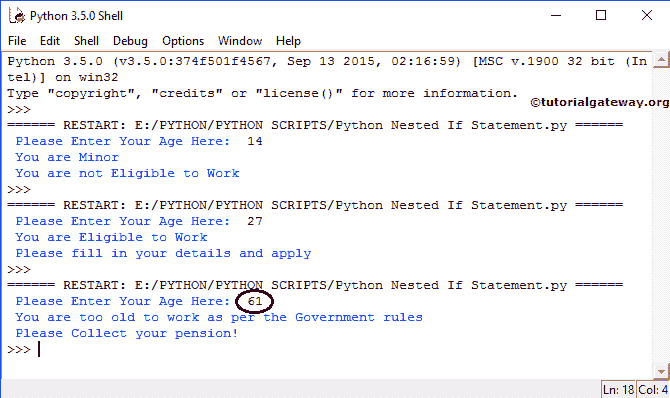

# Python 嵌套 If

> 原文:[https://www.tutorialgateway.org/python-nested-if/](https://www.tutorialgateway.org/python-nested-if/)

Python 嵌套 If 语句意味着将一个 If 语句放在另一个 If 语句中。Python If Else 语句允许我们根据表达式结果打印不同的语句(真、假)。有时，即使条件为真，我们也必须进一步检查。在这些情况下，我们可以使用 Python 嵌套 IF 语句，但是在使用时要小心。

Python 嵌套 if 语句的例子，每个人都有资格工作，如果他是 18 岁或以上，否则他没有资格。然而，公司不会给每个人都提供工作。因此，我们使用另一个 If 条件，也称为 Python 嵌套 If 语句来检查他的教育资格或任何特定的公司要求。

## Python 嵌套 If 语句语法

Python 嵌套 If 语句语法为

```
if ( test condition 1):
    # If test condition 1 is TRUE, then it checks for test condition 2
    if ( test condition 2):
         # If test condition 2 is TRUE, then these true statements executed
         Test condition 2 True statements
    else:
         # If test condition 2 is FALSE, then these false statements executed
         Test condition 2 False statements
else:
    # If test condition 1 is FALSE, then these statements executed
    Test condition 1 False statements
```

一旦我们在分号后按 enter 键，python 就会用制表符空间开始下一条语句，在其他编程语言中，这个制表符空间充当大括号({ })。

如果上述结构中出现的测试条件 1 为真，则转到 Python 嵌套 If 语句

*   如果测试条件 2 为真，则执行测试条件 2 为真的语句。
*   否则(这意味着测试条件 2 为假)执行测试条件 2 假语句

如果测试条件 1 为假，则执行测试条件 2 假语句。通过单击退格键，我们可以退出 If Else 块。

### Python 嵌套 if 语句流程图

下面的流程图将向你完美解释 Python 嵌套 If 语句


如果测试条件 1 为假，则执行状态 ENT3。如果测试条件 1 为真，则检查测试条件 2，如果为真，则 STATEMENT1 执行其他 STATEMENT2。

## Python 嵌套 If 示例

在这个 Python 嵌套 If 程序中，用户可以输入他的年龄，我们将把它存储在可变年龄中。如果年龄小于 18 岁，我们将打印两份报表。当条件失败时，我们再检查一个条件(嵌套)，如果成功，我们就打印一些东西。如果嵌套条件失败，我们使用 python 嵌套 If 语句打印一些其他代码。为了演示 Python 嵌套 if，请在新文件中添加以下脚本。

```
# Example for Nested If

age = int(input(" Please Enter Your Age Here:  "))
if age < 18:
    print(" You are Minor ") 
    print(" You are not Eligible to Work ") 
else:
    if age >= 18 and age <= 60:
        print(" You are Eligible to Work ")
        print(" Please fill in your details and apply")
    else:
        print(" You are too old to work as per the Government rules")
        print(" Please Collect your pension!")
```

请保存 Python 嵌套 If 文件，并通过选择运行模块或单击 F5 运行脚本。一旦点击运行模块，我们的 [Python](https://www.tutorialgateway.org/python-tutorial/) 外壳将弹出消息“请在此输入您的年龄:”。

输出 1:在这里，我们进入了 14 岁。如果第一个条件为真，那么输出将在 If 块中显示打印语句。

```
Please Enter Your Age Here: 14
You are Minor
You are not Eligible to Work
```

在这里，我们进入了年龄= 27。第一个如果条件为假，那么它将进入 else 块，并在那里检查嵌套的如果条件。这里，Python 嵌套 If 语句为真，因此输出显示嵌套 If 语句中的打印函数。

```
Please Enter Your Age Here: 27
You are Eligible to Work
Please fill in your details and apply
```

我们进入了 61 岁。如果第一个条件为假，那么它将进入 else 块，并在那里检查嵌套的 If 条件。这里 Python 嵌套 If 语句也是 FALSE，所以输出显示嵌套 If 的 else 块中的打印函数。



在这个 Python 嵌套 If 语句示例中，首先，我们声明了年龄变量。接下来，它要求用户输入任意整数值。int()限制用户不要输入非整数值

```
age = int(input(" Please Enter Your Age Here:  "))
```

如果此人的年龄小于 18 岁，则打印以下代码。

```
 print(" You are Minor ") 
 print(" You are not Eligible to Work ")
```

如果此人的年龄大于或等于 18 岁，则第一个条件失败，因此它会检查 else 语句。在 Else 语句中，还有另一个 if 条件(称为嵌套 If)。

Python 嵌套 IF 语句将检查该人的年龄是否大于或等于 18 岁且小于或等于 60 岁。当条件为真时，将打印以下代码

```
 print(" You are Eligible to Work ")
 print(" Please fill in your details and apply")
```

当嵌套 If 中的条件为假时。然后它将检查 else 块并打印下面几行代码。请参考[Python If Else](https://www.tutorialgateway.org/python-if-else/)[Python If](https://www.tutorialgateway.org/python-if-statement/)文章。

```
 print(" You are too old to work as per the Government rules")
 print(" Please Collect your pension!")
```