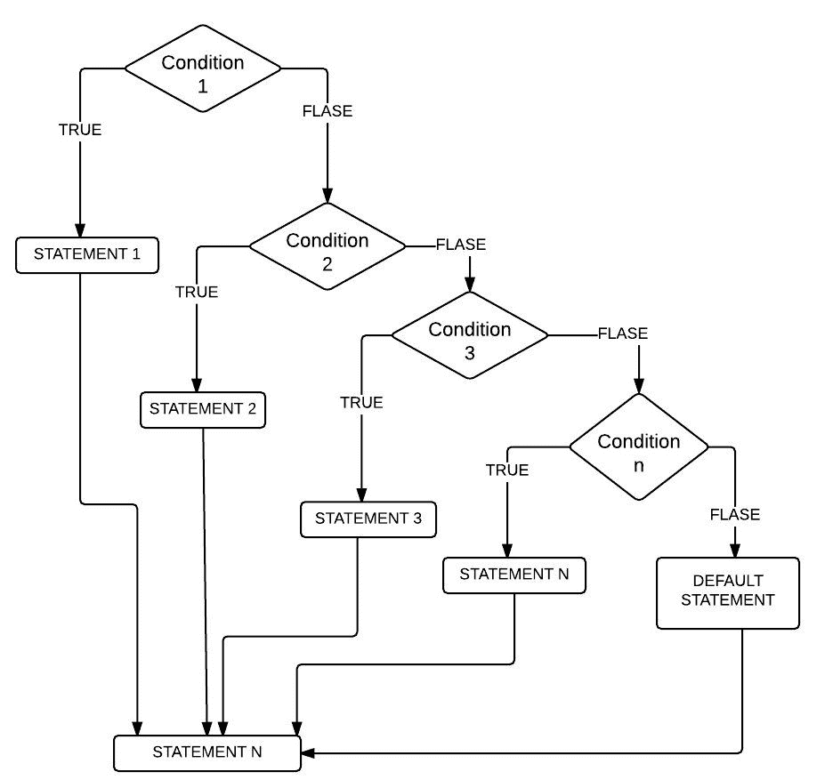
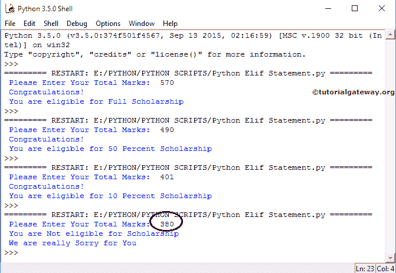

# Python el`if`语句

> 原文：<https://www.tutorialgateway.org/python-elif-statement/>

Python el`if`语句也被称为 Else If，当我们必须检查几个条件时，它非常有用。除了这个 Python elif，我们还可以使用嵌套`if`来实现同样的目的。然而，随着条件数量的增加，Python 嵌套`if`else 的复杂性也会增加。让我们看看 python El`if`语句的语法。

## Python elif 语法

Python elif 或`else if`语句的语法是

```
if (condition 1):
    statements 1
elif (condition 2):
    statements 2
    ...........
elif (condition n):
    statements n
else:
    default line
```

Python Elif 或`if`语句通过顺序执行多行来有效地处理它们。这意味着，Python elseif 将检查第一个条件，如果条件为真，那么它将执行该块中存在的语句。如果条件为假，那么 Python elseif 将检查下一个(Elif 条件语句)等等。在某些情况下，条件 1、条件 2 为真，例如:

x= 20，y=10

条件 1: x > y # 真

条件二:x！= y # 真

在这些情况下，将执行条件 1 下的代码块。因为 Python elif 条件只有在其之前的 if 或 el`if`语句(else)失败时才会被执行。

### Python`else if`语句流程图

Python el`if`语句的流程图是



## Python elif 示例

在这个 Python elseif 程序中，用户被要求输入他总共 6 个科目的分数。使用 Python El`if`语句，我们检查他/她是否有资格获得奖学金。

```
# Imagine you have 6 subjects and Grand total is 600
Totalmarks = int(input(" Please Enter Your Total Marks:  "))
if Totalmarks >= 540:
    print(" Congratulations! ")
    print(" You are eligible for Full Scholarship ")
elif Totalmarks >= 480:
    print(" Congratulations! ")
    print(" You are eligible for 50 Percent Scholarship ")
elif Totalmarks >= 400:
    print(" Congratulations! ")
    print(" You are eligible for 10 Percent Scholarship ")
else:
    print(" You are Not eligible for Scholarship ")
    print(" We are really Sorry for You ")
```

完成后，请保存 [Python](https://www.tutorialgateway.org/python-tutorial/) 文件。保存文件后，让我们按 F5 运行脚本。Python 外壳将弹出消息“请输入您的总分数”。

ELIF 输出 1:我们将输入 Totalmarks = 570。首先，如果条件为真。因此，elseif 输出在`if`语句中显示打印代码。

```
Please Enter Your Total Marks: 570
Congratulations!
You are eligible for Full Scholarship
```

这次，让我测试 Python el`if`语句。为此，我们将输入 Totalmarks 到 490，这意味着第一个 IF 表达式的计算结果为 FALSE。它将检查 elif(总标记> = 480)，这是真的，所以程序将打印该块内的代码。虽然如果(总标记> = 400)条件为真，但它不会检查该条件。

```
Please Enter Your Total Marks: 490
Congratulations!
You are eligible for 50 Percent Scholarship
```

输出 3:这次我们输入了 Totalmarks，因为 401 表示第一个 IF 条件，否则 if (Totalmarks >= 480)为 FALSE。因此，它将检查 else if (Totalmarks >= 401)，这是真的，所以 Python elseif 返回代码块。

```
Please Enter Your Total Marks: 401
Congratulations!
You are eligible for 10 Percent Scholarship
```

输出 4:我们输入了总标记，因为 380 表示所有的中频条件失败。所以，Python elseif 打印 else 块。



在这个 elseif 程序中，首先，我们声明 Totalmarks 输入任何整数值。

```
Totalmarks = int(input(" Please Enter Your Total Marks:  "))
```

如果人员总分数大于或等于 540，将显示以下行

```
print(" Congratulations! ")
print(" You are eligible for Full Scholarship ")
```

如果 elif 的第一个 Python elseif 条件失败，那么它将转到第二个。此外，如果人员总分数大于或等于 480，将显示以下代码。

```
print(" Congratulations! ")
print(" You are eligible for 50 Percent Scholarship ")
```

当 Python Else if 的第一个和第二个条件失败时，它将转到第三个条件。如果人员总分大于或等于 400，将显示以下语句。

```
print(" Congratulations! ")
print(" You are eligible for 10 Percent Scholarship ")
```

如果`else if`语句中的所有上述语句都失败，那么它将转到 else block 并打印以下语句。请参考[嵌套`if`](https://www.tutorialgateway.org/python-nested-if/) 篇。

```
print(" You are Not eligible for Scholarship ")
print(" We are really Sorry for You ")
```