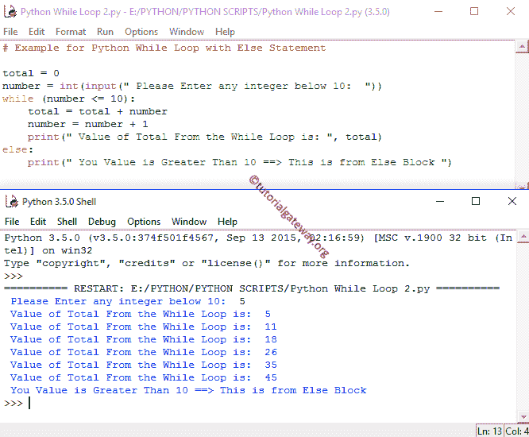

# Python`while`循环

> 原文：<https://www.tutorialgateway.org/python-while-loop/>

Python`while`循环用于将一个语句块重复给定的次数，直到给定的条件为 False。Python 中的`while`循环以条件开始，如果条件为真，那么将执行其中的语句。如果给定的条件为假，它至少不会执行一次。这意味着，Python`while`循环可能执行零次或更多次，其语法是:

## Python`while`循环语法

Python 循环语法如下:

```
while (Condition or Expression):
   statement 1
   statement 2
    ………….
# This is the statement Outside of it but inside the Program
```

一旦您在分号后按 enter 键，python`while`循环将使用制表符空间开始下一条语句，在其他编程语言中，该制表符空间充当大括号({ })。

第一个编译器将检查 Python`while`循环中的表达式。如果条件为真，则将执行该块下的语句或语句组。如果表达式为假，则编译器将从该代码块中出来，并在外部执行其他语句。

### Python 边循环边流程图

这个流程图将向您直观而完美地解释 Python`while`循环


Python`while`循环将在循环开始时检查条件。

1.  如果条件评估为真，那么它将执行其中的代码。
2.  接下来，我们必须在循环中使用算术运算符来增加和减少值。
3.  值增加后，它将再次检查表达式。只要满足条件，就会执行其中的语句。
4.  如果表达式变为假，那么它将退出。

## Python`while`循环示例

为了更好地理解，让我们看看 python`while`循环示例。首先，我们创建了一个名为 total 的变量，它被初始化为 0。

该程序允许用户输入一个小于 10 的整数。而 [Python](https://www.tutorialgateway.org/python-tutorial/) 代码的第二行将用户给定的整数存储在变量编号中。使用这个数字，编译器将把这些值加起来等于 10。

在下一行中，我们使用了它。来测试这个表达式。如果条件结果为真，那么数加起来就是总数，否则它将退出循环。我们还使用+运算符来增加数字值(数字=数字+1)。递增后，该过程重复，直到条件结果为假。

外面有一份打印声明。当条件为真或假时执行

```
total = 0
num = int(input(" Please Enter any integer below 10:  "))
while (num <= 10):
    total = total + num
    num = num + 1
print(" Total is: ", total)
```

我们将输入数字 5。意思是，总数= 5 + 6 + 7 + 8 + 9 + 10 = 45

```
Please Enter any integer below 10: 5
Total is: 45
```

### Python`while`循环其他示例

Python 编程允许我们将 else 语句与`while`循环语句一起使用，它的工作方式类似于 Python`if-else`语句。

*   如果条件为真，将执行代码块中的语句。
*   如果条件为假，则将执行 Else 子句中的语句。当我们使用`break`语句中断循环的执行时，Else 块将不会被执行。请参考 [Python If Else](https://www.tutorialgateway.org/python-if-else/) 和 [`break`语句](https://www.tutorialgateway.org/python-break/)。

这个 Python`while`循环 else 程序允许用户提供一个小于 10 的整数。使用这个数字，编译器将把这些值加到 10。

条件(数字< = 10)检查数字是否小于或等于 10。如果条件结果为真，则将数字加到总数中。

接下来，我们使用+来增加数值。递增后，该过程将重复，直到条件返回 False。

在下一行中，我们在其中使用了`print()`函数，该语句将显示每次迭代的总计中的值。

如果条件评估为假，else 块中的打印功能将执行该消息。

```
total = 0
number = int(input(" Please Enter any integer below 10:  "))
while (number <= 10):
    total = total + number
    number = number + 1
    print(" Value of Total From the While Loop is: ", total)
else:
    print(" You Value is Greater Than 10 ==> This is from Else Block ")
```

这里我们输入的值为 5，当它达到 10 时，条件将失败。因此，它将进入 else 块并打印 Else 子句中的语句。



### Python 编程中的无限`while`循环

如果您忘记在循环中增加或减少值，那么它将重复执行无限次(也称为无限循环)。

```
x = 1
while x < 10:
    print("Value = ", x)
```

```
Value = 1
Value = 1
Value = 1
Value = 1
Value = 1
Value = 1
Value = 1
Value = 1
Value = 1
....
....
...
```

这里 x 总是 1，x 总是小于 10，所以代码将继续执行无限次。现在，让我们在 Python 中添加算术运算符(x = x +1)，同时循环到上面的例子。

```
# Infinite Solution

x = 1
while x < 10:
    print(x)
    x = x + 1 # To increment X value
```

当它达到 10 时，条件将失效。

```
1
2
3
4
5
6
7
8
9
```