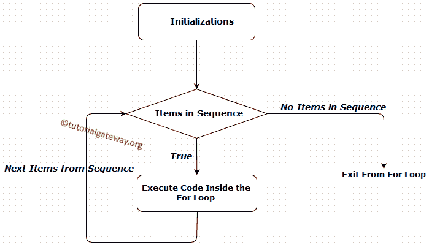
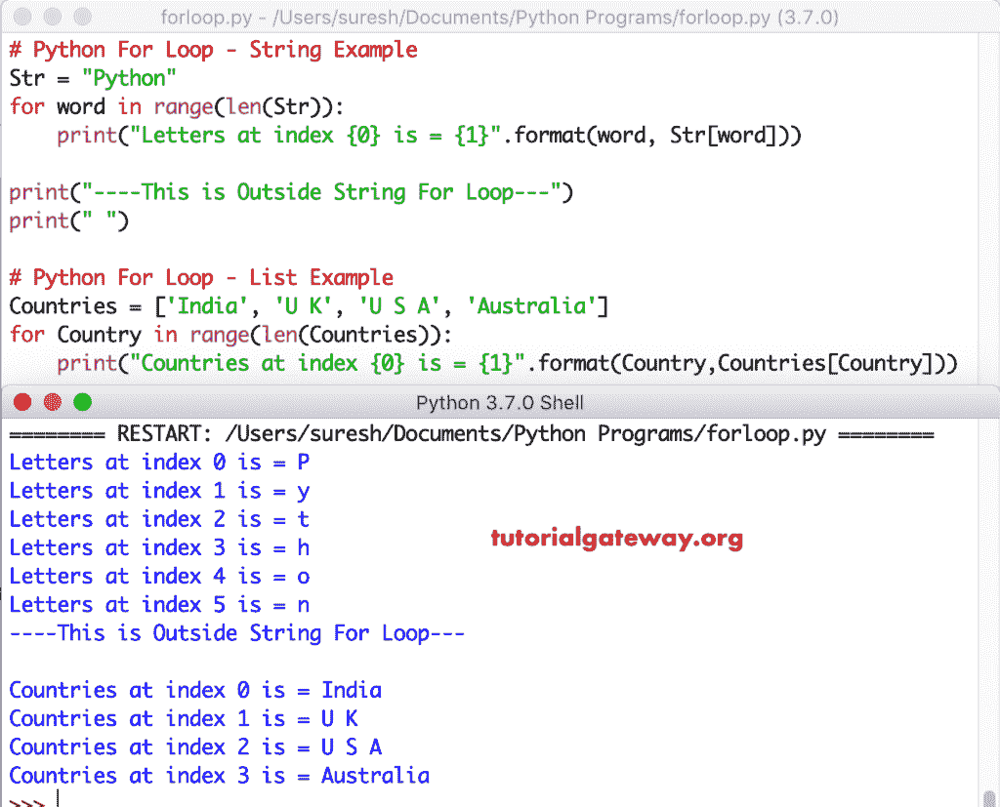

# Python For 循环

> 原文:[https://www.tutorialgateway.org/python-for-loop/](https://www.tutorialgateway.org/python-for-loop/)

Python For 循环用于重复一个语句块，直到对象中没有项目为止。对象可以是字符串、列表、元组或任何其他对象。让我们看看如何用实际例子编写 Python For Loop、range 和 else 部分。在我们进入细节之前，让我们看看 Python For 循环的语法:

## Python For 循环语法

Python For 循环的语法如下:

```
for item in Object:
     Statement 1
     Statement 2
     ………
     Statement n
```

如果您观察上面的 Python for 循环语法，对象可能是您想要迭代的任何东西。例如字符串或 Python 列表等等。

*   编译器从对象开始意味着，它将迭代对象，然后将第一个值赋给项。例如，我们的对象是一个字符串，值是教程，编译器将分配给项目
*   接下来，它将执行迭代器中的语句。
*   完成这些语句后，编译器将转到对象，并为该项分配下一个值
*   重复该过程，直到对象中没有项目。

## 用于循环流程图的 Python

Python For Loop



流程图

python 中 for 循环的执行过程是:

1.  初始化:我们在这里初始化变量。例 i=1。
2.  序列/对象中的项目:编译器将检查对象中的项目。例如，字符串中的单个字母。如果序列中有项目(真)，那么它将执行其中或内部的语句。如果序列中没有项目(假)，则它将退出。
3.  完成每次迭代后，编译器将遍历到下一项。
4.  它将再次按顺序检查新项目。只要项目按顺序排列，里面的语句就会被执行。

## Python For 循环示例

使用 Python for 循环从字符串中提取单个单词，并从 Python 列表中提取数据

```
Str = "TutorialGateway"
for word in Str: # First Loop
    print("Letters are: ", word)

print("----This is Outside String---")
print(" ")

# List Example
Countries = ['India', 'U K', 'U S A', 'Australia']
for Country in Countries: # Second one
    print("Countries are: ", Country)

print("---This is Outside List")
```

```
Letters are: T
Letters are: u
Letters are: t
Letters are: o
Letters are: r
Letters are: i
Letters are: a
Letters are: l
Letters are: G
Letters are: a
Letters are: t
Letters are: e
Letters are: w
Letters are: a
Letters are: y
----This is Outside String---

Countries are: India
Countries are: U K
Countries are: U S A
Countries are: Australia
---This is Outside List
```

首先，我们声明了一个名为 Str 的[字符串](https://www.tutorialgateway.org/python-string/)变量，并赋值为“TutorialGateway”

接下来，我们使用 Python for 循环遍历字符串中的一系列单个字符并显示它们。

然后我们在迭代器外使用了两个 print 语句。这些语句将在编译器从第一个块退出时执行。

```
print("----This is Outside String ---")
print(" ")
```

现在，编译器将进入列表示例(第二个)。首先，我们声明了国家列表并指定了以下值

```
Countries = ['India', 'U K', 'U S A', 'Australia']
```

接下来，我们使用 python for 循环遍历国家列表并显示各个列表项。

然后我们在代码块外使用 print 语句。一旦编译器从 second 退出，将执行该语句。

```
print("---This is Outside List")
```

它太大了，无法解释第一个。所以，我们将用迭代来解释第二个 [Python](https://www.tutorialgateway.org/python-tutorial/) 的例子。请使用相同的技巧来理解第一个例子

我们使用了第二个国家列表。

```
Countries = ['India', 'U K', 'U S A', 'Australia']
```

以迭代方式分析代码

第一次迭代，国家=印度。这意味着对象中有一些项目。因此，编译器将在其中执行打印语句

第二次迭代–国家=英国。这意味着对象中有一些项目。所以，编译器将执行国家名称。

第三次迭代–国家=美国。它会在里面打印出声明。

第四次迭代–国家=澳大利亚。它在内部执行语句。

第五次迭代:对象中没有为国家变量赋值的项目，所以编译器将退出。

## Python For 循环范围示例

Python For 循环范围函数的语法如下

```
for item in range(Start, End, Steps):
     Statement1
     Statement2
     ………
     StatementN
```

Python for 循环范围有三个参数:

*   开始:这是可选参数，如果忽略这个参数，python 范围函数将从 0 开始查找。
*   结束:范围参数将通知编译器范围结束位置。请记住，如果您指定 10 作为结束值，则 range 函数最多显示 9。
*   步骤:这是可选的参数，如果忽略这个参数，range 函数将把值增加 1。

### 带两个参数的 Python For 循环

这个 Python 范围程序将显示从 0 到 4 的数字序列。

```
for number in range(0, 5):
    print("Current Number: ", number)
```

```
Current Number: 0
Current Number: 1
Current Number: 2
Current Number: 3
Current Number: 4
```

第一次迭代–范围内的数字(0，5)

对于范围(0，5)中的 0–条件为真
打印语句将打印数字 0

第二次迭代-范围(0，5)中的 1–条件为真。打印语句将打印数字 1

第三次迭代-范围(0，5)中的 2–条件为真。所以，它打印 2

第四次迭代-范围(0，5)中的 3–条件为真。所以，它打印 3

第五次迭代-范围(0，5)中的 4–条件为真。所以，它打印 4

对于第六次迭代，范围(0，5)中的 5–条件为假。所以，程序将被终止。

### Python For 循环范围有三个参数

在这个例子中，我们在 python 中为循环范围使用了三个参数

```
for number in range(9, 14):
    print(number)
print("")

print("Second One")
for num in range(5, 18, 2):
    print(num)
```

具有三个参数输出的范围

```
9
10
11
12
13

Second One
5
7
9
11
13
15
17
```

在第一次练习中，我们从 9 点开始练习。第一个是显示从 9 到 13 的值。其中，在第二个示例中，我们使用步长值 2，因此第二个示例显示了从 5 到 18 的可选值。

### 在字符串和列表上使用 Python 进行循环范围

这个 python for loop range 程序将向您展示，如何在非整数上使用 range 函数。

```
Str = "Python"
for word in range(len(Str)):
    print("Letters at index {0} is = {1}".format(word, Str[word]))

print("----This is Outside String For Loop---")
print(" ")

# List Example
Countries = ['India', 'U K', 'U S A', 'Australia']
for Country in range(len(Countries)):
    print("Countries at index {0} is = {1}".format(Country,Countries[Country]))
```



在这个 Python for loop range 示例中，首先我们声明了字符串变量并赋值

在下一行中，我们使用了[范围功能](https://www.tutorialgateway.org/python-range-function/)。如果观察下面的代码，我们使用 python range 函数中的 [len 函数](https://www.tutorialgateway.org/python-len-function/)来计算字符串长度。这意味着，上述范围代码也可以写成

```
for word in range(len('Python')) 

for word in range(6): # Where 6 is the length of Str
```

所以，它从 0 开始迭代，到 5 结束

## Python For 循环 Else

Python 编程语言允许我们将 else 语句与 python For 循环语句一起使用，它的工作方式类似于 [Python If Else](https://www.tutorialgateway.org/python-if-else/) 语句。

*   如果序列中有项目，那么其中的语句将执行。
*   如果序列中没有项目，则将执行 Else 块中的语句。如果我们使用 [`break`语句](https://www.tutorialgateway.org/python-break/)来中断它，那么将不会执行 Else 块

### 否则语法

Python for 循环 Else 语句的语法如下所示:

```
for item in Object:
     Statement 1
     ………
     Statement n
else:
     Statements inside the else block
```

### Python For Loop Else 示例

这个 python for loop else 示例程序允许用户输入一个整数。如果用户输入的值低于 100，编译器将执行内部语句。否则，将执行 else 块中的 print 语句。

```
number = int(input(" Please Enter any integer below 100:  "))

for i in range(0, 100):
    if number == i:
        print(" User entered Value is within the Range (Below 100)")
        break
else:
    print(" User entered Value is Outside the Range (Above 100)")
```

```
Please Enter any integer below 100: 59
User entered Value is within the Range (Below 100
```

让我输入不同的值

```
Please Enter any integer below 100: 987
User entered Value is Outside the Range (Above 100)
```

在这个 Python for loop else 示例中，第一条语句将要求用户输入整数，并将用户输入的值存储在变量 number 中。在下一行中，我们使用带范围的 for 循环进行迭代

接下来我们使用 [`if`语句](https://www.tutorialgateway.org/python-if-statement/)来检查用户输入的值是否在范围内(意味着，数字< 100)。如果条件为真，则块代码将执行，并且[`break`语句](https://www.tutorialgateway.org/python-break/)将帮助退出。

如果用户输入的值不在范围内或不在范围内(意味着，数字> = 100)，则将执行 else 块打印语句(在 else 块内)