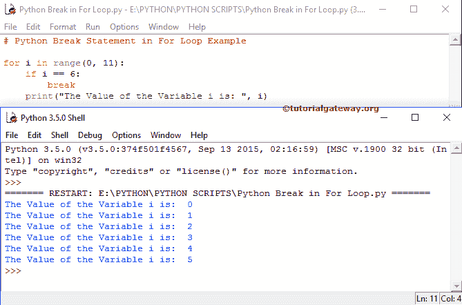

# Python `break`语句

> 原文:[https://www.tutorialgateway.org/python-break/](https://www.tutorialgateway.org/python-break/)

Python `break`语句是用来改变程序流程的重要语句。我们想分享两个例子来展示 Python`break`语句在`for`循环和`while`循环中的工作功能

循环用于执行特定代码块 n 次，直到测试条件为假。在某些情况下，我们没有执行所有语句就终止了循环。在这些情况下，我们可以使用 Python`break`语句。

## Python `break`语句

Python`break`语句在退出`for`循环、`while`循环和嵌套循环时非常有用。在执行这些代码块时，如果编译器发现其中有断点，编译器将停止执行其中的语句，并立即从迭代中退出。

例如，我们在循环中有 5 行代码，当某个条件为真时，我们想退出，否则，它必须执行它们。在这些情况下，我们可以将 Python`break`语句放在 If 条件中。

如果条件为真，则编译器将执行`break`语句。这意味着，这将使控制器完全退出循环。否则，它将执行所有代码块。

### Python 中断语法

Python `break`语句的语法如下:

```
break
```

### For 和`while`循环中的 Python `break`语句

在这个程序中，我们将使用`for`循环中的 Python`break`语句退出块迭代。

在`for`循环示例中的 Python`break`语句中，首先，我们使用了带 range()的`for`循环，这里不解释迭代方式的执行。

在`for`循环中，我们放置了 If 条件来测试 I 是否等于 6。如果条件为假，那么它将跳过这个，并使用打印功能打印该数字作为输出(在我们的例子中是 0、1、2、3、4、5)。

如果该条件(i == 6)为真，则将执行`break`语句，迭代将在该数字处停止，而不打印以下打印函数:

```
for i in range(0, 11):
    if i == 6:
        break
    print("The Value of the Variable i is: ", i)
```



在这个程序中，我们将在`while`循环中使用 Python`break`语句退出迭代。

在这个 Python break`while`循环示例中，我们在代码的开头将 I 的值初始化为:i = 0。在这个范围内，我们检查 I 是否小于或等于 10。

在`while`循环中，我们放置 [Python If 条件](https://www.tutorialgateway.org/python-if-statement/)来测试 I 是否等于 4。如果条件为假，它将跳过这种情况。接下来，它使用下面的打印功能打印该数字作为输出(在我们的例子中是 0、1、2、3)。

如果该条件(i == 4)为真，则 Break 执行，迭代将在该数字处停止，而不打印以下打印功能。

我们还使用[算术运算符](https://www.tutorialgateway.org/python-arithmetic-operators/) +运算符来增加 I 值(i = i +1)。如果你忘记了这一行，那么你将在无限循环中结束。请参考[继续](https://www.tutorialgateway.org/python-continue/)、[，而](https://www.tutorialgateway.org/python-for-loop/)在 [Python](https://www.tutorialgateway.org/python-tutorial/) 中。

```
i = 0
while i <= 10:
    print(" The Value of the Variable i =  ", i)
    i = i + 1
    if i == 4:
        break
```

```
The Value of the Variable i = 0
The Value of the Variable i = 1
The Value of the Variable i = 2
The Value of the Variable i = 3
```