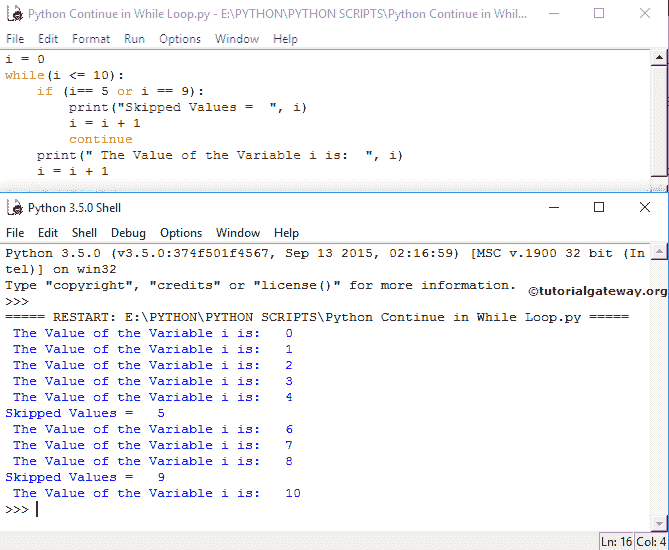

# Python 继续

> 原文：<https://www.tutorialgateway.org/python-continue/>

Python`continue`语句是另一个控制循环流的语句。这个 Python`continue`语句在 For 和`while`循环中使用。在执行这些 iterables 时，如果编译器在其中找到 python`continue`语句，那么编译器将停止当前迭代，并从头开始新的迭代。

例如，我们在循环中有 10 条语句。当某个条件为真时，我们希望跳过执行最后 5 个语句(statement6 — statement10)，否则它必须在一个循环中执行所有 10 个语句。在这些情况下，我们将条件放在第 5 个<sup>语句之后，然后是 Python`continue`语句。如果条件为真，那么它将停止执行语句 6 到 10，否则，它将执行语句 1 到 10。</sup>

## Python 继续语法

我们想分享两个例子来展示 Python`continue`语句在`for`循环和 While 中的工作功能。Python `continue`语句的语法是

```
continue
```

###`for`循环示例中的 Python `continue`语句

如何在`for`循环中使用 Python`continue`语句？。这个 Python for loop continue 程序允许用户输入任何整数值。接下来，它将显示整数值内的偶数和奇数。

在这个 python for loop continue 示例中，它将要求用户输入整数并存储在 number 中。在下一行中，我们使用了带有[范围](https://www.tutorialgateway.org/python-range-function/)的 [For Loop](https://www.tutorialgateway.org/python-for-loop/) 。请参考[中断代码](https://www.tutorialgateway.org/python-break/)了解 [Python](https://www.tutorialgateway.org/python-tutorial/) 中断在 For 和`while`循环中的实现。

在里面，我们放置了 [Python If 条件](https://www.tutorialgateway.org/python-if-statement/)来测试是否(i%2！= 0).如果该条件为真，则将执行`for`循环中的 python`continue`语句，迭代将在该数字处停止，而不打印另一个 print 语句:print(“偶数=，I”)。

为了更好地理解，我们在 If 中放置了一个打印消息。因此，每当迭代中断时，该值就会从这个打印函数中打印出来。

如果条件为假，它将跳过 continue，并使用下面的代码块输出该数字(在我们的例子中是偶数)。

```
number = int(input(" Please Enter any integer Value: "))
for i in range (1, number):
    if(i%2 != 0):
        print(" Odd Numbers = {0}(Skipped)".format(i))
        continue
    print(" Even numbers = ", i)
```

```
Please Enter any integer Value: 10
Odd Numbers = 1(Skipped)
Even numbers = 2
Odd Numbers = 3(Skipped)
Even numbers = 4
Odd Numbers = 5(Skipped)
Even numbers = 6
Odd Numbers = 7(Skipped)
Even numbers = 8
Odd Numbers = 9(Skipped)
```

### Python 在`while`循环示例中继续

在这个例子中，我们将通过例子向您展示如何在`while`循环中使用 Python`continue`语句。这个程序将从 1 迭代到 10，并打印每个数字直到 10。我们还使用 if 条件跳过一些数字。

```
i = 0
while(i <= 10):
    if (i== 5 or i == 9):
        print("Skipped Values =  ", i)
        i = i + 1
        continue
    print(" The Value of the Variable i is:  ", i)
    i = i + 1
```



在这个 Python while loop continue 程序示例中，首先，我们将 I 值初始化为 0，接下来，我们使用条件检查 I 值是否小于或等于 10。

在 [`while`循环](https://www.tutorialgateway.org/python-while-loop/)中，我们放置 Python If 来测试 I 是等于 5 还是 9。如果该条件为真，则继续执行。接下来，迭代将在该数字处停止，而不打印这一行代码:

为了更好地理解，我们在 If 条件中放置了以下打印功能。因此，每当迭代中断时，该值将被打印为输出。

如果条件为假，那么它将跳过 continue 并输出该数字(在我们的例子中是 0、1、2、3、4、6、7、8、10)

注:在本例中，我们还使用了[算术运算符](https://www.tutorialgateway.org/python-arithmetic-operators/) +运算符来增加 I 值(i = i + 1)。如果你忘记了这一行，那么你将在无限循环中结束。