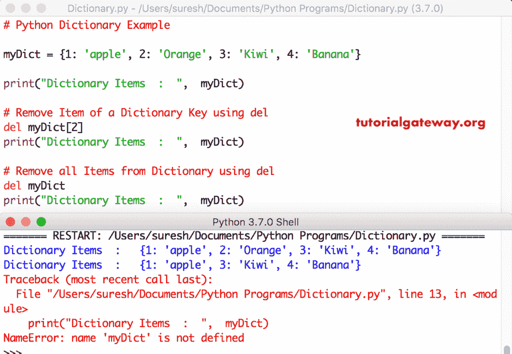
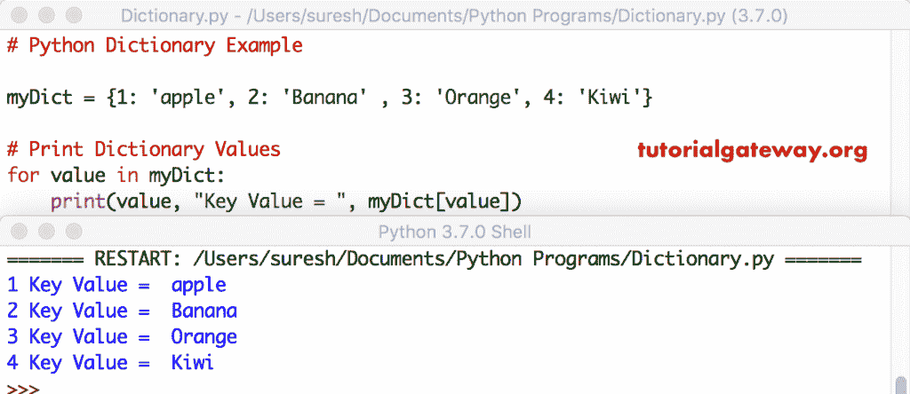

# Python 词典

> 原文：<https://www.tutorialgateway.org/python-dictionary/>

Python 字典是一个无序的、可变的和有索引的集合。与字符串不同，它是可变的。因此，Python 格言可以扩展或下沉。

## Python 字典语法

我们可以通过简单地放置空括号或者使用 dict()来声明 Python 字典。声明字典的语法

```
name = {
    <key>:<value>,
    <key>:<value>,
    .
    .
    .
    <key>:<value>
    }
```

或者可以使用 python dict 关键字创建一个 Dictionary。

```
name = dict([
    (<key>:<value>),
    .
    .
    .
    (<key>:<value>)
    ])
```

## 如何创建 Python 字典？

Python 编程中声明或创建字典的可用方法列表。

我们可以用花括号创建一个字典，所有的元素用逗号隔开。

```
# Empty
a = {}
a = dict()

# Integer
b = {1: 'apple', 2: 'Orange', 3: 'Kiwi'}

# String
c = {'fruit': 'apple', 'name': 'Kevin'}

d = {'name': 'TutorialGateway', 'age': 25}
e = {'name': 'TutorialGateway', 1: 22}
f = {'name': 'TutorialGateway', 1: [1, 2, 3]}

# For Sequence of Key-Value Pairs
g = dict([(1, 'apple'), (2, 'Orange'), (3, 'Kiwi')])

h = dict({1: 'apple', 2: 'Orange', 3: 'Kiwi'})
```

## 如何访问 Python 字典项目？

尽管字典是一个无序的集合，但是我们可以使用它们的键来访问这些值。这可以通过将键放在方括号中或使用`get()`函数来完成。如果我们访问不存在的函数，Python 会得到一个不返回任何值的函数。而将键放在方括号内会引发错误

Dname[key]或 Dname.get(key)

```
# Access Items Example

a = {'name': 'Kevin', 'age': 25, 'job': 'Developer'}

# Print 
print(a)

print("\nName :  ",  a['name'])
print("Age  :  ",  a['age'])
print("Job  :  ",  a['job'])

# using get()
print("\nItems - Name  :  ",  a.get('name'))
print("Items - Age   :  ",  a.get('age'))
print("Items - Job   :  ",  a.get('job'))
```

```
{'name': 'Kevin', 'age': 25, 'job': 'Developer'}

Name : Kevin
Age : 25
Job : Developer

Items - Name : Kevin
Items - Age : 25
Items - Job : Developer
```

## 插入和更新 Python 字典项目

请记住，dicts 是可变的，因此您可以在任何时间点插入或更新任何元素。使用以下语法插入或更新值。

DName[key] =值

如果存在密钥，它将更新该值。如果 DName 没有密钥，那么它会插入一个带有给定密钥的新密钥。

```
da = {'name': 'Kevin', 'age': 25}

# Print Elements
print("Items  :  ",  da)

# Add an Item
da['job'] = 'Programmer'
print("\nItems  :  ",  da)

# Update an Item
dat['name'] = 'Python'
print("\nItems  :  ",  da)
```

```
Items : {'name': 'Kevin', 'age': 25}
Items : {'name': 'Kevin', 'age': 25, 'job': 'Programmer'}
Items : {'name': 'Python', 'age': 25, 'job': 'Programmer'}
```

### 如何复制字典项目？

[复制](https://www.tutorialgateway.org/python-dictionary-copy-function/)功能将给定的字典浅层复制到一个全新的字典中。你也可以把它放在[列表](https://www.tutorialgateway.org/python-list/)中。

```
fruits = {'a': 'apple', 'o': 'Orange', 'm': 'Mango', 'k':'Kiwi'}

print(fruits)
print("Length: ", len(fruits))

new_fruits = fruits.copy()
print("\n", new_fruits)
print("Length: ", len(new_fruits))
```

```
{'a': 'apple', 'o': 'Orange', 'm': 'Mango', 'k': 'Kiwi'}
Length: 4

{'a': 'apple', 'o': 'Orange', 'm': 'Mango', 'k': 'Kiwi'}
Length: 4
```

## 删除 Python 字典项目

有几种方法可以删除元素。[弹出](https://www.tutorialgateway.org/python-dictionary-pop-function/)方法删除给定键的值，并打印删除的项目。 [Python](https://www.tutorialgateway.org/python-tutorial/) popitem 移除最后插入的项目(键、值对)。

```
db = {1: 'apple', 2: 'Orange', 3: 'Kiwi', 4: 'Banana'}

# Remove and Prints Item using pop()
print("Removed Item      :  ",  db.pop(3))
print("Remaining Items  :  ",  db)

# Remove and Prints Item using popitem()
print("\nRemoved Item      :  ",  db.popitem())
print("Remaining Items  :  ",  db)
```

```
Removed Item : Kiwi
Remaining Items : {1: 'apple', 2: 'Orange', 4: 'Banana'}

Removed Item : (4, 'Banana')
Remaining Items : {1: 'apple', 2: 'Orange'}
```

del 语句删除指定键处的 Python 字典项或值。如果我们没有提供密钥，它会完全删除或移除。这里，最后一个语句是引发错误。



clear 语句移除或清除项目并返回大括号。

```
dc = {1: 'apple', 2: 'Banana' , 3: 'Orange', 4: 'Kiwi'}
print("Items  :  ",  dc)

# Remove all Items using clear()
dc.clear()
print("Items  :  ",  dc)
```

```
Items  :   {1: 'apple', 2: 'Banana', 3: 'Orange', 4: 'Kiwi'}
Items  :   {}
```

## Python 字典迭代项

`for`循环是遍历或迭代 python 字典元素的最常见方式。

### 对于循环打印键

`for`循环帮助我们迭代和打印键。

```
dd = {1: 'apple', 2: 'Banana' , 3: 'Orange', 4: 'Kiwi'}

for val in dd:
    print(val)
```

```
1
2
3
4
```

### 对于循环打印值

`for`循环迭代并打印其中的值。

```
de = {1: 'apple', 2: 'Banana' , 3: 'Orange', 4: 'Kiwi'}

for val in de:
    print(de[val])
```

```
apple
Banana
Orange
Kiwi
```

本示例打印键和值



`values()`函数有助于打印项目。在`for`循环中使用它来返回值。

```
df = {1: 'apple', 2: 'Banana' , 3: 'Orange', 4: 'Kiwi'}

for i in df.values():
    print(i)
```

```
apple
Banana
Orange
Kiwi
```

### 项目功能

您可以使用`for`循环中的 Python 字典项函数来打印或返回键和值。`items()`函数对于访问单个项目非常有用。

```
dg = {1: 'apple', 2: 'Banana' , 3: 'Orange', 4: 'Kiwi'}

for i, j in dg.items():
    print(i, j)
```

```
1 apple
2 Banana
3 Orange
4 Kiwi
```

## Python 字典方法

它提供以下内置函数或方法

*   [清除()](https://www.tutorialgateway.org/python-dictionary-clear-function/)移除所有元素。
*   [抄()](https://www.tutorialgateway.org/python-dictionary-copy-function/)浅抄。
*   [fromkeys()](https://www.tutorialgateway.org/python-dictionary-fromkeys/) 返回一个新的，其中键从一个序列开始，等于值。
*   [获取给定键的()](https://www.tutorialgateway.org/python-dictionary-get-function/)值。
*   [items()](https://www.tutorialgateway.org/python-dictionary-items/) 返回包含项目(键值对)的列表
*   [键()](https://www.tutorialgateway.org/python-dictionary-keys-function/)打印键列表。
*   [pop()](https://www.tutorialgateway.org/python-dictionary-pop-function/) 移除并打印给定按键的项目。用于删除密钥。
*   [popitem()](https://www.tutorialgateway.org/python-dictionary-popitem/) 删除并打印最后插入的键值对。
*   [set default()](https://www.tutorialgateway.org/python-dictionary-setdefault/)–如果给定的键存在，它将返回其值。如果没有，这个函数插入一个给定值的键并打印出来。
*   [更新()](https://www.tutorialgateway.org/python-dictionary-update/)更新键值对。
*   [值()](https://www.tutorialgateway.org/python-dictionary-values/)返回所有值的列表。

## 常见的 Python 字典方法

可以在列表、字典、元组中使用的常用方法。以下示例有助于您理解这些常见方法。

Dictionary`len()`函数查找所有可用项目的总和。求和函数求所有元素的和。

```
da = {1: 10, 2: 20, 3: 30, 4: 40, 5: 50}
print(da)

length = len(da)
print("The Length: ", length)
print()

db = {'name': 'Kevin', 'age': 25}
print(db)
print("The Length: ", len(db))

total = sum(da.values())
print("\nThe sum of Values: ", total)

key_total = sum(da.keys())
print("The sum of Keys: ", key_total)
```

```
{1: 10, 2: 20, 3: 30, 4: 40, 5: 50}
The Length: 5

{'name': 'Kevin', 'age': 25}
The Length: 2

The sum of Values: 150
The sum of Keys: 15
```

Python dict`min()`函数求最小值。`max()`函数查找最大元素。

```
da = {3: 30, 4: 40, 1: 120, 2: 20, 5: 50}
print(da)

min_value = min(da.values())
print("\nThe Minimum Val: ", min_value)

min_key = min(da.keys())
print("The Minimum Ky: ", min_key)

max_value = max(da.values())
print("\nThe Maximum Val: ", max_value)

max_key = max(da.keys())
print("The Maximum Ky: ", max_key)
```

```
{3: 30, 4: 40, 1: 120, 2: 20, 5: 50}

The Minimum Val: 20
The Minimum Ky: 1

The Maximum Val: 120
The Maximum Ky: 5
```