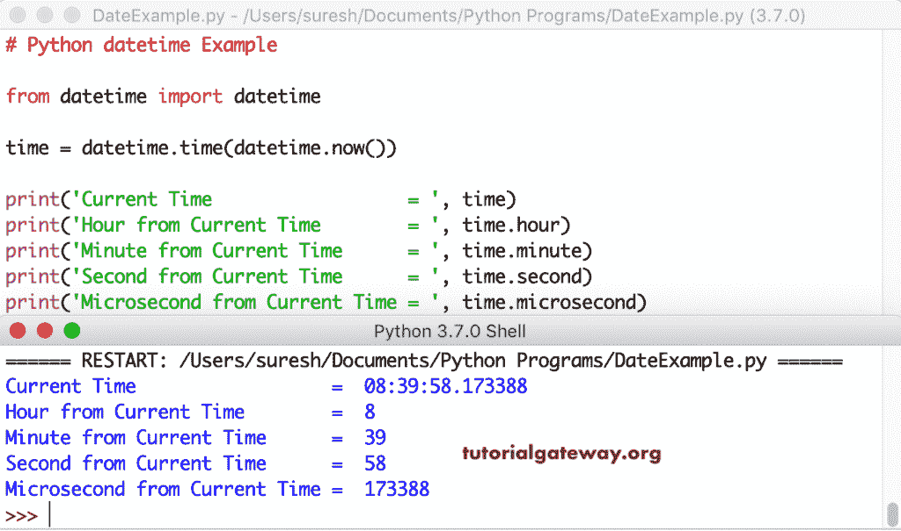

# Python datetime

> 原文：<https://www.tutorialgateway.org/python-datetime/>

与其他编程语言不同，Python 不允许我们直接使用日期对象。要在 python 中使用日期和时间对象，必须导入 datetime 模块。

这个 Python datetime 模块包含不同的类来处理日期或者操作日期和时间，格式化它们，timedelta，strptime，strftime 类和实际的例子。

```
import datetime 
```

这个 Python 日期时间的语法是

```
datetime.datetime(Year_Number, Month_Number, Day_Number, Hours, Minutes, Seconds)
```

## Python 日期时间示例

让我向您展示 Python 日期时间模块中可用方法的列表。为此，您必须使用 Python 日期时间作为`dir()`函数参数。

```
import datetime

print(dir(datetime))
```

Python 日期时间模块中可用方法的列表。

```
['MAXYEAR', 'MINYEAR', '__all__', '__builtins__', '__cached__', '__doc__', 
'__file__', '__loader__', '__name__', '__package__', '__spec__', 'date',  
'sys', 'time', 'timedelta', 'timezone', 'tzinfo']
```

MAXYEAR 返回 Python datetime 模块支持的最大(最高)年份，即 9999。MINYEAR 返回允许的最小年份，即 1。

```
print('Maximum Year  = ', datetime.MAXYEAR)
print('Minimum Year  = ', datetime.MINYEAR) 
```

```
Maximum Year  =  9999
Minimum Year  =  1
```

### Python 日期时间类

这个类有年、月和日的属性。这里，第一个[打印语句](https://www.tutorialgateway.org/python-print-function/)从当前日期提取并返回年份。接下来的两个打印语句返回月号和日。

```
import datetime

today = datetime.date.today()

print('Today\'s Date = ', today)
print('Year     = ', today.year)
print('Month = ', today.month)
print('Day     = ', today.day)
```

```
Today's Date =  2021-05-03
Year  =  2021
Month =  5
Day   =  3
```

### Python 日期时间现在和现在

[Python](https://www.tutorialgateway.org/python-tutorial/) datetime 模块现在有函数，它还有`today()`函数，返回当前日期和时间。

```
import datetime as sydt

dt = sydt.datetime.now()
print(dt)

print('Today\'s Dt = ', dt)

print()
dt = sydt.date.today()

print('\nToday\'s Dt = ', dt)
```

```
2021-05-03 16:03:25.186286
Today's Dt =  2021-05-03 16:03:25.186286

Today's Dt =  2021-05-03
```

### Python 日期时间类属性

到目前为止，我们使用的是导入日期时间，这就是我们两次使用关键字和 method_name 的原因。但是，如果我们使用下面的 from import 技术，我们可以去掉这些额外的东西。

本示例显示 Python 日期时间类中所有可用属性的列表。它们是年、月、月、日、小时、分钟、秒、微秒和工作日。

我们还展示了 Python datetime 中的可用函数，用于从当前提取和返回日期和时间。

```
from datetime import datetime

dt = datetime.now()

print('Date           = ', dt)
print('Short Date = ', dt.date())
print('Year           = ', dt.year)
print('Month          = ', dt.month)
print('Day            = ', dt.day)
print('Time           = ', dt.time())
print('Hour           = ', dt.hour)
print('Minute         = ', dt.minute)
print('Second         = ', dt.second)
print('Microsecond    = ', dt.microsecond)
print('Weekday Number = ', dt.weekday())
```

```
Date =  2021-05-03 16:00:39.908339
Short Date     = 2021-05-03
Year           =  2021
Month          =  5
Day            =  3
Time           =  16:00:39.908339
Hour           =  16
Minute         =  0
Second         =  39
Microsecond    =  908339
Weekday Number =  0
```

Python 日期时间模块具有用于工作或操作时间值的时间类。这里，我们使用 time 类从当前日期和时间开始编写时间。接下来，我们使用 print 语句使用可用的属性小时、分钟、秒和微秒返回时间部分。

```

time = datetime.time(datetime.now())

print('Current Time                  = ', time)
print('Hour from Current Time        = ', time.hour)
print('Minute from Current Time      = ', time.minute)
print('Second from Current Time      = ', time.second)
print('Microsecond from Current Time = ', time.microsecond)
```



### Python 等值格式

Python datetime 类具有相同的格式，它以 ISO 8601 格式(YYYY-MM-DD)返回日期的字符串表示形式

```
from datetime import datetime as sydt

print(sydt.now())
print(sydt.now().isoformat())
```

```
2021-05-03 16:05:47.074065
2021-05-03T16:05:47.103824
```

在我们前面的例子中，我们使用现在或今天使用当前 dt。但是，您可以使用日期函数来创建自定义日期。在这里，我们使用它并以 iso 格式返回。

```
from datetime import date

dt = date(2018, 1, 31)
print(dt)
print(dt.isoformat())
```

```
2018-01-31
2018-01-31
```

### 使用 Python 日期时间模块创建日期和时间

这里，我们使用`datetime()`函数来创建自定义日期，它接受年、月、日、小时、分钟、秒和微秒。第一条语句创建一个时间为零或不为零的自定义 dt。第四个创建 dt，第五个也返回微秒。

```
from datetime import datetime as sydt

dt1 = sydt(2017, 12, 31)
print(dt1)

dt4 = sydt(2014, 12, 31, 22, 33, 44)
print(dt4)

dt5 = sydt(2016, 12, 31, 22, 33, 44, 123456)
print(dt5)
```

```
2017-12-31 00:00:00
2014-12-31 22:33:44
2016-12-31 22:33:44.123456
```

### Python 时间戳函数

Python 时间戳函数返回 POSIX 时间戳。方法从给定的时间戳返回世界协调时。这里，我们使用这两个函数来返回当前时间戳和世界协调时。

```
from datetime import datetime as sydt

print("--- timestamp Result---") 
dt = sydt.now()
print(dt)
print(dt.timestamp())

print("\n---utcfromtimestamp Result---")
tm_stamp = sydt.utcfromtimestamp(123456789)
print(tm_stamp)

tm_stamp2 = sydt.utcfromtimestamp(482056789)
print(tm_stamp2)

tm_stamp3 = sydt.utcfromtimestamp(19023456789)
print(tm_stamp3)

tm_stamp4 = sydt.utcfromtimestamp(12761456789)
print(tm_stamp4)
```

```
--- timestamp Result---
2021-05-03 17:39:20.605253
1620043760.605253

---utcfromtimestamp Result---
1985-04-11 08:39:49
2572-10-29 21:33:09
2374-05-25 01:06:29
```

### Python 日期时间替换

Python 替换函数用新值替换日期和时间部分。这种替换的语法是

```
repalce(year = self.year, month = self.month, day = self.day, hour = self.hour, minute = self.minute, second = self.second, microsecond = self.microsecond, tzinfo = self.tzinfo)
```

我们替换了小时、分钟、秒和微秒。

```
from datetime import datetime

dt = datetime.now()
print(dt)

date_replace = dt.replace(hour = 2)
print(date_replace)

date_replace2 = dt.replace(minute = 59)
print(date_replace2)

date_replace3 = dt.replace(second = 4)
print(date_replace3)

date_replace4 = dt.replace(microsecond = 7)
print(date_replace4)
```

```
2021-05-03 17:38:03.697423
2021-05-03 02:38:03.697423
2021-05-03 17:59:03.697423
2021-05-03 17:38:04.697423
2021-05-03 17:38:03.000007
```

以下是该类中所有其他可用属性和函数的列表。

```
from datetime import datetime

dt = datetime.now()
print('Date and Time   = ', dt)

print('Replace         = ', dt.replace(hour = 2))
print('Tzinfo          = ', dt.tzinfo)
print('Tzname          = ', dt.tzname())

print('Timetz          = ', dt.timetz())
print('Timestamp       = ', dt.timestamp())
print('Time            = ', dt.ctime())
print('isoweekday      = ', dt.isoweekday())

print('astimezone      = ', dt.astimezone())
print('utcoffset       = ', dt.utcoffset())
print('Daylight Saving = ', dt.dst())
```

```
Date and Time   =  2021-05-03 17:37:16.992139
Replace         =  2021-05-03 02:37:16.992139
Tzinfo          =  None
Tzname          =  None
Timetz          =  17:37:16.992139
Timestamp       =  1620043636.992139
Time            =  Mon May  3 17:37:16 2021
isoweekday      =  1
astimezone      =  2021-05-03 17:37:16.992139+05:30
utcoffset       =  None
Daylight Saving =  None
```

### Python 日期时间组合

`combine()`函数通过组合给定的日期值和时间返回一个新的对象。这个 Python 组合的语法是

```
combine(date, time, tzinfo = self.tzinfo)
```

首先，我们声明了自定义日期和自定义时间。接下来，我们使用 Python 组合函数来组合这些对象并返回日期和时间。由此，我们使用可用的属性返回 dt 零件。

在这个例子中，我们使用时间函数而不提供第二个的值。接下来，我们使用组合 dt 的组合函数。

```
import datetime as syt

dt = syt.date(2018, 12, 31)

tm = syt.time(23, 59, 58)

tm2 = syt.time(23, 0)

combine_dt = syt.datetime.combine(dt, tm)
combine_dt2 = syt.datetime.combine(dt, tm2)

print('Date           = ', dt)
print('Time           = ', tm)
print('Time2          = ', tm2)
print('Date and Time  = ', combine_dt)
print('Date and Time2 = ', combine_dt2)

print('Year           = ', combine_dt.year)
print('Month          = ', combine_dt.month)
print('Day            = ', combine_dt.day)
print('Hour           = ', combine_dt.hour)
print('Minute         = ', combine_dt.minute)
print('Second         = ', combine_dt.second)
print('Microsecond    = ', combine_dt.microsecond)
```

```
Date           =  2018-12-31
Time           =  23:59:58
Time2          =  23:00:00
Date and Time  =  2018-12-31 23:59:58
Date and Time2 =  2018-12-31 23:00:00
Year           =  2018
Month          =  12
Day            =  31
Hour           =  23
Minute         =  59
Second         =  58
Microsecond    =  0
```

## Python 日期时间日期类

datetime 模块具有用于操作或工作的日期类。它有三个重要的属性。

*   min:返回最早或最小的可表示日期。
*   最大值:最晚或最大可表示日期。
*   分辨率:连续日期之间的最小可能差异。

### Python 日期类属性

我们使用 Python today 方法返回当前日期，然后使用这三个属性。

这个例子显示了 python 中可用的日期属性列表。这里，year 属性返回从当前日期开始的年份，月=月号，日=月中的某一天，工作日=工作日

```
from datetime import date

dt = date.today()

print('Today\'s Date  = ', dt)
print('Year           = ', dt.year)
print('Month          = ', dt.month)
print('Day            = ', dt.day)
print('Weekday Number = ', dt.weekday())
print('\nMinimum          = ', date.min)
print('Maximum         = ', date.max)
print('Resolution       = ', date.resolution)
```

```
Today's Date   =  2021-05-03
Year           =  2021
Month          =  5
Day            =  3
Weekday Number =  0

Minimum        =  0001-01-01
Maximum        =  9999-12-31
Resolution     =  1 day, 0:00:00
```

它还具有日期功能，可以根据年、月和月中的某一天创建自定义日期。Python`fromtimestamp()`函数接受 POSIX 时间戳值作为参数，并从中返回日期。

```
from datetime import date

dt = date(2018, 1, 31)
print(dt)

print("\n---fromtimestamp Result ---") 

tm_stamp = date.fromtimestamp(123456789)
print(tm_stamp)

tm_stamp2 = date.fromtimestamp(412056789)
print(tm_stamp2)

tm_stamp3 = date.fromtimestamp(9123456789)
print(tm_stamp3)

tm_stamp4 = date.fromtimestamp(8761456789)
print(tm_stamp4)
```

```
2018-01-31

---fromtimestamp Result ---
1973-11-30
1983-01-22
2259-02-10
2247-08-22
```

## 时间等级

Python datetime 模块有时间类，它帮助我们处理时间并操纵它们。它有以下 3 个重要属性。

*   min:返回最早或最小可表示时间。
*   最大值:最晚或最大可表示时间。
*   分辨率:最小可能的时间差。

第一条语句使用 Python 时间方法返回 00:00:00。在第二个语句中，我们使用函数来构造或创建一个 10 小时 22 分 33 秒的时间。接下来，我们使用这些重要属性。

```
from datetime import time

tt = time()
print(tt)
print()

tt2 = time(10, 22, 33)
print(tt2)

print('\nMinimum         = ', time.min)
print('Maximum        = ', time.max)
print('Resolution       = ', time.resolution)
```

```
00:00:00

0:22:33

Minimum         =  00:00:00
Maximum         =  23:59:59.999999
Resolution      =  0:00:00.000001
```

### 用 Python 创建时间

这个 Python 时间示例是上面的扩展。这里，我们还使用了微秒和参数名。

```
from datetime import datetime, time

tme = datetime.time(datetime.now())
print('Current Time          = ', tme)

tt = time()
print(tt)

tt1 = time(10, 22, 45)
print(tt1)

tt2 = time(11, 34, 49, 890765)
print(tt2)

tt3 = time(hour = 17, minute = 11, second = 33)
print(tt3)

tt4 = time(hour = 17, minute = 22, second = 55, microsecond = 223344)
print(tt4)
```

```
16:12:24.490551
00:00:00
10:22:45
11:34:49.890765
17:11:33
17:22:55.223344
```

### Python 时间属性

这个例子显示了 python 中可用时间属性的列表。在这里，小时属性返回给定的小时、分钟、秒和微秒

```
from datetime import time

tt = time(10, 50, 33)
print('Time  = ', tt)

print('Hours        = ', tt.hour)
print('Minutes      = ', tt.minute)
print('Seconds      = ', tt.second)
print('Microseconds = ', tt.microsecond)
```

```
Time         =  10:50:33
Hours        =  10
Minutes      =  50
Seconds      =  33
Microseconds =  0
```

### Python datetime timedelta， strftime and strptime

timedelta 对象预测或返回过去和未来的日期。在本例中，我们将返回一年后和两年前的日期和时间。参见[时间增量](https://www.tutorialgateway.org/python-timedelta/)。

strftime 方法以指定的格式格式化日期，并以字符串形式返回相同的日期。这里，%Y-%m-%d '表示年-月-日(2019-01-31)。参见[时间](https://www.tutorialgateway.org/python-strftime/)。

str time 将日期的字符串表示形式转换为常规日期和时间，字符串转换为 dt。在这里，str time(dt _ str，' %d %B %Y ')表示字符串 dat 以 Day Month_Name Year 格式传递。参见[str time](https://www.tutorialgateway.org/python-strptime/)。

```
from datetime import datetime, timedelta

dt = datetime.now()

print('Dt         = ', dt)

future_dt = dt + timedelta(days = 365)
print('Future = ', future_dt)

past_dt = dt - timedelta(days = 730)
print('Past    = ', past_dt)

print("\n-----strftime Results----")
dt2 = dt.strftime('%Y-%m-%d')
print(dt2)

dt3 = dt.strftime('%Y/%m/%d %H:%M:%S %p')
print(dt3)

dt4 = dt.strftime('%B %d, %Y %I-%M-%S %p')
print(dt4)

print("\n-----strptime Results----")
dt_str = '31 December 2017'
dt_value = dt.strptime(dt_str, '%d %B %Y')
print(dt_value)

dt_str2 = '15/8/17 22:33:55'
dt_value2 = dt.strptime(dt_str2, '%d/%m/%y %H:%M:%S')
print(dt_value2)
```

```
Dt      =  2021-05-03 16:10:47.540318
Future  =  2022-05-03 16:10:47.540318
Past    =  2019-05-04 16:10:47.540318

-----strftime Results----
2021-05-03
2021/05/03 16:10:47 PM
May 03, 2021 04-10-47 PM

-----strptime Results----
2017-12-31 00:00:00
2017-08-15 22:33:55
```