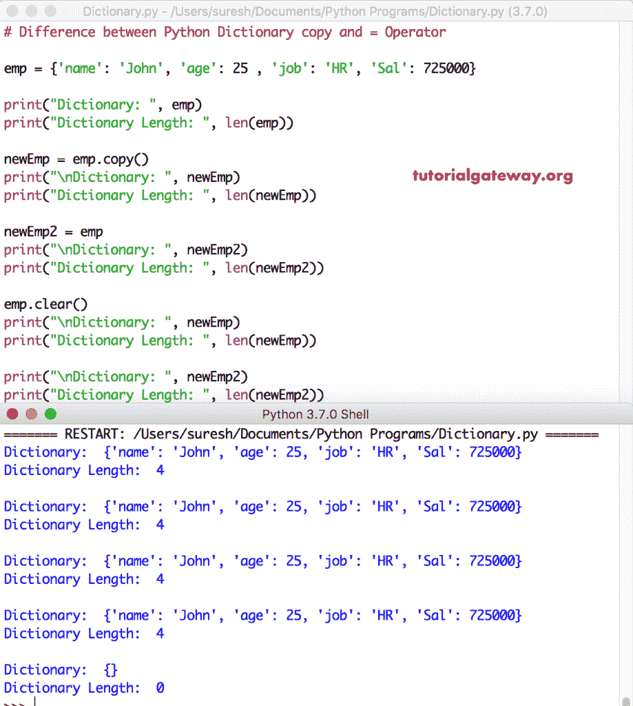

# Python 字典副本和=运算符之间的区别

> 原文:[https://www . tutorialgateway . org/区别-python-dictionary-copy-and-operator/](https://www.tutorialgateway.org/difference-between-python-dictionary-copy-and-operator/)

在本节中，我们将通过实例讨论 Python 字典副本和=运算符之间的区别。Python 字典副本将字典条目浅拷贝到一个全新的字典中。反之=运算符创建现有字典的一个实例。

## Python 字典副本和=运算符的区别示例 1

在本例中，我们展示了如何使用这两个选项将字典项复制到新的字典中。如您所见，它们和 Python 代码给出了相同的结果。

```
# Difference between Python Dictionary copy and = Operator

emp = {'name': 'John', 'age': 25 , 'job': 'HR', 'Sal': 725000}

print("Dictionary: ", emp)
print("Dictionary Length: ", len(emp))

newEmp = emp.copy()
print("\nDictionary: ", newEmp)
print("Dictionary Length: ", len(newEmp))

newEmp2 = emp
print("\nDictionary: ", newEmp2)
print("Dictionary Length: ", len(newEmp2))
```

字典副本 vs =等于运算符输出

```
Dictionary:  {'name': 'John', 'age': 25, 'job': 'HR', 'Sal': 725000}
Dictionary Length:  4

Dictionary:  {'name': 'John', 'age': 25, 'job': 'HR', 'Sal': 725000}
Dictionary Length:  4

Dictionary:  {'name': 'John', 'age': 25, 'job': 'HR', 'Sal': 725000}
Dictionary Length:  4
```

### 区分字典副本和=运算符示例 2

在本程序中，我们使用[字典清除](https://www.tutorialgateway.org/python-dictionary-clear-function/)功能从[字典](https://www.tutorialgateway.org/python-dictionary/)中删除项目。如果你仔细观察，当我们从 emp 中移除物品时，newEmp2 也返回了一个空集合。

```
# Difference between Python Dictionary copy and = Operator

emp = {'name': 'John', 'age': 25 , 'job': 'HR', 'Sal': 725000}

print("Dictionary: ", emp)
print("Dictionary Length: ", len(emp))

newEmp = emp.copy()
print("\nDictionary: ", newEmp)
print("Dictionary Length: ", len(newEmp))

newEmp2 = emp
print("\nDictionary: ", newEmp2)
print("Dictionary Length: ", len(newEmp2))

emp.clear()
print("\nDictionary: ", newEmp)
print("Dictionary Length: ", len(newEmp))

print("\nDictionary: ", newEmp2)
print("Dictionary Length: ", len(newEmp2))
```

