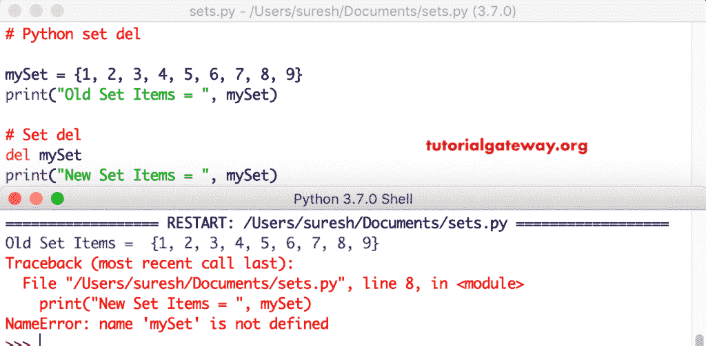

# Python 集合

> 原文：<https://www.tutorialgateway.org/python-set/>

Python 集合数据类型类似于列表。但是，它不接受重复项目(唯一值)。Python 集合是零个或多个项目的无序集合，这些项目没有索引(没有索引位置)。

Python Sets 允许可变项目，因此添加和移除项目非常容易。但是，切片是不可能的，因为没有索引。通常，Python 集对于执行数学运算非常有用，如并集、交集、比较和差异。

## Python 集声明

Python 集合是通过将必需的项目放在花括号中或者使用 set()函数而不使用任何参数来创建的。它允许您放置不同类型的数据类型项，如整数、字符串等。，在一个单一的。以下是在 Python 中声明集合的可用方法列表。

```py
# Declaration

# Empty
s1 = {}
s2 = set()

# With Integer Keys
s3 = {1, 2, 3, 4, 5}

# with String Keys
s4 = {'apple', 'kiwi', 'banana', 'orange'}

# with Mixed Data Types
s5 = {1, 2, 1.5, 2.5, 'apple'}
s6 = {'banana', 1, 2, (1, 2, 3)}

# Using ()
s7 = set([1, 2, 3, 4, 5])
s8 = set((1, 2, 3, 4, 5, 6, 7))

# Example 2
s9 = (['apple', 'kiwi', 'banana', 'orange'])
s10 = (('apple', 'kiwi', 'banana', 'orange'))
```

## Python 集示例

让我申报几个并打印出来。这有助于理解这个概念。

```py
# Declaration

# Empty 
s1 = {}
s2 = set()

# with Integer Keys
s3 = {1, 2, 3, 4, 5}

# with String Keys
s4 = {'apple', 'kiwi', 'banana', 'orange'}

print(s1)
print(s2)
print(s3)
print(s4)
```

```py
{}
set()
{1, 2, 3, 4, 5}
{'apple', 'kiwi', 'orange', 'banana'}
```

### Python 混合集示例

我们可以用多种数据类型创建这个。在这个例子中，我们用混合数据类型来声明它。接下来，我们使用()来声明。

```py
# Mixed Data Types
mySet1 = {1, 2, 1.5, 2.5, 'apple'}
mySet2 = {'banana', 1, 2, (1, 2, 3)}

print(mySet1)
print(mySet2)

mySet3 = set([1, 2, 3, 4, 5])
mySet4 = set((1, 2, 3, 4, 5, 6, 7))

print(mySet3)
print(mySet4)

mySet5 = (['apple', 'kiwi', 'banana', 'orange'])
mySet6 = (('apple', 'kiwi', 'banana', 'orange'))

print(mySet5)
print(mySet6)
```

```py
{1, 2, 2.5, 1.5, 'apple'}
{1, 2, (1, 2, 3), 'banana'}
{1, 2, 3, 4, 5}
{1, 2, 3, 4, 5, 6, 7}
['apple', 'kiwi', 'banana', 'orange']
('apple', 'kiwi', 'banana', 'orange')
```

### {} vs set()

这个例子展示了{}和 set()在声明时的区别。

```py
# {} Vs set()
mySet = {'TutorialGateway'}
mySet1 = set('TutorialGateway')

print(mySet)
print(mySet1)

mySet2 = {123456}
mySet3 = set('123456')

print(mySet2)
print(mySet3)
```

```py
{'TutorialGateway'}
{'o', 'y', 'e', 't', 'u', 'G', 'l', 'T', 'a', 'r', 'i', 'w'}
{123456}
{'3', '1', '4', '6', '2', '5'}
```

### 将列表转换为集合

通过在列表前后添加花括号，可以转换[列表](https://www.tutorialgateway.org/python-list/)。

```py
mySet = [1, 2, 3]

print(mySet)
print({mySet})
```

```py
[1, 2, 3]
Traceback (most recent call last):
  File "/Users/suresh/Desktop/simple.py", line 4, in <module>
    print({mySet})
TypeError: unhashable type: 'list'
```

### 将字典转换为集合

如果你用上面的技巧转换一个[字典](https://www.tutorialgateway.org/python-dictionary/)，那么它会抛出一个错误。

```py
mySet1 = {'a':1, 'b':2, 'c':3}

print(mySet1)
print({mySet1})
```

```py
{'a': 1, 'b': 2, 'c': 3}
Traceback (most recent call last):
  File "/Users/suresh/Desktop/simple.py", line 4, in <module>
    print({mySet1})
TypeError: unhashable type: 'dict'
```

## 插入项目

以下选项可用于将新项目插入现有项目。

1.  [添加(x)](https://www.tutorialgateway.org/python-set-add/) :在 [Python](https://www.tutorialgateway.org/python-tutorial/) 中的现有项目上添加一个项目。
2.  update():向现有项目添加多个项目。

更新方法帮助我们添加多个元素。在这里，我们添加多个项目。请记住，如果在 update 方法中使用重复值，python 会忽略它们。

```py
mySet = {1, 2, 4, 5}
print("Old Items = ", mySet)

mySet.update([2, 3, 6, 7])
print("New Items = ", mySet)

mySet.update([2, 3, 6, 7], {5, 8, 9})
print("New Items = ", mySet)

FruitSet = {'apple', 'Mango', 'orange','kiwi'}
print("\nOld Items = ", FruitSet)

FruitSet.update({'banana', 'cherry'})
print("New Items = ", FruitSet)
```

```py
Old Items =  {1, 2, 4, 5}
New Items =  {1, 2, 3, 4, 5, 6, 7}
New Items =  {1, 2, 3, 5, 6, 7, 8, 9}

Old Items =  {'apple', 'Mango', 'kiwi', 'orange'}
New Items =  {'banana', 'kiwi', 'orange', 'apple', 'Mango', 'cherry'}
```

del 语句完全删除了它。如果在执行此 del 方法后选择对象，它将引发错误。这是因为这个`del()`函数完全删除了它。

```py
mySet = {1, 2, 3, 4, 5, 6, 7, 8, 9}
print("Old Set Items = ", mySet)

del mySet
print("New Set Items = ", mySet)
```

