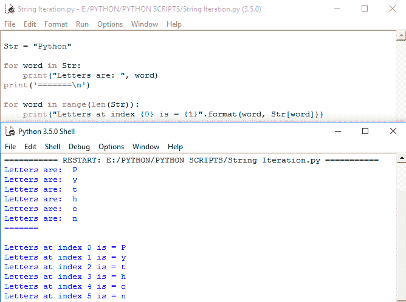

# Python 字符串

> 原文：<https://www.tutorialgateway.org/python-string/>

Python 字符串只不过是一系列字符。在本节中，我们将讨论如何创建一个字符串，访问单个字符(项)，迭代字符。另外，向您展示 Python 编程语言中的字符串切片。

## 创建一个 Python 字符串

在 Python 中有多种方法可以创建字符串。这给了你一个创造它的想法。

```py
# Create using Single Quote
Str1 = 'This is a message'
print(Str1)

# Create using Double Quote
Str2 = "This is another with Double Quotes"
print(Str2)

# Create using Multiple Single Quotes
Str3 = '''This also Work'''
print(Str3)

# Create it using Triple Quotes
# This is Very Useful to create Multiline Text
Str4 = """Learn Programming
          at Tutorial Gateway"""
print(Str4)
```

```py
This is a message
This is another with Double Quotes
This also Work
Learn Programming
          at Tutorial Gateway
```

### 访问 Python 字符串项

我们可以使用索引访问 Python 字符串中的元素。使用索引，我们可以分别访问每个项目。索引值从 0 开始，到 n-1 结束，其中 n 是长度。例如，如果长度为 5，索引从 0 开始，以 4 结束。要访问第一个值，请使用名称[0]，要访问第五个值，请使用名称[4]。

```py
x = 'Tutorial Gateway'

# Positive Indexing
print(x[0])
print(x[4])
print(x[9])
print('=======\n')

# Negative 
print(x[-3])
print(x[-7])
print(x[-16])
print('=======\n')
```

如果您使用的是负索引号，它会从右向左开始查找项目(这里，-1 是最后一个项目，-2 是倒数第二个项目，等等)。

```py
T
r
G
=======

w
G
T
======= 
```

### 迭代 Python 字符串

`for`循环是遍历字符或项目的最常见方式。这段代码帮助我们迭代字符串，并打印字符串中的每个字符。

提示:回路和[功能](https://www.tutorialgateway.org/python-string-functions/)请参考[。](https://www.tutorialgateway.org/python-for-loop/)

```py
Str = "Python"

for word in Str:
    print("Letters are: ", word)
```

上面指定的代码可以很好地打印其中的字符。但是，要更改单个项目，我们还需要 [Python](https://www.tutorialgateway.org/python-tutorial/) 索引位置。要解决这个问题，我们必须使用[范围功能](https://www.tutorialgateway.org/python-range-function/)和`for`循环

```py
for word in range(len(Str)):
    print("Letters at index {0} is = {1}".format(word, Str[word]))
```



### 串并置

连接或组合多个字符串被称为 Python 字符串连接或 concat。有多种连接方式。

*   我们可以使用+运算符连接多个。
*   通过放置多个文字，自动连接它们。
*   将多个放在一个内，并用括号括起来()
*   *运算符重复该句子给定的次数。这里是三次。

在这个例子中，我们向您展示了如何在 Python 字符串上使用算术运算符来执行算术运算。

```py
X = 'Tutorial '
Y = 'Gateway'

# Using + Operator
Concat = X + Y 
Concat1 = 'This ' + X

# Placing two Literals Together
Concat2 = 'Tutorial ' 'Gateway'

# Using Parentheses
Concat3 = ('Tutorial ' 'Gateway') 

print(Concat)
print(Concat1)
print(Concat2)
print(Concat3)

# Using * Operator
Z = X * 3
print(Z)
```

```py
Tutorial Gateway
This Tutorial 
Tutorial Gateway
Tutorial Gateway
Tutorial Tutorial Tutorial 
```

## Python 字符串切片

在 python String Slice 中，第一个整数值是切片开始的索引位置，第二个整数值是切片结束的位置，但它不包括该索引位置的内容。例如，如果我们定义 stritem[1:4]，那么字符串切片从索引位置 1 开始，到索引位置 3 结束(而不是 4)。

```py
x = 'Tutorial Gateway'

#  Using two
a = x[2:13] 
print(a)

# Using Second 
b = x[:8] 
print(b)

# Slice using First
c = x[4:] 
print(c)

# without using two 
d = x[:] 
print(d)

# Slice using Negative first
e = x[-3:] 
print(e)

# Slice using Negative second
f = x[:-2] 
print(f)
```

```py
torial Gate
Tutorial
rial Gateway
Tutorial Gateway
way
Tutorial Gatew
```

切片分析

*   如果省略第一个索引，切片将从头开始。
*   如果省略第二个参数，切片将从第一个位置开始，一直持续到最后一个位置。
*   而且，如果您使用负数作为索引，切片将从右向左开始。