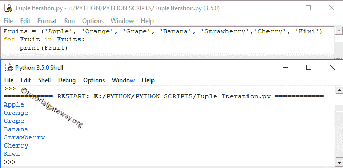

# Python 元组

> 原文:[https://www.tutorialgateway.org/python-tuple/](https://www.tutorialgateway.org/python-tuple/)

Python 元组几乎类似于列表，只是它们是不可变的，而列表是可变的。这意味着一旦我们声明了 Python Tuple，我们就不能更改它里面的值或项，就像其他编程语言中的 Constant 关键字一样。

## Python 中的元组是什么？

Python 元组是有序序列中多个值的序列。Python 元组是使用左括号和右括号( )声明的。与字符串不同，Python Tuple 允许我们存储不同类型的数据，如整数、浮点、字符串等。

### 如何声明 Python 元组？

要在 Python 中声明不包含任何值的空 Tuple，请使用 TupleName =()。

像任何其他集合一样，我们必须声明元素，其中每一项都用逗号分隔。即使用一个项目声明这个对象，我们也必须在项目后面指定一个逗号。

例如:TupleName = (245，)。忘记添加逗号，那么它是整数类型(不是元组)。以下是在 Python 中声明字符串、混合、嵌套和列表元组的可能方法列表。

StringTup =(“苹果”、“橘子”、“葡萄”、“芒果”)是一个包含四个字符串值的字符串元组。

MixedTup = ('apple '，2，3.50，' Mango ')是一个包含一个整数、一个浮点数和两个整数值的混合整数。

NestedTup =(“网关”，“教程”，(1，2，3))是一个在另一个里面的例子(Nested)。

ListTup = ('Py '，' Tutorial '，[1，2，3])是其中的 List 的一个例子。

### 如何访问 Python Tuple 项？

我们可以使用索引来访问 Python Tuple 项。使用索引，我们可以分别访问其中的每个项目。索引值从 0 开始，到 n-1 结束，其中 n 是大小。使用负数作为索引，它开始从右向左查找元素。

例如，如果一个类存储 5 个元素，那么索引从 0 开始，以 4 结束。要访问第一个值，请使用图名[0]，要访问第五个值，请使用图名[4]。为了更好地理解，让我们看看整数数据类型示例:

```
x = (1, 2, 3, 4, 5, 6, 7, 8, 9)

# Positive Indexing
print(x[0])
print(x[4])
print(x[8])
print('=======\n')

# Negative Indexing
print(x[-2])
print(x[-4])
print(x[-8])
print('=======\n')

MixedTup = ((1, 2, 3), [4, 5, 6], 'Learn')
print(MixedTup[0][0])
print(MixedTup[1][0])
print(MixedTup[2][0])
print(MixedTup[2][4])
```

```
1
5
9
=======

8
6
2
=======

1
4
L
n
```

### 迭代 Python 元组

循环的[是最流行的遍历元素的方式。以下语句有助于迭代对象并打印水果中的项目。](https://www.tutorialgateway.org/python-for-loop/)

```
Fruits = ('Apple', 'Orange', 'Grape', 'Banana', 'Strawberry','Cherry', 'Kiwi')
for Fruit in Fruits:
    print(Fruit)
```



### 算术运算

在这个例子中，我们展示了在 Python Tuple 上使用算术运算符来执行算术运算。

```
X = (1, 2, 3)
Y = (4, 5, 6)
Sum = X + Y
print(Sum)

# Using * Operator
Z = X * 3
print(Z)
```

执行[算术运算](https://www.tutorialgateway.org/python-arithmetic-operators/)输出。参考[使用数字](https://www.tutorialgateway.org/python-program-to-create-a-tuple-with-numbers/)创建它的例子。

```
(1, 2, 3, 4, 5, 6)
(1, 2, 3, 1, 2, 3, 1, 2, 3)
```

从上面的输出中，您可以观察到

*   +运算符正在连接
*   *运算符重复给定的次数。这是三次

## Python 元组切片

在 python Tuple Slice 语法中，第一个整数值是切片开始的索引位置，第二个整数值是切片结束的索引位置。

切片上升到第二个整数值，但不包括该索引位置的值。例如，如果我们指定 tuple_exmp[1:4]，那么切片从索引位置 1 开始，到位置 3 结束(不是 4)。

```
x = (1, 2, 3, 4, 5, 6, 7, 8, 9)

# Slicing using two indexes
a = x[2:6] 
print(a)

# Slicing using First
b = x[:6] 
print(b)

# Using Second
c = x[2:] 
print(c)

# Without using two
d = x[:] 
print(d)

# Slice using Negative
e = x[-3:] 
print(e)

# Slice using Negative
f = x[:-2] 
print(f)
```

```
(3, 4, 5, 6)
(1, 2, 3, 4, 5, 6)
(3, 4, 5, 6, 7, 8, 9)
(1, 2, 3, 4, 5, 6, 7, 8, 9)
(7, 8, 9)
(1, 2, 3, 4, 5, 6, 7)
```

切片分析

*   如果没有第一个索引，那么 [Python](https://www.tutorialgateway.org/python-tutorial/) 切片从开始处开始
*   如果没有提供第二个索引，切片将从第一个索引开始，一直到最后一个索引
*   使用负数作为索引，切片从右向左开始。

## 更改 Python 元组项

它不允许改变里面的物品。让我们看看当我们这样做时会发生什么？


分析:在第一个语句中，我们在索引位置 2 指定了一个新值。因为它是不可变的，所以输出抛出一个类型错误。在第二条语句中，我们在第一个索引位置的另一条语句中为此赋值。

虽然它是一个嵌套的 Python 元组，但输出会抛出一个类型错误，因为它是不可变的。在第三个语句中，我们在位置[1][1]指定了一个新值，那就是[列表](https://www.tutorialgateway.org/python-list/)在里面。由于 List 是可变的，我们成功地将该值从 5 更改为 14。

## Python 元组方法

Python 提供了以下方法。元组()方法有助于将字符串或列表转换为元组。

最小函数帮助我们找到最小或最小的项目，最大函数找到最大或最大的项目。

Len 方法查找或计算项目的长度或数量，排序方法有助于按升序对元素进行排序。index 函数返回指定值的索引位置。

sum 函数计算给定项目中所有项目的总和。count 函数计算指定值重复的总次数。

在下面的程序中，我们应用了所有的 Tuple 方法。查看所有功能可能会有所帮助。

```
FruitsTP = ('Apple', 'Orange', 'Banana', 'Kiwi', 'Grape', 'Blackberry')
tp = (9, 4, -5, 0, 22, -1, 2, 14)

#Finding Sum of all item in a  using Sum() Method
print('Sum of all items in a tp  = ', sum(tp))

#Calculating Length of a  using len() Method
print('Length of a FruitsTP  = ', len(FruitsTP))
print('Length of a tp  = ', len(tp))

#Finding Minimum item in a  using min() Method
print('Minimum item in a FruitsTP  = ', min(FruitsTP))
print('Minimum item in a tp  = ', min(tp))

#Finding Maximum item in a  using max() Method
print('Maximum item in a FruitsTP  = ', max(FruitsTP))
print('Maximum item in a tp  = ', max(tp))

# Using Sorted() Method
print('After Sorting FruitsTP  = ', sorted(FruitsTP))
print('After Sorting tp  = ', sorted(tp))

# Index position of an item in a  using index() Method
print('The Index position of Banana = ', FruitsTP.index('Banana'))
print('The Index position of -1 = ', tp.index(-1))

# Counting items in a  using count() Method
tp2 = (9, 4, 1, 4, 9, -1, 2, 4)
print('Number of Times 4 is repeated = ', tp2.count(4))
print('Number of Times 9 is repeated = ', tp2.count(9))

# Converting List
tp3 = [1, 2, 3, 4, 5]
print(tuple(tp3))
```

```
Sum of all items in a tp  =  45
Length of a FruitsTP  =  6
Length of a tp  =  8
Minimum item in a FruitsTP  =  Apple
Minimum item in a tp  =  -5
Maximum item in a FruitsTP  =  Orange
Maximum item in a tp  =  22
After Sorting FruitsTP  =  ['Apple', 'Banana', 'Blackberry', 'Grape', 'Kiwi', 'Orange']
After Sorting tp  =  [-5, -1, 0, 2, 4, 9, 14, 22]
The Index position of Banana =  2
The Index position of -1 =  5
Number of Times 4 is repeated =  3
Number of Times 9 is repeated =  2
(1, 2, 3, 4, 5)
```