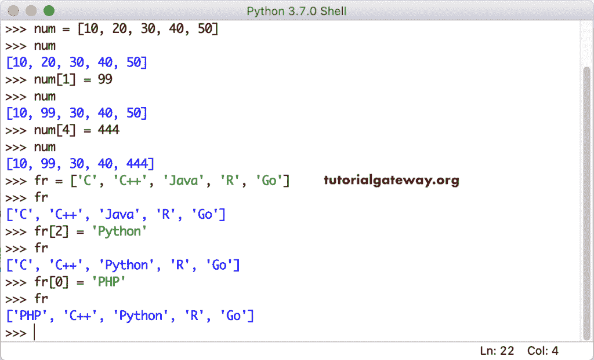
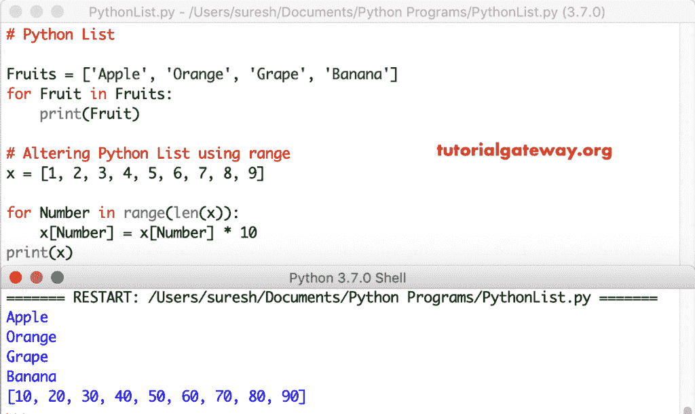

# 什么是 Python 中的列表？

> 原文:[https://www.tutorialgateway.org/python-list/](https://www.tutorialgateway.org/python-list/)

Python 列表是实时中最有用的序列之一。Python 列表是有序序列中多个值的序列。与字符串不同，它允许我们存储不同类型的数据，如整数、浮点、字符串等。

## 如何声明 Python 列表

有几种方法可以在 Python 中创建列表。最直接的方法是将所需项目放在方括号[ ]内。

### 如何创建空列表？

不包含值或元素的对象是空的。通过放置一个空的方括号，在 python 中创建一个空列表。

列表 Name = []

### 如何创建不同数据类型的 Python 列表？

第一个语句是由五个整数值组成的整数。第二个语句是包含三个字符串值或三个单词的字符串。

IntegerList = [1，2，3，4，5]

StringList = ['苹果'，'橘子'，'葡萄'，'芒果']

Python 列表允许将不同的数据类型放在一个。这是一个混合的例子，它包含一个整数、浮点和两个整数值。

混合列表= ['苹果'，2，3，50，'芒果']

### 如何访问 Python 列表项？

Python 列表按顺序存储数据(有序)。因此，我们可以在索引的帮助下访问元素。此外，使用索引，我们可以分别访问或修改/更改其中的每一项。访问项目的语法是

列表名称([索引编号])

索引值从 0 开始，到 n-1 结束，其中 n 是大小。例如，如果它存储 5 个元素，则索引从 0 开始，以 4 结束。若要访问或更改第一个列表值，请使用 list_name[0]，若要访问第五个列表项，请使用 list_name[4]。为了更好地理解，让我们看看 Python 列表示例:

```
x = [1, 2, 3, 4, 5, 6, 7, 8, 9]

# Positive Indexing
print(x[0])
print(x[4])
print(x[8])
print('=======\n')

# Negative
print(x[-2])
print(x[-4])
print(x[-8])
```

正负指标的要素输出

```
1
5
9
=======

8
6
2
```

请使用负数作为索引，从右到左访问元素。这意味着以相反的顺序访问 Python 列表项。

```
x = ['apple', 'Mango', 'banana', 'orange', 'cherry','kiwi']

# Using Positive 
print("IP 0 = ", x[0])
print("IP 2 = ", x[2])
print("IP 4 = ", x[4])
print("IP 3 = ", x[3])
print('=======\n')

#Using Negative 
print("Pos -1 = ", x[-1])
print("Pos -3 = ", x[-3])
print("Pos -5 = ", x[-5])
print("Pos -6 = ", x[-6])
```

使用正数和负数访问元素元素

```
IP 0 =  apple
IP 2 =  banana
IP 4 =  cherry
IP 3 =  orange
=======

Pos -1 =  kiwi
Pos -3 =  orange
Pos -5 =  Mango
Pos -6 =  apple
```

### 更改 Python 列表项

因为有可变的，除了访问项目，使用这个索引位置来改变或替换元素。



### 迭代 Python 列表项

For 循环是遍历列表项的最常见方式，它有助于迭代和打印项。该代码可以准确地打印其中的项目。然而，要改变单个元素，我们需要索引位置。

为了解决这个问题，我们必须使用[范围函数](https://www.tutorialgateway.org/python-range-function/)和 [Python](https://www.tutorialgateway.org/python-tutorial/) 进行循环。

```
Fruits = ['Apple', 'Orange', 'Grape', 'Banana']
for Fruit in Fruits:
    print(Fruit)
```

它将每个项目乘以 10。如果我们想根据条件进行计算，那么在 for 循环中使用 [If 语句](https://www.tutorialgateway.org/python-if-statement/)。

```
x = [1, 2, 3, 4, 5, 6, 7, 8, 9]

for Number in range(len(x)):
    x[Number] = x[Number] * 10
print(x)
```



在这个例子中，我们声明了一个[字符串](https://www.tutorialgateway.org/python-string/)。循环的第一个[是迭代和打印项目。第二个 for 循环与范围一起使用索引的位置迭代每个元素。让我们看看另一个例子。](https://www.tutorialgateway.org/python-for-loop/)

```
# Iterate Items

Fruits = ['apple', 'Mango', 'banana', 'orange', 'cherry','kiwi']

# Iterate Elements
for fruit in Fruits:
    print(fruit)

# Iterate Items using Index 
for i in range(len(Fruits)):
    print("Item at ", i, " = ", Fruits[i])
```

使用 for 循环和 for 循环范围输出迭代字符串列表项

```
apple
Mango
banana
orange
cherry
kiwi
Item at 0  =  apple
Item at 1  =  Mango
Item at 2  =  banana
Item at 3  =  orange
Item at 4  =  cherry
Item at 5  =  kiwi
```

### 将项目插入 Python 列表

将新项目插入现有项目的可用内置函数。

1.  [追加(x)](https://www.tutorialgateway.org/python-append-list-function/) :在末尾增加 x 项。
2.  [插入(I，x)](https://www.tutorialgateway.org/python-insert-list-function/) :在位置 I 插入指定的项目 x。
3.  [扩展(New_List)](https://www.tutorialgateway.org/python-extend-list-function/) :在末尾添加 New_List 中的所有元素。

```
Fruits = ['Apple', 'Orange', 'Grape', 'Banana']

# Adding items using append
Fruits.append('Blackberry')
print(Fruits)

# inserting items using insert
Fruits.insert(2, 'Kiwi')
print(Fruits)

# Extending using extend
Fruit_new = ['berry','Cherry']
Fruits.extend(Fruit_new) 
print(Fruits)
```

```
['Apple', 'Orange', 'Grape', 'Banana', 'Blackberry']
['Apple', 'Orange', 'Kiwi', 'Grape', 'Banana', 'Blackberry']
['Apple', 'Orange', 'Kiwi', 'Grape', 'Banana', 'Blackberry', 'berry', 'Cherry']
```

## Python 列表切片

在 python List Slice 中，第一个整数值是切片开始的索引位置，第二个整数值是切片结束的索引位置。切片一直进行到第二个整数值，但不包括该结束索引位置的值。例如，如果我们指定[1:4]，那么切片从索引位置 1 开始，到 3(而不是 4)结束

```
x = [1, 2, 3, 4, 5, 6, 7, 8, 9]

# Slicing using two indexes
a = x[2:6] 
print(a)

# Slicing using First
b = x[:6] 
print(b)

# Slicing using Second
c = x[2:] 
print(c)

# Slicing without using two
d = x[:] 
print(d)
```

```
[3, 4, 5, 6]
[1, 2, 3, 4, 5, 6]
[3, 4, 5, 6, 7, 8, 9]
[1, 2, 3, 4, 5, 6, 7, 8, 9]
```

使用负数作为分割元素的值。

```
x = [1, 2, 3, 4, 5, 6, 7, 8, 9]

# Slicing using Negative first
e = x[-3:] 
print(e)

# Slicing using Negative Second
f = x[:-2] 
print(f)

# Slicing using Negative first and second
g = x[-7:-2] 
print(g)

# Assigning new values
x[1:3] = ['t','g']
print(x)
```

```
[7, 8, 9]
[1, 2, 3, 4, 5, 6, 7]
[3, 4, 5, 6, 7]
[1, 't', 'g', 4, 5, 6, 7, 8, 9]
```

根据上面的切片

*   省略第一个索引意味着切片从头开始。
*   省略第二个，从第一个索引开始切片，一直到最后一个。
*   使用负值从右向左分割元素。

## 内置函数

在这个 Python Lists 程序中，我们应用了所有的内置方法。

```
Fruits = ['Apple', 'Orange', 'Banana', 'Kiwi', 'Grape', 'Blackberry']
x = [9, 4, -5, 0, 22, -1, 2, 14]

#Copying using Copy() Method
New_Fruits = Fruits.copy()
print(New_Fruits)

#Removing all the items using Clear() Method
New_Fruits.clear()
print(New_Fruits)

# Sorting using Sort() Method
Fruits.sort()
x.sort()
print(Fruits)
print(x)

# Reverse using reverse() Method
Fruits.reverse()
x.reverse()
print(Fruits)
print(x)

# position of an item
print('The Index position of Banana = ', Fruits.index('Banana'))
print('The Index position of -1 = ', x.index(-1))

# Counting items using count() Method
y = [9, 4, 1, 4, 9, -1, 2, 4]
print('Number of Times 4 is repeated = ', y.count(4))
print('Number of Times 9 is repeated = ', y.count(9))
```

```
['Apple', 'Orange', 'Banana', 'Kiwi', 'Grape', 'Blackberry']
[]
['Apple', 'Banana', 'Blackberry', 'Grape', 'Kiwi', 'Orange']
[-5, -1, 0, 2, 4, 9, 14, 22]
['Orange', 'Kiwi', 'Grape', 'Blackberry', 'Banana', 'Apple']
[22, 14, 9, 4, 2, 0, -1, -5]
The Index position of Banana =  4
The Index position of -1 =  6
Number of Times 4 is repeated =  3
Number of Times 9 is repeated =  2
```

### 总额

列表求和函数计算所有项目的总和。

```
a = [5, 10, 15, 20, 25]
print(a)

# sum of elements
total = sum(a)

print("\nThe sum = ", total)
```

```
[5, 10, 15, 20, 25]

The sum =  75
```

## Python 列表算术运算示例

使用[算术运算符](https://www.tutorialgateway.org/python-arithmetic-operators/)执行算术运算。

*   +运算符将它们串联起来。
*   *运算符将元素重复给定的次数。这里是三次。

```
x = [10, 20, 30, 40]
y = [15, 25, 35, 45]

# using + Operator
total = x + y
print("\nAddition : ", total)

# using * Operator
multi = x * 2
print("Multiplication : ", multi)

multi2 = y * 3
print("Multiplication of Y : ", multi2)
```

执行算术运算并返回输出。

```
Addition :  [10, 20, 30, 40, 15, 25, 35, 45]
Multiplication :  [10, 20, 30, 40, 10, 20, 30, 40]
Multiplication of Y :  [15, 25, 35, 45, 15, 25, 35, 45, 15, 25, 35, 45]
```