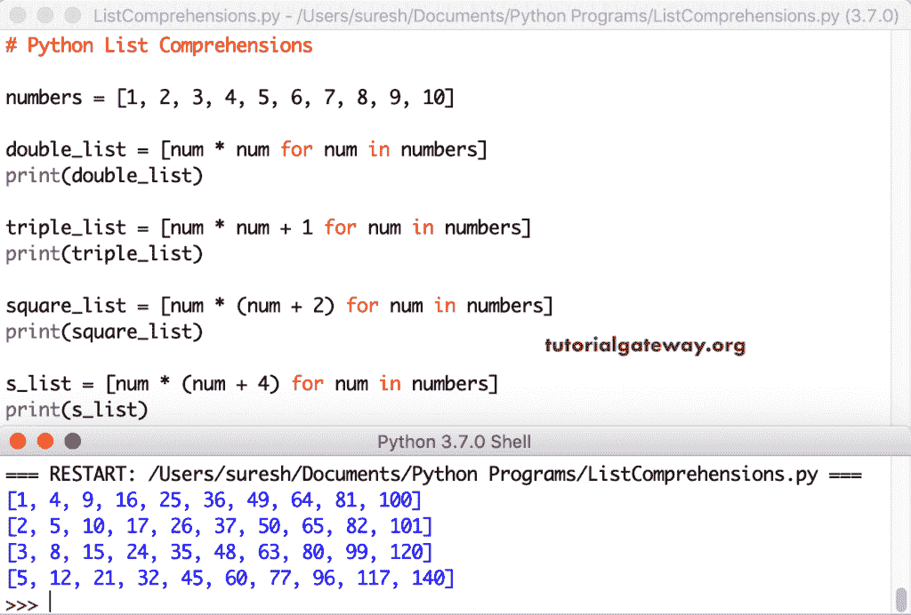

# Python 列表理解

> 原文:[https://www.tutorialgateway.org/python-list-comprehensions/](https://www.tutorialgateway.org/python-list-comprehensions/)

Python 列表理解提供了一种简单明了的方法来创建基于另一个或一些可选项的列表。更少的代码行，易于阅读的 Python 列表理解语法，帮助我们优雅地编写更复杂的功能，它是

```
[output_expression for item in L1]

[output_expression for item in L2 if condition]

[output_expression If Else conditions for item in L3]
```

## Python 列表理解示例

下面的例子帮助我们学习 Python 列表理解。

### 简单的 Python 列表理解示例

在我们开始使用 Python 列表理解之前，让我们看看实现相同结果的传统方法。

通常，我们使用`for`循环语法结构和 append 函数来迭代和添加元素。但是，您可以使用 Python 列表理解来获得这个结果。它易于阅读，执行时间更短。

下面的列表理解代码使用`for`循环来迭代项并将每个项附加到一个新项。简而言之，我们正在将项目复制到一个全新的项目。

在这里，我们使用一种常见的方法，即列表理解方法。我们对循环使用相同的方法，但是删除了[附加功能](https://www.tutorialgateway.org/python-append-list-function/)。我建议你参考 [Lisrt](https://www.tutorialgateway.org/python-list/) 、[的循环](https://www.tutorialgateway.org/python-for-loop/)和[功能](https://www.tutorialgateway.org/python-list-functions/)来自 [Python](https://www.tutorialgateway.org/python-tutorial/) 页面。

```
numbers = [1, 2, 3, 4, 5, 6, 7, 8, 9, 10]

new = []

for num in numbers:
    new.append(num)

print(new)

print("===================")

my = [num for num in numbers]
print(my)
```

```
[1, 2, 3, 4, 5, 6, 7, 8, 9, 10]
===================
[1, 2, 3, 4, 5, 6, 7, 8, 9, 10]
```

你也可以看到这个 Python 列表理解的例子。这里，我们将每个项目乘以 2。如果仔细观察，我们在两个例子中使用了相同的`for`循环，但唯一的区别是 append 函数。

```
numbers = [1, 2, 3, 4, 5, 6, 7, 8, 9, 10]

mul = []

for num in numbers:
    mul.append(num * 2)

print(mul)

print("===================")

my = [num * 2 for num in numbers]
print(my)
```

```
[2, 4, 6, 8, 10, 12, 14, 16, 18, 20]
===================
[2, 4, 6, 8, 10, 12, 14, 16, 18, 20]
```

我们使用 Python 列表理解将元素乘以 2、3，并找到每个项目的正方形。

```
a = [1, 2, 3, 4, 5, 6, 7, 8, 9, 10]

doubleA = [i * 2 for i in a]
print(doubleA)

tripleA = [i * 3 for i in a]
print(tripleA)

squareA = [i ** 2 for i in a]
print(squareA)
```

```
[2, 4, 6, 8, 10, 12, 14, 16, 18, 20]
[3, 6, 9, 12, 15, 18, 21, 24, 27, 30]
[1, 4, 9, 16, 25, 36, 49, 64, 81, 100]
```

和上面的例子一样。然而，这一次，我们比较了常规方法和 Python 列表理解。

```
numbers = [1, 2, 3, 4, 5, 6, 7, 8, 9, 10]

new1 = []
new2 = []
new3 = []

for num in numbers:
    new1.append(num * 2)
    new2.append(num * 3)
    new3.append(num ** 2)

print(new1)
print(new2)
print(new3)

print("===================")
doubleN = [num * 2 for num in numbers]
print(doubleN)

tripleN = [num * 3 for num in numbers]
print(tripleN)

squareN = [num ** 2 for num in numbers]
print(squareN)
```

```
[2, 4, 6, 8, 10, 12, 14, 16, 18, 20]
[3, 6, 9, 12, 15, 18, 21, 24, 27, 30]
[1, 4, 9, 16, 25, 36, 49, 64, 81, 100]
===================
[2, 4, 6, 8, 10, 12, 14, 16, 18, 20]
[3, 6, 9, 12, 15, 18, 21, 24, 27, 30]
[1, 4, 9, 16, 25, 36, 49, 64, 81, 100]
```

在本例中，第一条语句将每一项与其自身相乘，以此类推。这里，方括号决定了计算的优先级。例如，2 * 2 + 1 表示 4 + 1，而 2 * (2 + 1)表示 2 * 3。

```
numbers = [1, 2, 3, 4, 5, 6, 7, 8, 9, 10]

double_list = [n * n for n in numbers]
print(double_list)

triple_list = [n * n + 1 for n in numbers]
print(triple_list)

square_list = [n * (n + 2) for n in numbers]
print(square_list)

s_list = [n * (n + 4) for n in numbers]
print(s_list)
```



### Python 列表理解 If

在我们前面的所有示例中，我们使用`for`循环来迭代每个元素并执行计算。如果我们想用这个列表理解来检查一些条件呢？

这里，我们使用 [`if`语句](https://www.tutorialgateway.org/python-if-statement/)来检查和显示一个数字中的偶数。首先，我们在[]中放置`for`循环，接下来我们放置`if`语句。最后，我们将附加项放在`for`循环之前。

```
n1 = [1, 2, 3, 4, 5, 6, 7, 8, 9, 10]

a = []

for y in n1:
    if y % 2 == 0:
        a.append(y)

print(a)

print()

b = [y for y in n1 if y % 2 == 0]
print(b)
```

```
[2, 4, 6, 8, 10]

[2, 4, 6, 8, 10]
```

### Python 列表理解多条件

Python 编程语言还允许您使用多种条件。在这个列表理解的例子中，我们使用多个 [`if`语句](https://www.tutorialgateway.org/python-if-statement/)来检查项目或值除以 2 等于 0。如果为真，则检查该项是否也能被 5 整除。如果两者都是真的，那么这个数字就被添加到我的列表中。

```
a = []

for n in range(1, 150):
    if n % 2 == 0 and n % 5 == 0:
        a.append(n)

print(a)

print()

b = [n for n in range(1, 150) if n % 2 == 0 if n % 5 == 0]
print(b)
```

```
[10, 20, 30, 40, 50, 60, 70, 80, 90, 100, 110, 120, 130, 140]

[10, 20, 30, 40, 50, 60, 70, 80, 90, 100, 110, 120, 130, 140]
```

### Python 列表理解 If Else

在这个例子中，我们在列表理解中使用了 If else。 [If else](https://www.tutorialgateway.org/python-if-else/) 代码检查并显示该值是偶数还是奇数。

```
a = [1, 2, 3, 4, 5, 6, 7, 8, 9, 10]
print(a)

b = ["Even" if i % 2 == 0 else "Odd" for i in a]

print(b)
```

```
[1, 2, 3, 4, 5, 6, 7, 8, 9, 10]
['Odd', 'Even', 'Odd', 'Even', 'Odd', 'Even', 'Odd', 'Even', 'Odd', 'Even']
```

### 嵌套循环的列表理解

这里，我们使用循环嵌套来打印乘法表。

```
numbers = [1, 2, 3, 4, 5, 6, 7, 8, 9, 10]

a = [[i * j for j in range(1, 11)] for i in range(2, 4)]

print(a)

# Same using For loop
print()
for i in range(2, 4):
    for j in range(1, 11):
        print(f"{i} * {j} = {i * j}")
```

```
[[2, 4, 6, 8, 10, 12, 14, 16, 18, 20], [3, 6, 9, 12, 15, 18, 21, 24, 27, 30]]

2 * 1 = 2
2 * 2 = 4
2 * 3 = 6
2 * 4 = 8
2 * 5 = 10
2 * 6 = 12
2 * 7 = 14
2 * 8 = 16
2 * 9 = 18
2 * 10 = 20
3 * 1 = 3
3 * 2 = 6
3 * 3 = 9
3 * 4 = 12
3 * 5 = 15
3 * 6 = 18
3 * 7 = 21
3 * 8 = 24
3 * 9 = 27
3 * 10 = 30
```

为了实现 3 * 3 矩阵的转换，我们需要 Python 中的嵌套列表理解。

```
a = [[10, 20, 30], [40, 50, 60], [70, 80, 90]]
print(a)

b = [[row[i] for row in a] for i in range(3)]
print(b)
```

```
[[10, 20, 30], [40, 50, 60], [70, 80, 90]]
[[10, 40, 70], [20, 50, 80], [30, 60, 90]]
```

嵌套列表理解将嵌套转换为普通。

```
c = [[10, 20, 30], [40, 50, 60], [70, 80, 90]]
print(c)

d = [item for row in c for item in row]
print(d)
```

```
[[10, 20, 30], [40, 50, 60], [70, 80, 90]]
[10, 20, 30, 40, 50, 60, 70, 80, 90]
```

在这个例子中，首先，我们使用了在第一个中添加每个项目，即在第二个中添加每个元素。我的意思是，[10 + 40，20 + 40，30 + 40]，[10 + 50，20 + 50，30 + 50]等等。在第二个语句中，我们使用这个语句通过组合两个现有的元组来创建一个元组列表。

```
a = [10, 20, 30]
b = [40, 50, 60]

c = [[i + j for i in a] for j in b]
print(c)

print()
d = [[(i, j) for i in a] for j in b]
print(d)
```

```
[[50, 60, 70], [60, 70, 80], [70, 80, 90]]

[[(10, 40), (20, 40), (30, 40)], [(10, 50), (20, 50), (30, 50)], [(10, 60), (20, 60), (30, 60)]]
```

### 列表理解字符串

到目前为止，我们使用整数项进行数学计算。但是，您可以在字符串上使用这个 Python 列表理解。

在这个例子中，我们展示了如何在其中使用内置函数。第一种是对每个项目应用[较低的函数](https://www.tutorialgateway.org/python-lower/)，将它们转换成小写。第二个应用[上层函数](https://www.tutorialgateway.org/python-upper/)将项目转换为大写。

为了更好地理解这一点，我们使用了更多的函数。第一个使用[交换功能](https://www.tutorialgateway.org/python-swapcase/)交换字母大小写。第二行使用[镜头功能](https://www.tutorialgateway.org/python-len-function/)查找并返回字符串中每个项目的长度。在最后一个例子中，我们捕获了每个项目的第一个字母。

```
fruits = ['ApplE', 'OraNGe', 'GrAPe', 'BaNAna']
print(fruits)

low = [a.lower() for a in fruits]
print(low)

upp = [a.upper() for a in fruits]
print(upp)

swap = [a.swapcase() for a in fruits]
print(swap)

ln = [len(a) for a in fruits]
print(ln)

first = [item[0] for item in fruits]
print(first)
```

```
['ApplE', 'OraNGe', 'GrAPe', 'BaNAna']
['apple', 'orange', 'grape', 'banana']
['APPLE', 'ORANGE', 'GRAPE', 'BANANA']
['aPPLe', 'oRAngEs', 'gRapE', 'bAnaNA']
[5, 7, 5, 6]
['A', 'O', 'G', 'B']
```

在这个 Python 嵌套列表理解的例子中，我们混合了数字和字符串。它返回每个水果和一个数字的组合。我的意思是，苹果有 1，2，3，4，5，橙色有 1，2，3，4，5 等等。

```
fruits = ['Apple', 'Orange', 'Grape', 'Banana', 'Kiwi']
numbers = [1, 2, 3, 4, 5]

f = [[(fruit, num) for fruit in fruits] for num in numbers]

print(f)

# Same using For loop
print()
g = []

for fruit in fruits:
    for num in numbers:
        g.append((fruit, num))

print(g)
```

```
[[('Apple', 1), ('Orange', 1), ('Grape', 1), ('Banana', 1), ('Kiwi', 1)], [('Apple', 2), ('Orange', 2), ('Grape', 2), ('Banana', 2), ('Kiwi', 2)], [('Apple', 3), ('Orange', 3), ('Grape', 3), ('Banana', 3), ('Kiwi', 3)], [('Apple', 4), ('Orange', 4), ('Grape', 4), ('Banana', 4), ('Kiwi', 4)], [('Apple', 5), ('Orange', 5), ('Grape', 5), ('Banana', 5), ('Kiwi', 5)]]

[('Apple', 1), ('Apple', 2), ('Apple', 3), ('Apple', 4), ('Apple', 5), ('Orange', 1), ('Orange', 2), ('Orange', 3), ('Orange', 4), ('Orange', 5), ('Grape', 1), ('Grape', 2), ('Grape', 3), ('Grape', 4), ('Grape', 5), ('Banana', 1), ('Banana', 2), ('Banana', 3), ('Banana', 4), ('Banana', 5), ('Kiwi', 1), ('Kiwi', 2), ('Kiwi', 3), ('Kiwi', 4), ('Kiwi', 5)]
```

### 字符串数据的列表理解

您也可以在字符串数据上使用它。这里，我们从一个字符串中提取每个字符，并创建一个新的字符串。在本例中，我们将字符串值声明为教程网关。

```
string = 'Tutorial Gateway' 
print(string)

my = [word for word in string]
print(my)

# Same using For loop
print()
new1 = []

for word in string:
    new1.append(word)

print(new1)
```

```
Tutorial Gateway
['T', 'u', 't', 'o', 'r', 'i', 'a', 'l', ' ', 'G', 'a', 't', 'e', 'w', 'a', 'y']

['T', 'u', 't', 'o', 'r', 'i', 'a', 'l', ' ', 'G', 'a', 't', 'e', 'w', 'a', 'y']
```

## Python 列表理解与 Lambda 函数

如果更少的代码行是我们的优先事项，那么我们并不局限于此。可以使用[λ功能](https://www.tutorialgateway.org/python-lambda/)。这里，我们使用传统方法、列表理解方法和 lambda 函数将每个项目与它自己相乘。

通过查看代码，您可以看到 lambda 函数也非常有用。但是，代码易于阅读，执行速度也更快。

```
numbers = [1, 2, 3, 4, 5, 6, 7, 8, 9, 10]
a = []

for num in numbers:
    a.append(num * num)

print(a)

print()

b = [num * num for num in numbers]
print(b)

print()

c = list(map(lambda num: num * num, numbers))
print(c)
```

Python 列表理解与 lambda 函数最终输出

```
[1, 4, 9, 16, 25, 36, 49, 64, 81, 100]

[1, 4, 9, 16, 25, 36, 49, 64, 81, 100]

[1, 4, 9, 16, 25, 36, 49, 64, 81, 100]
```

这是区分列表理解和 lambda 函数之间代码可读性的另一个例子。

```
numbers = [10, 20, 30, 40, 50, 60, 70, 80, 90, 100]

doubleN = [num * 2 for num in numbers]
print(doubleN)

tripleN = [num * 3 for num in numbers]
print(tripleN)

squareN = [num ** 2 for num in numbers]
print(squareN)

#Lambda Function Example
print("===================")

dN = list(map(lambda num: num * 2, numbers))
print(dN)

tN = list(map(lambda num: num * 3, numbers))
print(tN)

sN = list(map(lambda num: num ** 2, numbers))
print(sN)
```

```
[20, 40, 60, 80, 100, 120, 140, 160, 180, 200]
[30, 60, 90, 120, 150, 180, 210, 240, 270, 300]
[100, 400, 900, 1600, 2500, 3600, 4900, 6400, 8100, 10000]
===================
[20, 40, 60, 80, 100, 120, 140, 160, 180, 200]
[30, 60, 90, 120, 150, 180, 210, 240, 270, 300]
[100, 400, 900, 1600, 2500, 3600, 4900, 6400, 8100, 10000]
```