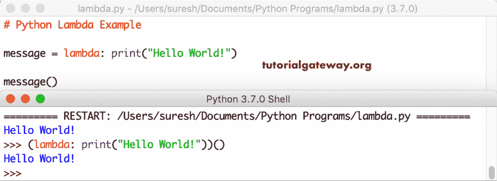
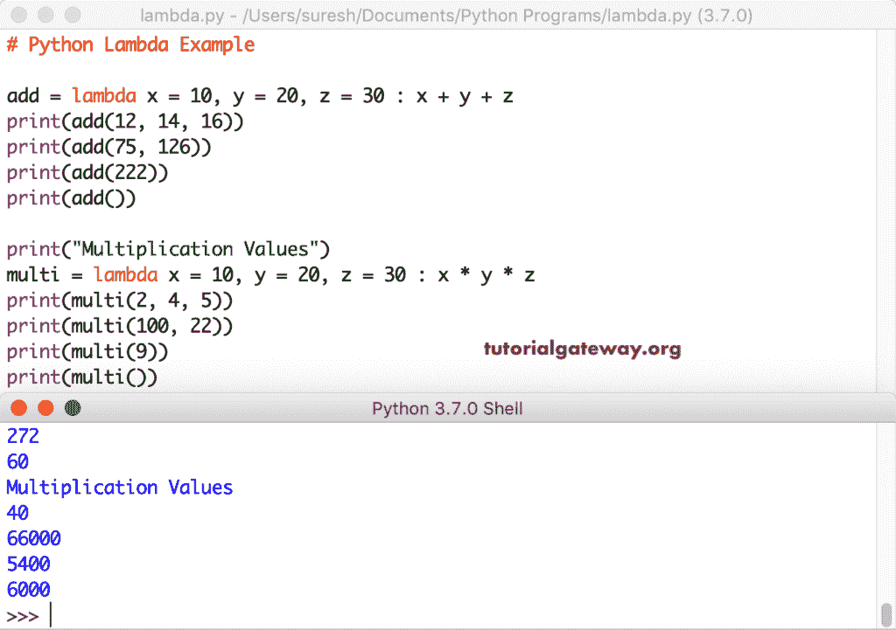

# `Python()`函数

> 原文：<https://www.tutorialgateway.org/python-lambda/>

Python`lambda()`函数是匿名的，是一个没有定义关键字和名称的函数。要创建这个`Python()`函数，我们必须使用 lambda 关键字。Python lambda 表达式的语法是

```
lambda arguments: expression
```

Python`lambda()`函数接受任意数量的参数。然而，它只需要一个表达式。

例如，λa，b: a + b。这里，a 和 b 是`Python()`函数接受的参数，a + b 是表达式。

## Python 示例

下面的例子列表有助于学习 Python`lambda()`函数。

### 没有参数的 Python

使用下面的 Python lambda 语句将“真”或“假”显示为输出。它可以让您明白，创建 Python lambda 表达式不需要任何参数。

```
num = lambda: True

print(num())
```

没有参数输出的 Python`lambda()`函数

```
True
```

### pythonλSum

我们使用 Python lambda 表达式给给定的参数值加上 5。它接受一个值，因为我们在关键字后指定了一个参数。在冒号之后，它是一个表达式，或者是我们调用这个匿名函数时它必须执行的功能。

```
num = lambda a: a + 5

print(num(10))
```

我们传递了 10 作为 Python 参数。10 + 5 = 15.

```
15
```

在这个 Python lambda Sum 示例中，我们使用两个参数来执行加法或求两个数的和。这意味着在调用这个表达式时，我们必须分配两个值。

```
add = lambda a, b : a + b

print(add(10, 20))
```

```
30
```

一般来说，我们可以通过声明或创建一个函数来实现同样的目的。这一次，我们使用的是 Python lambda 表达式和正则函数。两者给出相同的结果。

```
add = lambda x, y : x + y
print(add(10, 20))

print("\nResult from a Function")
def add_func(x, y):
    return x + y

print(add_func(10, 20))
```

这个函数和常规函数都返回相同的结果。但是，常规函数需要 def 关键字、函数名和返回值。然而，这个函数不需要它们中的任何一个。默认情况下，它返回表达式结果。

```
30

Result from a Function
30
```

这些表达式不是关于添加两个值。我们可以进行乘法、减法或任何其他计算。这里，我们将两个参数值相乘。

为了更好地理解这一点，我们还放置了正则函数。请参考 [Python](https://www.tutorialgateway.org/python-tutorial/) 中的[功能](https://www.tutorialgateway.org/functions-in-python/)

```
multi = lambda a, b : a * b
print(multi(5, 20))

print("\nResult from a multi")
def multi_func(a, b):
    return a * b

print(multi_func(5, 20))
```

```
100

Result from a multi
100
```

### python lambda 多个值

在这个例子中，我们使用了三个参数。接下来，我们将这三个参数值相乘。

```
multi =lambda a, b, c : a * b * c
print(multi(5, 2, 6))

print("\nResult from a multi")
def multi_func(a, b, c):
    return a * b * c

print(multi_func(5, 2, 6))
```

带有三个参数输出的 Python lambda

```
60

Result from a multi
60
```

到目前为止，我们使用这个表达式来计算一些东西并返回结果。但是，也可以使用 print 语句打印输出。下面的代码打印 Hello World！作为输出。

```
message = lambda: print("Hello World!")

message()
```

```
Hello World!
```

我们也可以通过用括号调用该语句来获得相同的结果。



### Python 默认参数值

在本例中，我们为所有三个参数指定了默认值。接下来，我们将它们相加，再乘以三。如果我们有默认值，我们就不必在调用它时传递值。

```
add = lambda x = 10, y = 20, z = 30 : x + y + z
print(add()) # 10 + 20 + 30

multi = lambda x = 10, y = 20, z = 30 : x * y * z
print(multi()) # 10 * 20 * 30
```

```
60
6000
```

但是，您可以通过传递新值作为参数来覆盖默认值。这里，第一个 print 语句用 12 覆盖 10，用 14 覆盖 20，用 16 覆盖 30。意思是，x = 12，y = 14，z = 16。在第二种说法中，x = 75，y = 126，z = 30。

```
add = lambda x = 10, y = 20, z = 30 : x + y + z
print(add(12, 14, 16)) # 12 + 14 + 16
print(add(75, 126)) # 75 + 126 + 30
print(add(222)) # 222 + 20 + 30
print(add()) # 10 + 20 + 30

print("Multiplication Values")
multi = lambda x = 10, y = 20, z = 30 : x * y * z
print(multi(2, 4, 5)) # x = 2, y = 4, z = 5
print(multi(100, 22)) # x = 100, y = 22, z = 30
print(multi(9)) # x = 9, y = 20, z = 30
print(multi()) # 10 * 20 * 30
```



### 不带参数的 Python

如果你不想传递任何参数，但是你想从中返回一些东西，那么你可以使用这种语句。

我们不需要传递任何参数值来调用这些表达式。每当我们调用它们时，它们都会返回相同的结果。

```
add = lambda : 10 + 20
print(add())

print("Multiplication Values")
multi = lambda : 10 * 20
print(multi())
```

```
30
Multiplication Values
200
```

### 使用λ的 Python 匿名函数

当我们在方法中使用这个匿名函数时，这个函数非常强大。这里，我们声明了一个接受一个参数的函数。在函数内部，我们使用这个表达式将这个值乘以未知的次数。

```
def new_func(n):
    return lambda a : a * n

number = new_func(2)

print(number(50))
```

Python Lambda 匿名函数输出 1

```
100
```

它调用`new_func()`函数，其中 n = 2。意思是，方法返回一个:a * 2。然后，我们将该值赋给数字(lobject)

```
number = new_func(2)
```

接下来，我们用 50 调用这个数字(这是参数值。意思是，50 : 50 * 2 => 100

用不同的按值调用此方法。先用 2，再用 3。

```
def new_func(n):
    return lambda a : a * n

number1 = new_func(2)
number2 = new_func(3)

print(number1(50))
print(number2(50))
```

```
100
150
```

## Python Lambda 内置函数

我们可以使用可用的内置方法和这个函数。

### 过滤器示例

我们使用内置的过滤器功能来过滤列表项的序列。首先，我们声明了一个从 1 到 15 的数字列表。接下来，我们在这个表达式中使用了 filter 方法。这个 Python lambda 过滤器表达式检查一个数是否能被 2 整除。接下来，筛选方法返回所有真值。

此方法过滤并返回偶数和奇数。参考[列表](https://www.tutorialgateway.org/python-list/)文章

```
number = [1, 2, 3, 4, 5, 6, 7, 8, 9, 10, 11, 12, 13, 14, 15]
print(number)

even_num = list(filter(lambda x : x % 2 == 0, number))
print(even_num)

odd_num = list(filter(lambda x : x % 2 != 0, number))
print(odd_num)
```

```
[1, 2, 3, 4, 5, 6, 7, 8, 9, 10, 11, 12, 13, 14, 15]
[2, 4, 6, 8, 10, 12, 14]
[1, 3, 5, 7, 9, 11, 13, 15]
```

### 地图示例

与过滤器不同，映射函数接受每个列表项并返回真值和假值。在这个 Python lambda 映射示例中，我们使用了 map 方法来返回布尔值。它检查每个单独的值是否能被等于 0 的 2 整除。如果为真，则返回真。否则，它返回 false。

```
number = [1, 2, 3, 4, 5, 6, 7, 8, 9, 10]
print(number)

new_num = list(map(lambda x : x % 2 == 0, number))
print(new_num)
```

```
[1, 2, 3, 4, 5, 6, 7, 8, 9, 10]
[False, True, False, True, False, True, False, True, False, True]
```

这次，我们使用 Python lambda 映射函数来执行乘法。它一次取一个单独的列表项，并执行乘法运算。最后，表达式返回修改后的列表。

```
number = [1, 2, 3, 4, 5, 6, 7, 8, 9, 10]
print(number)

double_num = list(map(lambda x : x * 2, number))
print(double_num)

square_num = list(map(lambda x : x ** 2, number))
print(square_num)
```

```
[1, 2, 3, 4, 5, 6, 7, 8, 9, 10]
[2, 4, 6, 8, 10, 12, 14, 16, 18, 20]
[1, 4, 9, 16, 25, 36, 49, 64, 81, 100]
```

使用[地图功能](https://www.tutorialgateway.org/python-map-function/)，还可以对多个列表进行计算。例如，本示例执行两个列表的加法、减法和乘法。它从同一位置的两个列表中取一个值并执行计算。

```
number1 = [10, 20, 30]
number2 = [15, 25, 35]
print(number1)
print(number2)

print()

mul_num = list(map(lambda x, y : x * y, number1, number2))
print(mul_num)
```

首先，数字 1 的 x = 10，数字 2 的 y = 15。两者相加得到 25。

```
[10, 20, 30]
[15, 25, 35]

[150, 500, 1050]
```

### 减少例子

Python lambda`reduce()`函数接受两个值和一个列表作为参数值。用这个减和这个。

```
from functools import reduce
number = [10, 20, 30, 15, 25, 35, 45]
print(number)

print("==========")
add_num = reduce((lambda x, y : x + y), number)
print(add_num)
```

```
[10, 20, 30, 15, 25, 35, 45]]
==========
180
```

减少分析

首先，x = 10，y = 20。或者写成((((((10 + 20) + 30) + 15) + 25) + 35) + 45)

### 内置函数示例

直到现在，我们都在用这个表达式来计算一些东西或者进行数值运算。但是，您也可以在字符串数据上使用它们。

在这个例子中，我们声明了一个字符串列表。接下来，我们使用[排序方法](https://www.tutorialgateway.org/python-sort/)对列表项进行排序。然而，我们使用排序的关键字作为表达式。

在这个表达式中，我们使用 [len 方法](https://www.tutorialgateway.org/python-len-function/)来找到每个单词的长度。这意味着排序是根据项目长度进行的。

```
x = ['apple', 'Mango Fruit', 'Banana', 'oranges', 'cherry','kiwi']
print(x)

y = sorted(x, key =lambda a: len(a))
print(y)

z = sorted(x, key =lambda a: a.casefold())
print(z)
```

len 和`casefold()`函数输出。

```
['apple', 'Mango Fruit', 'Banana', 'oranges', 'cherry', 'kiwi']
['kiwi', 'apple', 'Banana', 'cherry', 'oranges', 'Mango Fruit']
['apple', 'Banana', 'cherry', 'kiwi', 'Mango Fruit', 'oranges']
```