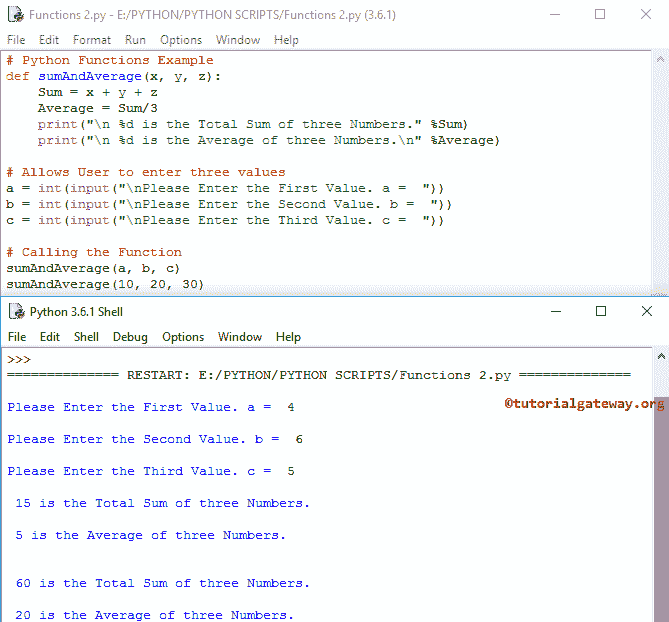

# Python 中的函数

> 原文：<https://www.tutorialgateway.org/functions-in-python/>

Python 函数是执行特定操作的一段代码或任何逻辑。我们到现在已经看到了一些方法，你可能没有注意到。例如，print()，阶乘()，round()，等等。，是 Python 编程语言中很少的内置函数。

让我们看看 Python 中函数的定义、声明、语法和使用示例。Python 编程语言中有两种类型的函数:

*   我们不必担心库中的逻辑或 Python 编程语言中的内置函数。在我们之前的文章中，我们使用了许多库方法，如 print()、factorial()、round()等。
*   用户定义函数:Python 编程语言允许我们创建自己的被称为用户定义函数的函数，而不是依赖于内置函数。例如，如果我们想要实现一些数学计算，那么将它们放在具有正确名称的单独方法中。然后我们可以多次调用该方法。

## Python 中函数的优势

1.  它有助于将大程序分成小组，这样我们就可以更快更好地阅读代码和调试程序。
2. Python 函数阻止我们多次编写相同的逻辑。我们可以将逻辑绑定在一个 def 中，然后反复调用同一个 def。
3.  通过给每个人分配不同的方法，许多人可以在同一个程序上工作。
4.  它鼓励我们用不同的输入多次调用同一个方法。

### Python 函数语法

Python 编程中函数的语法是

```py
def Function_Name (Parameters):
        Local Variable Declaration
        Programming Logic
        Executable Statement 1
        ……
        return
```

*   def:关键字 def 是对函数定义的介绍。请记住， [Python](https://www.tutorialgateway.org/python-tutorial/) def 关键字后面必须紧跟 FunctionName。
*   Function_Name:除了系统保留的关键字之外，它可以是您希望给出的任何名称。
*   参数:每个 Python 函数接受 0 个或更多的参数。这完全取决于用户需求。
*   局部变量声明:有时，我们可能只需要某个特定方法的临时变量，然后我们就可以在其中声明局部范围变量。它不是强制性的，完全取决于用户要求。请记住，这些变量只对这个特定的方法可用，我们不能在外部访问它们。
*   逻辑:你需要在这个特殊函数中实现的任何数学或任何代码或计算。
*   可执行语句:从这个特定的定义中打印一些数据的任何打印语句。
*   return:这个关键字是从方法中返回一些东西所必需的。例如，返回两个整数之和等。

## Python 实现中的用户定义函数

为了在 Python 程序中实现用户定义的函数，我们必须遵循一些规则，例如:

### Python 函数声明

它通知 def 名称和参数数量。

定义函数名(参数):

例如，

```py
def Add(a, b):
```

### 如何在 Python 中调用函数？

没什么，只是用有效数量的参数调用原始函数。例如，添加(2，3)。请记住，用户定义的函数名应该与方法调用完全匹配。

### Python 函数定义

这是我们将放置所有逻辑、计算等的地方。请不要忘记方法体内的 return 语句，否则程序不会返回任何东西。在调用它时，总是传递函数块所需的参数。例如，

```py
def Adding(a, b):
    Sum = a + b
    return Sum
print("After Calling:", Adding(3, 4))
```

```py
After Calling: 7
>>> Adding(8, 9)
17
```

## Python 函数求 3 个数的和与平均

在这个 Python 函数程序中，用户要求输入三个数字。然后通过调用方法，我们计算这三个数字的和与平均值。

```py
def sumAndAverage(x, y, z):
    Sum = x + y + z
    Average = Sum/3
    print("\n %d is the Total Sum of three Numbers." %Sum)
    print("\n %d is the Average of three Numbers.\n" %Average)

# Allows User to enter three values
a = int(input("\nPlease Enter the First Value. a =  "))
b = int(input("\nPlease Enter the Second Value. b =  "))
c = int(input("\nPlease Enter the Third Value. c =  "))

# Calling the Func
sumAndAverage(a, b, c)
sumAndAverage(10, 20, 30)
```



它被称为函数声明。如果您忘记了这个函数声明，那么它会抛出一个错误。

```py
def sumAndAverage(x, y, z):
```

以下语句要求用户输入 3 个数字，并将用户输入值存储在 a、b、c 变量中

```py
a = int(input("\nPlease Enter the First Value. a =  "))
b = int(input("\nPlease Enter the Second Value. b =  "))
c = int(input("\nPlease Enter the Third Value. c =  "))
```

在下一行中，我们将多次调用 Python 函数。首先是用户指定的值，然后是静态的 10、20、30。

```py
sumAndAverage(a, b, c)
sumAndAverage(10, 20, 30)
```

当它到达这个方法时，它遍历以检查 sumAndAverage()。如果它无法识别函数名，就会抛出一个错误。

在定义中，

```py
def sumAndAverage(x, y, z):
    Sum = x + y + z
    Average = Sum/3
```

我们声明了两个局部变量，求和和平均。在下一行中，我们使用[赋值运算符](https://www.tutorialgateway.org/python-assignment-operators/)计算三个数字的总和和平均值。请参考[打印()](https://www.tutorialgateway.org/python-print-function/)、[阶乘()](https://www.tutorialgateway.org/python-factorial/)、[圆形()](https://www.tutorialgateway.org/python-round/)

Sum = x + y + z
Sum = 10 + 20 + 30 = 60

平均值=总和/ 3
平均值= 60 / 3 = 20

将总和和平均值打印到输出中。

```py
 print("\n %d is the Total Sum of three Numbers." %Sum)
 print("\n %d is the Average of three Numbers.\n" %Average)
```

在下一行中，我们再次调用 Average()，这一次，我们将局部变量作为方法参数传递。我们调用了 2 次，因为这有助于你理解，我们可以调用 func n 次。