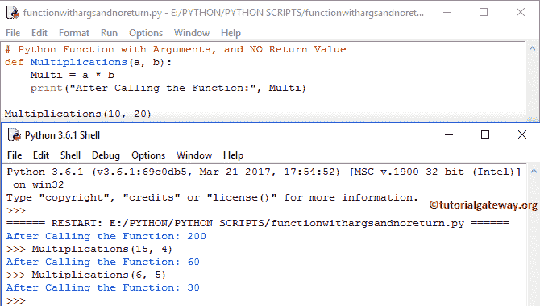
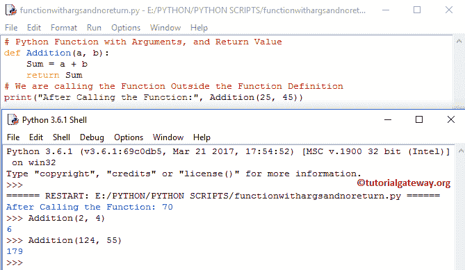

# Python 中函数的类型

> 原文:[https://www . tutorialgateway . org/python 中的函数类型/](https://www.tutorialgateway.org/types-of-functions-in-python/)

实时地，Python 函数可以定义参数，也可以不定义参数，函数可以返回值，也可以不返回值。这完全取决于用户需求。在本文中，我们通过示例向您解释 Python 编程语言中的函数类型。

在 Python 编程中，根据我们的要求，我们可以用多种方式定义用户定义的函数。下面是 Python 中可用函数类型的列表。

1.  没有参数和返回值的 Python 函数。
2.  不带参数且带有返回值的函数。
3.  带参数且无返回值的 Python 函数。
4.  带有参数和返回值的函数。

综上所述，Python 中的 1 和 3 类函数在函数被调用时不返回值。因此，在定义函数时，我们可以避免使用 return 关键字。当我们在 Python 中调用 2 和 4 类函数时，它们会返回一些值。所以，我们必须使用 return 关键字。

## Python 中函数的类型

以下示例解释了 Python 编程中可用函数类型的列表。

### 无参数无返回值的 Python 函数

在 Python 中的这种类型的函数中，在定义、声明或调用函数时，我们不会向函数传递任何参数。这种类型的 Python 函数在我们调用该函数时不会返回值。

每当我们不期望任何返回值时，我们可能需要一些打印语句作为输出。在这种情况下，我们可以在 Python 中使用这种类型的函数。

#### 无参数无返回值的 Python 函数示例

在 Python 程序中的这类函数中，我们将计算 2 个整数值的和，并打印用户定义函数本身的输出。

```
# Python Function with No Arguments, and No Return Value
def Adding():
    a = 20
    b = 30
    Sum = a + b
    print("After Calling the Function:", Sum)
Adding()
```

没有参数和返回值输出的 Python 函数

```
After Calling the Function: 50
>>> Adding()
After Calling the Function: 50
```

如果观察加法()[函数](https://www.tutorialgateway.org/functions-in-python/)，我们没有向加法()函数传递任何参数/参数

我们声明了整数变量 a、b，并将 20 分配给 a，30 分配给 b。在下一行中，我们使用算术运算符(+)计算总和

```
    a = 20
    b = 30
    Sum = a + b
```

下面的 [Python](https://www.tutorialgateway.org/python-tutorial/) 打印语句就是打印输出。每当我们调用 add()函数时，它都会输出相同的输出，因为 a 和 b 在函数内部有固定的值。

```
print("After Calling the Function:", Sum)
```

### 不带参数和返回值的 Python 函数

在 Python 中的这种类型的函数中，我们不会在定义、声明或调用函数时向函数传递任何参数。当我们调用 Python 函数时，这种类型的函数会返回一些值。

#### 不带参数且带有返回值的函数示例

在 Python 程序中的这种类型的函数中，我们将使用不带参数的用户定义函数和 return 关键字来计算 2 个整数值的乘积。

```
# Python Function with No Arguments, and with Return Value
def Multiplication():
    a = 10
    b = 25
    Multi = a * b
    return Multi
print("After Calling the Multiplication Function: ", Multiplication())
```

没有参数和返回值输出的 Python 函数

```
After Calling the Multiplication Function: 250
>>> Multiplication()
250
```

在乘法()函数中，我们没有传递任何参数。接下来，我们声明了 Multi、a、b 的整数变量，并为 a 赋值 10，为 b 赋值 25。在下一行中，我们使用算术运算符(*)将 a 和 b 相乘。

```
a = 10
b = 25
Multi = a * b
```

最后，打印语句是打印输出。请记住，我们在定义的函数之外使用 print 语句，在 print 语句内使用函数名。(除了调用函数什么都没有)

```
print("After Calling the Multiplication Function: ", Multiplication())
```

此外，每当我们调用乘法()函数时，它都会输出相同的输出，因为 a 和 b 在函数内部有固定的值。

### 带参数且无返回值的 Python 函数

如果你观察以上两种类型的函数，无论你执行多少次，Python 都会给出相同的输出。我们对变量值(a，b)没有任何控制，因为它们是固定值。在实时中，我们主要处理动态数据，这意味着我们必须允许用户输入自己的值，而不是固定的值。

Python 中这种类型的函数允许我们在调用函数时将参数传递给函数。但是，Python 中的这种类型的函数在我们调用该函数时不会返回值。

#### 带参数且无返回值的 Python 函数示例

这个 Python 中函数类型的程序允许用户输入 2 个整数值，然后，我们将这些值传递给用户定义的函数来相乘。

```
# Python Function with Arguments, and NO Return Value
def Multiplications(a, b):
    Multi = a * b
    print("After Calling the Function:", Multi)

Multiplications(10, 20)   
```

我们用不同的按值调用乘法函数，它根据值给出输出。



在乘法(a，b)函数中，我们声明了 Multi 的变量，并且，我们在函数中也有(a，b)个参数。这意味着这个函数允许用户传递 2 个值。

在下一行中，我们使用算术运算符(*)添加了 a 和 b

```
Multi = a * b
```

在下一行中，print 语句将打印输出。

```
print("After Calling the Function:", Multi)
```

### 带参数和返回值的 Python 函数

这种类型的 python 函数允许我们在调用函数时将参数传递给函数。Python 中的这类函数在我们调用函数时会返回一些值。这种类型的用户定义函数称为完全动态函数，意味着它为最终用户提供了最大的控制。

#### 带参数和返回值的 Python 函数示例

Python 程序中的这类函数允许用户输入 2 个整数值。然后，我们将这些值传递给用户定义的函数来添加这些值，并使用 return 关键字返回该值。

```
# Python Function with Arguments, and NO Return Value
def Addition(a, b):
    Sum = a + b
    return Sum
# We are calling the Function Outside the Function Definition
print("After Calling the Function:", Addition(25, 45))
```



在加法(a，b)函数中，我们声明了和的变量，并且，我们在函数中也有(a，b)个参数。这意味着这个函数允许用户传递 2 个值。在下一行中，我们使用[算术运算符](https://www.tutorialgateway.org/python-arithmetic-operators/) ( *)添加了 a 和 b

```
Multi = a * b
```

在下一行中，print 语句将打印输出。

```
print("After Calling the Function:", Multi)
```

从上面的输出可以看出，我们用不同的按值调用了加法函数，它根据值给出输出。