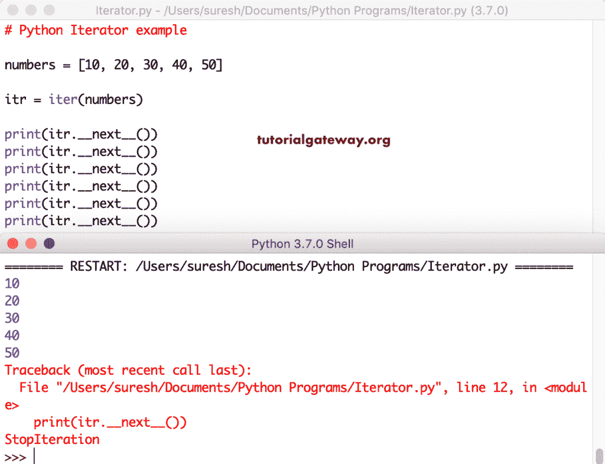
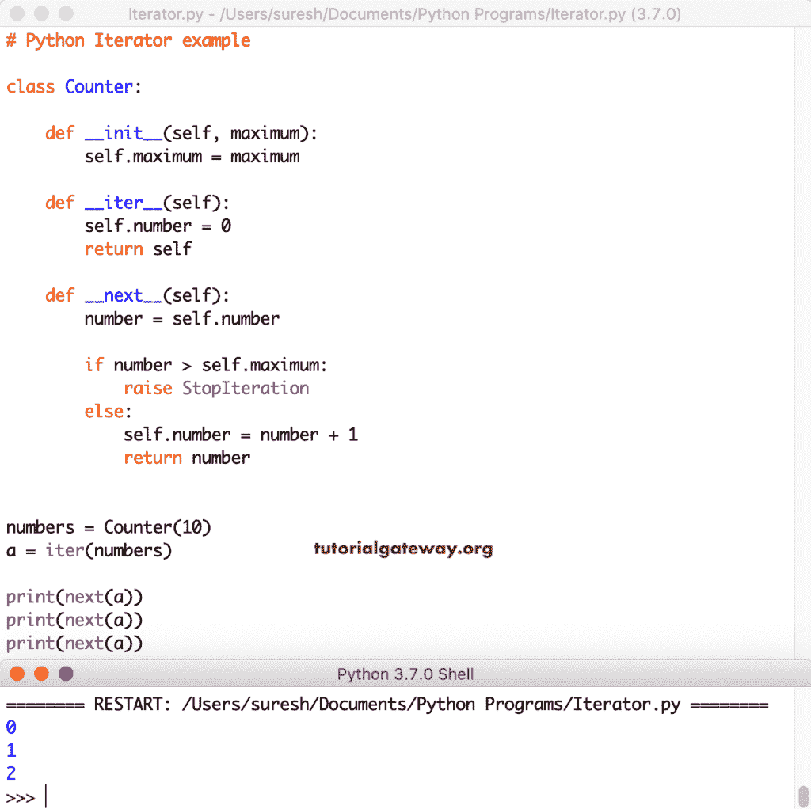

# Python 迭代器

> 原文:[https://www.tutorialgateway.org/python-iterator/](https://www.tutorialgateway.org/python-iterator/)

Python 中的迭代器是一个包含可数数值或元素的对象。您可以使用这个迭代器遍历所有这些元素。Python 迭代器使用称为 __iter__()和 __next__()方法的特殊方法来迭代对象元素。

## Python 迭代器与可迭代器

如果我们能从中获得 Python 迭代器，那么我们就称这个对象为可迭代的。到目前为止，我们已经看到了称为列表、元组、集合和字典的条目。从这些对象中，您可以调用迭代器或 Iter。本节用实际例子解释如何使用 Python 迭代器类并创建我们自己的迭代器和无限迭代器。

## Python 迭代器字符串示例

在 python 中，字符串是可迭代的对象。这里，我们使用 for 循环来迭代字符串中的每个字符并返回该字符。默认情况下，或者说，For 循环在您不知情的情况下实现了 Python 迭代器的概念。

```
string = 'tutorialgateway'

for x in string:
    print(x, end = '  ')
```

```
t u t o r i a l g a t e w a y
```

### 循环的 Python 迭代器示例 2

在这个例子中，我们同时使用了 loop 和 iter。在 python 中，我们必须使用 next()函数从迭代器中返回一个元素或值。

请记住，Python next()方法一次返回一个项目。因此，对于 n 个项目，您必须使用 n 个 next()语句。这里，我们使用了下一个()一次。因此，它返回字符串的第一个字符。

```
string = 'tutorialgateway'

for x in string:
     print(x, end = '  ')

print("\n**** Output *****")
itr = iter(string)

print(next(itr))
```

```
t u t o r i a l g a t e w a y
**** Output *****
t
```

让我使用 next()来迭代字符串中的所有字符。这一次， [Python](https://www.tutorialgateway.org/python-tutorial/) 写入完成的字符串。

```
string = 'tutorialgateway'

for x in string:
    print(x, end = '  ')

print("\n**** Example *****")
itr = iter(string)

print(next(itr))
print(next(itr))
print(next(itr))
print(next(itr))
print(next(itr))
print(next(itr))
print(next(itr))
print(next(itr))
```

```
t u t o r i a l
**** Example *****
t
u
t
o
r
i
a
l
```

### Python 迭代器列表示例

在这个迭代器示例中，我们展示了如何迭代[列表](https://www.tutorialgateway.org/python-list/)项并打印它们。

```
numbers = [10, 20, 30, 40, 50]

itr = iter(numbers)

print(next(itr))
print(next(itr))
print(next(itr))
print(next(itr))
print(next(itr))
```

```
10
20
30
40
50
```

在这个列表示例中，我们使用了 __next__()特殊方法。如果您观察最后一条语句，我们试图返回下一个不存在的元素。这就是 Iter 调用 Iter 迭代的原因。

```
numbers = [10, 20, 30, 40, 50]

itr = iter(numbers)

print(itr.__next__())
print(itr.__next__())
print(itr.__next__())
print(itr.__next__())
print(itr.__next__())
print(itr.__next__())
```



### Python 迭代器集示例

您可以使用它来迭代集合项并返回迭代器对象。该程序迭代[集合](https://www.tutorialgateway.org/python-set/)中的数字，并打印每一个数字。

```
mySet = {1, 2, 3, 4, 5}

ittr = iter(mySet)

print(ittr.__next__())
print(ittr.__next__())
print(ittr.__next__())
print(ittr.__next__())
print(ittr.__next__())
```

```
1
2
3
4
5
```

### 元组迭代器

Python 迭代器也可以让你在元组上使用。该程序迭代[元组](https://www.tutorialgateway.org/python-tuple/)项，并打印元组中的每个项。

```
fruits = ('Apple', 'Orange', 'Grape', 'Banana', 'Kiwi')

fruit_itr = iter(fruits)

print(next(fruit_itr))
print(next(fruit_itr))
print(next(fruit_itr))
print(next(fruit_itr))
print(next(fruit_itr))
```

```
Apple
Orange
Grape
Banana
Kiwi
```

## 用 Python 创建自己的迭代器

这是一个名为 Counter 的简单类。首先，我们在 __init__ 方法中声明了一个最大值。__iter__ 方法用于初始化可迭代对象的值。现在，我们将数字设置为 0。这意味着 Iter 从 0 开始。

__next__ 方法是从对象中选择下一个元素。在这个方法中，我们使用 [`if-else`语句](https://www.tutorialgateway.org/python-if-else/)来检查下一个数字是否大于最大值。如果为真，则引发停止迭代错误。否则，数字会递增。

```
class Counter:

    def __init__(self, maximum):
        self.maximum = maximum

    def __iter__(self):
        self.number = 0
        return self

    def __next__(self):
        number = self.number

        if number > self.maximum:
            raise StopIteration
        else:
            self.number = number + 1
            return number

numbers = Counter(10)
a = iter(numbers)

print(next(a))
print(next(a))
print(next(a))
```



上面的 Python 迭代器代码显示的是从 0 到 2 的数字。这是因为我们只用了接下来的(a)三次。在这个程序中，我们使用 for 循环来迭代计数器类，其中最大值为 10。这会打印从 0 到 10 的值。__iter__()从 0 开始，并且 __next__()最多打印 10 个元素。

```
class Counter:

    def __init__(self, maximum):
        self.maximum = maximum

    def __iter__(self):
        self.number = 0
        return self

    def __next__(self):
        number = self.number

        if number > self.maximum:
            raise StopIteration
        else:
            self.number = number + 1
            return number

for t in Counter(10):
    print(t)
```

```
0
1
2
3
4
5
6
7
8
9
10
```

### 无限迭代器

当您创建自己的 iter 时，您应该始终小心无限循环。如果你忘记了提出错误，那么你就陷入了无限循环。这是一个无限迭代器的简单例子。和上面一样，但是我们去掉了`if`语句。

```
class Counter:

    def __iter__(self):
        self.number = 0
        return self

    def __next__(self):
        number = self.number

        self.number = number + 1
        return number

numbers = Counter()
a = iter(numbers)

print(next(a))
print(next(a))
print(next(a))
```

```
0
1
2
```

虽然上面的例子是一个无限 iter，但你可能没有注意到。这是因为我们只使用了三次 next()。所以，让我使用计数器类作为循环函数。请参考 [Python 词典](https://www.tutorialgateway.org/python-dictionary/)文章。

```
class Counter:

    def __iter__(self):
        self.num = 0
        return self

    def __next__(self):
        num = self.num

        self.num = num + 1
        return num

for t in Counter():
    print(t)
```

现在，您可以看到 Python 无限迭代器。这将持续执行。

```
267
268
269
270
271
272
273
```