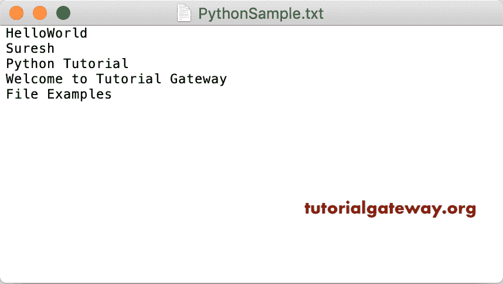
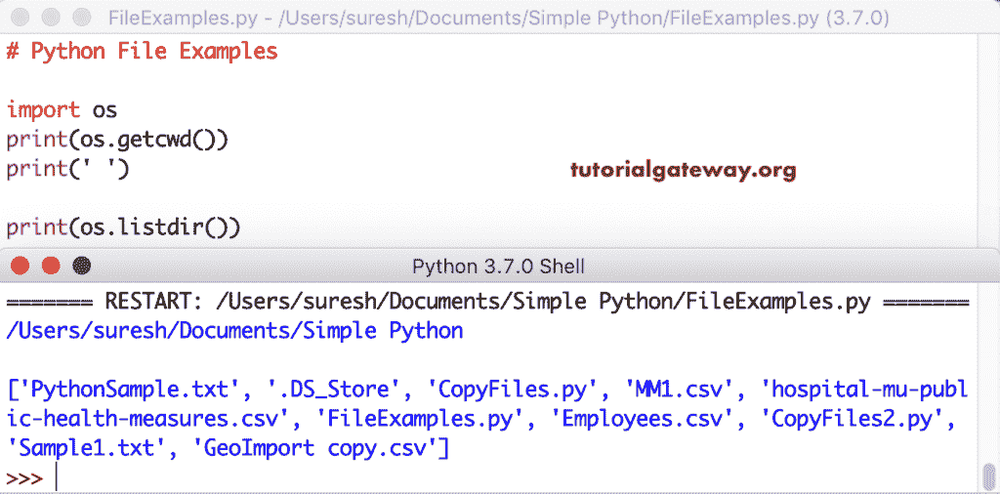
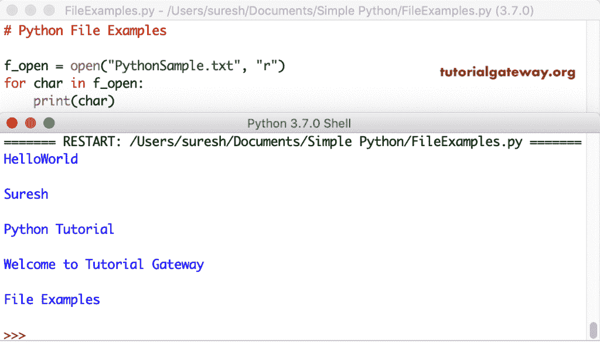
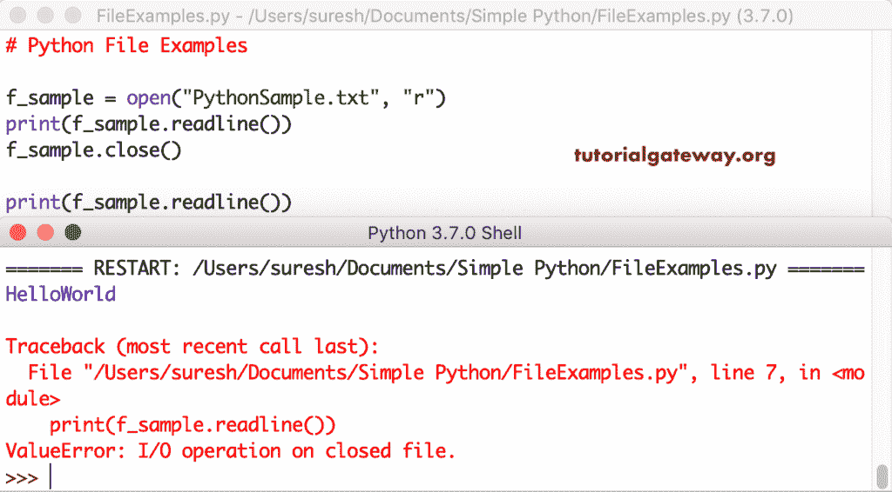
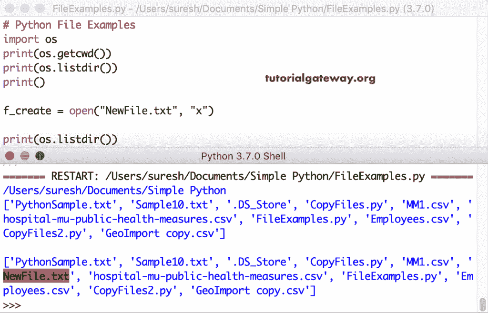
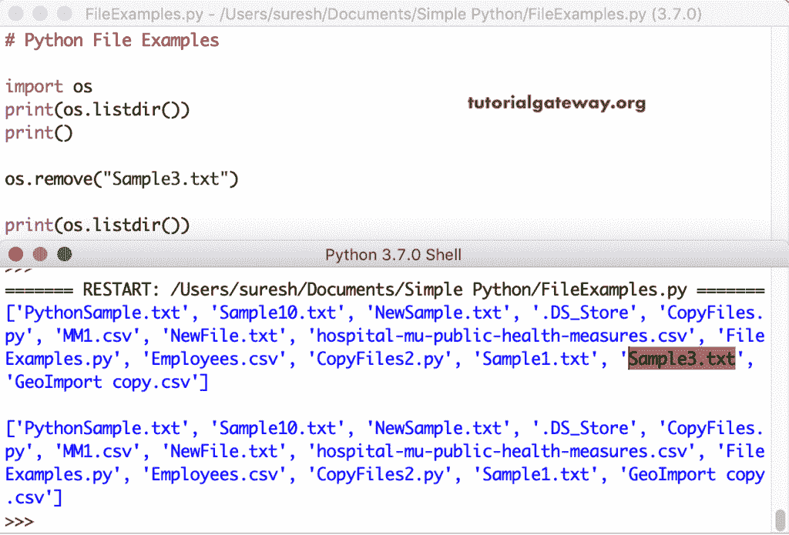

# Python 文件处理

> 原文：<https://www.tutorialgateway.org/python-file/>

Python 确实支持文件处理。我的意思是，Python 提供了各种功能，允许我们创建文件、打开、读取数据以及将数据写入文件。与其他语言不同，Python 处理文件的方式不同。Python 根据数据将文件视为文本或二进制文件，每行必须以换行符、逗号等行尾字符结束。

Python 提供了一个名为 open 的重要函数来处理文件。Python 文件打开函数接受两个参数，它们是文件名和模式。这个 Python 文件打开函数的语法是

```
f_open = open(“File_Name”, “mode”)
```

在上面的 Python 文件处理语法中，模式是一个可选参数。Python 中有四种不同的打开文件的模式。

*   r–表示读取模式，这是 Python 文件打开的默认模式。如果没有这样的文档，它会打开一个现有的文档进行阅读，然后抛出一个错误。
*   r+–这适用于读写模式。
*   a–表示追加。如果它存在，这将打开该文件并将数据附加到现有内容中。如果没有，它会用我们指定的名称创建一个新文件。
*   w–表示写入模式。它以写模式打开一个 Python 文件，并用新内容覆盖现有内容。如果它不存在，它会创建一个新的。
*   x–用它来创建一个新的。如果它已经存在，它会抛出一个错误。
*   除了这些模式之外，您还可以指定文件必须处理的数据类型。我的意思是二进制数据或文本模式
*   文本模式，这是默认模式。
*   b–二进制模式。

```
f_open = open("PythonSample.txt")
```

上面的 python 文件处理代码等于 f _ open = open(“python sample . txt”，“rt”)

## Python 文件操作示例

以下示例列表有助于在 Python 中创建新文件、打开、重命名、删除。接下来，向其写入文本，关闭、追加、写入、读取可用选项。为了演示大多数 Python 文件功能，我们使用下面的文本示例。



### Python 打开文件

在 Python 中，您可以打开一个文件，指定名称或完整路径。全名会在当前工作目录中打开它。但是，使用完整路径，您可以访问任何目录下的文档。在我们开始之前，让我使用 listdir 函数获取当前目录中的文件列表。

```
import os

print(os.getcwd())
print(' ')
print(os.listdir())
```



在 Python 中，您可以打开一个文件，指定名称或完整路径。

```
f_open = open("PythonSample.txt")
```

或者使用完整路径

```
f_open = open("C:/users/Document/PythonSample.txt")
```

### Python 红色文件

Python 文件读取功能是读取其中的数据。这是一个简单的 [Python](https://www.tutorialgateway.org/python-tutorial/) 示例，它在读取模式下打开一个示例 txt。接下来，我们使用 read 函数读取该 txt 中的数据。

```
f_open = open("PythonSample.txt", "r")
print(f_open.read())
```

```
HelloWorld
Suresh
Python Tutorial
Welcome to Tutorial Gateway
File Examples 
```

处理字符串数据时，可以使用带参数的 read 函数来限制 read 函数返回的字符数。例如，read(5)读取前 5 个字符，read(10)读取前 10 个字符。

```
f_open = open("PythonSample.txt", "r")
print(f_open.read(5))
print(f_open.read(2))
```

读取所需字符输出

```
Hello
Wo
```

第一个 read 语句打印前五个字符。接下来，read 正在打印下两个。如果你想打印前 10 个，那么你必须关闭并重新打开它。

```
f_open = open("PythonSample.txt", "r")
print(f_open.read(5))

f_open = open("PythonSample.txt", "r")
print(f_open.read(8))
```

```
Hello
HelloWor
```

#### 使用`for`循环读取 Python 文件

您也可以使用循环来读取序列中的所有数据。例如，下面的例子使用 [For Loop](https://www.tutorialgateway.org/python-for-loop/) 来读取这个 txt 中的每一行。

```
f_open = open("PythonSample.txt", "r")
for char in f_open:
    print(char)
```



这个 python 文件处理示例循环遍历示例文本中的完整文本，并打印每一行。

```
f_open = open("PythonSample.txt", "r")
for line in f_open:
    print(line, end = '')
```

要读取的循环已打开

```
HelloWorld
Suresh
Python Tutorial
Welcome to Tutorial Gateway
File Examples 
```

#### Python 文件 readline 函数

Python readline 函数读取行尾字符之前的完整行。本示例打开一个文件并读取其中的第一行。

```
f_sample = open("PythonSample.txt", "r")
print(f_sample.readline())
```

```
HelloWorld

>>> 
```

如果你想读两行，那么调用 readline 函数两次，以此类推。让我打印三行。

```
f_sample = open("PythonSample.txt", "r")
print(f_sample.readline())
print(f_sample.readline())
print(f_sample.readline())
```

```
HelloWorld

Suresh

Python Tutorial
```

您可以使用此 readline 功能来读取或打印所需的行。下面的 readline 函数代码打印文本文件的第二行。如果将 readline 函数与参数一起使用，那么它的行为与带有参数的 read 函数相同。我的意思是，readline(2) = read(2)

```
f_sample = open("PythonSample.txt", "r")
print(f_sample.readline(2))
print()

f_sample = open("PythonSample.txt", "r")
print(f_sample.read(2))
```

Python 文件读取线与读取函数输出

```
He

He
```

#### 读取线功能

在 Python 中，我们还有一个名为 readlines()的函数。它从给定的文本文件中读取数据，并以列表格式打印所有数据。它用适当的分隔符分隔每一行。

```
f_sample = open("PythonSample.txt", "r")
print(f_sample.readlines())
```

```
['HelloWorld\n', 'Suresh\n', 'Python Tutorial\n', 'Welcome to Tutorial Gateway\n', 'File Examples\n']
```

### Python 文件关闭功能

Python 文件关闭函数关闭已经打开的文件。虽然它有一个垃圾收集器来关闭它们，但是您不应该完全依赖它。关闭打开的总是好的做法。在这里，我们打开它，读一行，然后关闭它。

```
f_sample = open("PythonSample.txt", "r")
print(f_sample.readline())
f_sample.close()
```

```
HelloWorld 
```

让我打印关闭的 txt 中的另一行。

```
f_sample = open("PythonSample.txt", "r")
print(f_sample.readline())

f_sample.close()
print(f_sample.readline())
```

您可以注意到 Python shell 抛出的错误。



上面的程序展示了 close 方法的使用。然而，使用我们上面展示的方法是不明智的。

实时情况下，您必须使用 with 语句来正确关闭打开的文件。或者，有人说，我们可以去尝试最后的阻碍。我们给你俩看。

#### Python 文件使用尝试最后

```
try:
    f_sample = open("PythonSample.txt", "r")
    print(f_sample.read())
finally:
    f_sample.close()
```

```
HelloWorld
Suresh
Python Tutorial
Welcome to Tutorial Gateway
File Examples
```

### 带语句的 Python

Python with 语句确保由此打开的每个文件都被关闭，而不管是否有错误。

```
with open("PythonSample.txt", "r") as f_sample:
    print(f_sample.read())
f_sample.close()
```

```
HelloWorld
Suresh
Python Tutorial
Welcome to Tutorial Gateway
File Examples
```

Python with 语句不是关于关闭文件对象的。您可以使用这个 with 语句以任何模式打开文件。我的意思是，你可以用这个来读数据，写方法到数据等等。

最重要的是，我们在文件操作的情况下使用这种方法，在这种情况下，我们必须执行多个语句。该语句将它们保存在一个块中，这样我们就可以在该块中写入多个语句，例如读写文件。

```
with open("PythonSample.txt", "w") as f_sample:
    f_sample.write("First Line")
    f_sample.close()

with open("PythonSample.txt", "r") as f_sample:
    print(f_sample.read())
f_sample.close()
```

```
HelloWorld
Suresh
Python Tutorial
Welcome to Tutorial Gateway
File Examples

>>>
```

### Python 文件写入

Python 提供了将内容或数据写入文件的写功能。在我们进入 Python 编写函数示例之前，我假设您还记得我之前说过的话。您必须使用追加模式或写入模式。

本示例以写入模式打开示例文本，并编写欢迎消息。接下来，我们打开它来打印数据。

```
f_demo = open("PythonSample.txt", "w")
f_demo. write("Welcome to Tutorial gateway")
f_demo.close()

# Let me open and check
f_demo = open("PythonSample.txt", "r")
print(f_demo.read())
```

```
Welcome to Tutorial gateway
```

这一次，我们使用 write 函数编写多行代码。

```
f_writedemo = open("PythonSample.txt", "w")
f_writedemo. write("Python")
f_writedemo. write("\nTutorial gateway")
f_writedemo. write("\nHappy Coding!")
f_writedemo. write("\nHi \nHello \nCheers")
f_writedemo.close()

# Let me open it and check
f_writedemo = open("PythonSample.txt", "r")
print(f_writedemo.read())
```

```
Python
Tutorial gateway
Happy Coding!
Hi
Hello
Cheers
>>>
```

我们从一开始就在处理这个文件。但是，这个写函数删除了所有内容，并返回了这个欢迎消息。

write 函数接受一个列表作为参数，因此您可以一次性编写一个项目列表。我是说，不用多个写函数。

```
f_writelinesdemo = open("PythonSample.txt", "w")
text = ["First Line\n", "Second Line\n", "Third Line\n", "Fourth Line"]
f_writelinesdemo. writelines(text)
f_writelinesdemo.close()

# Let me open and check
f_writelinesdemo = open("PythonSample.txt", "r")
print(f_writelinesdemo.read())
```

```
First Line
Second Line
Third Line
Fourth Line
>>>
```

#### Python 文件追加

我们正在以追加模式打开一个文件，并检查在写入 hello 消息后会发生什么

```
f_demo = open("PythonSample.txt", "a")
f_demo. write("\nHell World!")
f_demo.close()

# Let me open the file and check
f_demo = open("PythonSample.txt", "r")
print(f_demo.read())
```

```
First Line
Second Line
Third Line
Fourth Line
Hell World!
>>>
```

#### 使用循环写入 Python 文件

您也可以使用`for`循环来写入多行信息。这里，我们在 Sample10 文本文件中采样写入 10 行。

```
f_loopdemo = open("Sample10.txt", "w")
for i in range(1, 11):
    f_loopdemo.write("This is the %d Line\n" %(i))
f_loopdemo.close()

# Let me open the file and check
f_loopdemo = open("Sample10.txt", "r")
print(f_loopdemo.read())
```

使用`for`循环输出写入

```
This is the 1 Line
This is the 2 Line
This is the 3 Line
This is the 4 Line
This is the 5 Line
This is the 6 Line
This is the 7 Line
This is the 8 Line
This is the 9 Line
This is the 10 Line 
```

### 用 Python 创建新文件

到目前为止，我们正在处理现有的文件。但是，您可以使用 read 方法创建自己的。为此，您必须使用 x 来创建新的、a 模式或 w 模式。这三种模式都创建了一个新的，但最后两种模式不同。

```
f_create = open("NewFile.txt", "x")
```

让我用 Python 创建另一个文件，并向其中写入一些内容。所以，你可以看到新的和文本。这个程序创建一个 Sample1 文本，写一个 Python 程序字符串并关闭它。接下来，我们在读取模式下打开它，并从中打印数据。

```
f_create = open("Sample1.txt", "x")
f_create.write("Python Program")
f_create.close()

# Open the Sample1 file
f_create = open("Sample1.txt", "r")
print(f_create.read())
```



它使用 w 作为写模式来创建一个新文件，并向其中写入一些内容。

```
f_wcreate = open("Sample2.txt", "x")
f_wcreate.write("Python Tutorial")
f_wcreate.close()

# Open the Sample1
f_wcreate = open("Sample2.txt", "r")
print(f_wcreate.read())
```

```
Python Program 
>>>
```

打开功能和模式-附加模式。

```
f_acreate = open("Sample3.txt", "x")
f_acreate.write("Tutorial Gateway")
f_acreate.close()

# Open the Sample1
f_acreate = open("Sample3.txt", "r")
print(f_acreate.read())
```

```
Tutorial Gateway 
>>>
```

### 重新命名

要重命名目录中的文件，必须导入 os 模块。在 os 模块中，我们有一个重命名功能，可以帮助我们重命名目录中的现有文件。

让我使用这个 Python 文件重命名函数将 Sample2.txt 重命名为 NewSample.txt。接下来，我们打开重命名后的文件，查看其中的数据。

```
import os
os.rename("Sample2.txt", "NewSample.txt")

f_sample = open("NewSample.txt", "r")
print(f_sample.read())
```

```
Python Tutorial 
>>>
```

### 删除

要从[目录](https://www.tutorialgateway.org/python-directory/)中删除<font color="#000000">文档</font>文档，您必须导入操作系统模块。在操作系统模块中，我们有一个删除功能，可以帮助我们从目录中删除文件。让我使用这个 Python 文件移除函数来删除我们之前创建的 Sample3.txt。

```
import os
os.remove("Sample3.txt")
```



它像一种魅力一样工作；但是，如果您试图删除一个不存在的文件，抛出一个错误。让我删除之前删除的 Sample3.txt。

当您运行时，它会抛出一个错误:FileNotFoundError:[Errno 2]没有这样的文件或目录:“Sample3.txt”。为了避免这种错误，最好检查它是否存在。

```
import os
if os.path.exists("Sample3.txt"):
    os.remove("Sample3.txt")
else:
    print("Hey! No such file exists")
```

```
Hey! No such file exists 
>>>
```

### Python 文件查找和告诉函数

这是找到指针位置的两个函数。

*   tell():它告诉你当前指针的位置。
*   seek():将指针位置设置到特定位置。

```
with open("PythonSample.txt", "r") as f_sample:
    print("Pointer Initial Position : ", f_sample.tell())
    print(f_sample.read())
    print("Current Pointer Position : ", f_sample.tell())

    f_sample.seek(22)
    print("\nCurrentPointer Position : ", f_sample.tell())

f_sample.close()
```

```
Pointer Initial Position : 0
First Line
Second Line
Third Line
Fourth Line
Hell World!
Current Pointer Position : 57

Current Pointer Position : 22
>>>
```

### 属性

Python 提供了以下文件属性来获取您正在使用的关于它们的信息。

*   名称:它返回它的名称。
*   模式:打开什么模式。例如，r 模式、w 模式等
*   关闭:如果给定的关闭，则返回真，否则返回假。

```
f_open = open("PythonSample.txt", "r")
print(f_open.read())

print('\nName = ', f_open.name)
print('Mode = ', f_open.mode)
print('closed? = ', f_open.closed)

f_open.close()
print('\closed? = ', f_open.closed)
```

```
Pointer Initial Position : 0
First Line
Second Line
Third Line
Fourth Line
Hell World!

Name = PythonSample.txt
Mode = r
closed? = False

closed? = True
>>>
```