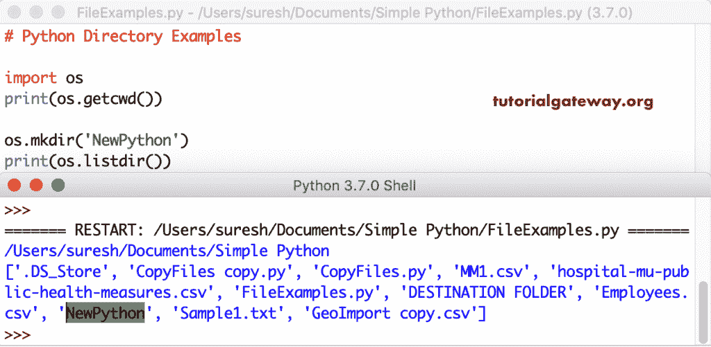

# Python 目录

> 原文：<https://www.tutorialgateway.org/python-directory/>

在处理文件时，您应该知道您正在使用哪个 Python 目录，您的文件存储在哪里等等。如果您知道它们，您可以轻松地更改工作目录，甚至创建子文件夹来组织您的文件。

在 Python 中，我们有一个操作系统模块，它包含了处理文件目录的所有必要功能。因此，要使用 Python 目录方法，您必须导入这个操作系统模块。

## Python 目录示例

下面的示例列表有助于您理解可用的函数，这有助于您使用 Python 目录。它们是 getcwd、chdir、listdir、mkdir、rmdir 和`rename()`函数。

### 在 Python 中获取当前目录

Python getcwd 方法返回当前工作目录。这个`getcwd()`函数示例向您展示了相同的内容。

```
import os
print(os.getcwd())
```

```
/Users/suresh/Documents/Simple Python
```

getcwd 方法帮助您将当前文件夹更改到新位置。

```
import os
print(os.getcwd())

os.chdir('/Users/suresh/Documents')
print(os.getcwd())
```

改变电流方向的输出

```
/Users/suresh/Documents/Simple Python
/Users/suresh/Documents
```

### Python 目录和文件列表

listdir 方法返回该文件夹中所有可用的文件和子文件夹。

```
import os
print(os.getcwd())

print(os.listdir())
```


### 用 Python 创建新目录

mkdir 方法创建一个新文件夹。如果您想让这个目录在当前工作文件夹中，那么只需指定文件夹名称；否则，请指定完整路径。

```
import os
print(os.getcwd())

os.mkdir('NewPython')
print(os.listdir())
```



让我提供完整的路径，这样我就可以在不同的位置创建一个文件夹。在这里，我们首先创建了一个文件夹。接下来，我们使用 chdir 方法更改了当前的工作文件夹。接下来，使用 listdir 列出其中的文档和文件夹。

```
import os
print(os.getcwd())

os.mkdir('/Users/suresh/Documents/NewPython')
os.chdir('/Users/suresh/Documents')
print(os.listdir())
```


### 重命名目录

os 模块中的重命名功能帮助我们重命名现有文件，甚至重命名文件夹。在这里，我们使用 Python 重命名文件函数将 Python 示例副本重命名为示例 1 文本。

```
import os
print(os.getcwd())

print(os.listdir())

os.rename("PythonSampleCopy.txt", "Sample1.txt")
print(os.listdir())
```


我们上面提到的重命名函数也重命名了文件夹。让我们使用这个重命名文件夹功能将第一个文件夹重命名为第二个文件夹。

```
import os
print(os.getcwd())

print(os.listdir())

os.rename("FirstFolder", "SecondFolder")
print(os.listdir())
```


### 删除文件

移除功能是从文件夹中移除文件。本示例使用`remove()`函数中的一个示例来删除 CopyFile.txt。

首先，我们列出当前工作文件夹中的文件。接下来，我们删除了那个特定的，然后打印文件。

```
import os
print(os.getcwd())

print(os.listdir())

os.remove("CopyFiles.txt")
print(os.listdir())
```


`rmdir()`函数是删除一个 [Python](https://www.tutorialgateway.org/python-tutorial/) 目录。这里，我们使用`rmdir()`函数删除现有的 SecondFolder。

```
import os
print(os.getcwd())

print(os.listdir())

os.rmdir("SecondFolder")
print(os.listdir())
```

