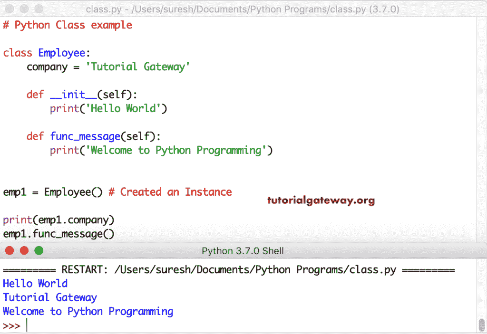

# Python 类

> 原文：<https://www.tutorialgateway.org/python-class/>

Python 是一种面向对象的编程语言。这意味着 python 中的一切都是某个类的对象或实例。简单地说，Python 类是一个对象的蓝图。或者，Python 类是初始化变量、定义方法、静态方法、类方法等的组合。在本节中，我们将通过示例向您解释如何在 Python 中创建类、创建对象或类的实例、修改对象、删除对象或实例。

## 用 Python 创建一个空类

如果要创建一个什么都不做的 Python 类或者创建一个空类，必须使用 pass 关键字。

```
class Employee:
    pass
```

下面的示例显示了如何在 Python 类中声明变量和创建方法。有不同种类的方法，我们将在后面的部分讨论。现在，理解 Python 类语法。

```
class Employee:
    Variable = Value

    def function_name(self):
        Statements 
    …………..
```

### Python 类对象

在 Python 中，类对象支持属性引用和实例化。您可以使用它们中的任何一个来调用类属性。它是实例化和属性引用的例子。

*   属性引用使用类名。变量名或类名。函数名。
*   对于实例化，您必须创建该 Python 类的实例(或该类的副本)。若要创建实例，请使用 instance_name = class_Name()，调用变量 instance_name.variable_name，并调用方法 instance_name.method_name()

这里，emp = Employee()正在创建一个实例化，print 内部的 emp.company 意味着调用类变量。接下来，Employee.company 是属性引用的一个例子。

```
class Employee:
    company = 'Tutorial Gateway'

emp = Employee()
print(emp.company)

print("-------------")
print(Employee.company)
```

```
Tutorial Gateway
-------------
Tutorial Gateway
```

在这个 Python 类示例中，我们声明了一个变量 company，并定义了一个带有 self 参数的函数，该函数打印一条欢迎消息。接下来，我们为雇员类创建了一个对象 emp1。通过使用这个对象 emp1，我们可以访问公司变量 func_message()。

在最后两条语句中，我们使用属性引用来访问变量值和函数结果。通过使用属性引用，可以打印变量值。但是，Employee.func_message 返回的是函数对象，而不是实际的函数结果。因此，在 python 类中处理属性引用时，您应该记住这个概念。

```
class Employee:
    company = 'Tutorial Gateway'

    def func_message(self):
        print('Welcome to Python Programming')

emp = Employee()
print(emp.company)
emp.func_message()

print("-------------")
print(Employee.company)
print(Employee.func_message)
```

```
Tutorial Gateway
Welcome to Python Programming
-------------
Tutorial Gateway
<function Employee.func_message at 0x7f831ddd8d30>
```

### Python __init()函数

默认情况下，所有实时 Python 类都有一个 __init__()函数。使用此函数为对象的属性赋值。当您创建 Python 类的对象时，它会自动调用 __init__()函数。你不必这么说。

在这个 [Python](https://www.tutorialgateway.org/python-tutorial/) 示例中，我们在 __init__()函数中使用了一个简单的 print 语句。接下来，我们创建了一个雇员对象。如您所见，它正在直接打印消息。

```
class Employee:
    company = 'Tutorial Gateway'

    def __init__(self):
        print('Hello World')

    def func_message(self):
        print('Welcome to Python Programming')

emp1 = Employee() # Created an Instance

print(emp1.company)
emp1.func_message()
```



这里，我们使用 __init__()函数向 Python 类中的属性添加值。这里，我们在函数中使用了姓名、年龄、性别，并在下一行中分配了这些值。这意味着，当您创建员工对象时，您必须提供姓名、年龄和性别(在创建对象本身时)。

例如，如果您创建一个没有参数值的对象 emp1 = Employee()，则会引发以下错误。TypeError: __init__()缺少 3 个必需的位置参数:“姓名”、“年龄”和“性别”

```
class Employee:
    company = 'Tutorial Gateway'

    def __init__(self, name, age, gender):
        self.name = name
        self.age = age
        self.gender = gender

    def func_message(self):
        print('Welcome to Python Programming')

emp1 = Employee('Jack', 25, 'Male') 

print(emp1.company)
emp1.func_message()
print(emp1.name)
print(emp1.age)
print(emp1.gender)
```

Python 初始化输出

```
Tutorial Gateway
Welcome to Python Programming
Jack
25
Male
```

从上面的 Python 类示例中，声明参数可能会让您感到困惑，因为我们一直使用相同的名称:姓名、年龄、性别。但是，这样使用并不是强制性的，但这样做是最佳实践。

在这个 Python 类示例中，我们使用 n，a，gen 作为 __init__ 参数，使用姓名，年龄，性别作为自我初始化。希望这能消除你的困惑。

```
class Employee:
    company = 'Tutorial Gateway'

    def __init__(self, n, a, gen):
        self.name = n
        self.age = a
        self.gender = gen

    def func_message(self):
        print('Welcome to Python Programming')

emp1 = Employee('Johnson', 29, 'Male')

print(emp1.company)
emp1.func_message()
print(emp1.name)
print(emp1.age)
print(emp1.gender)
```

Python 初始化输出

```
Tutorial Gateway
Welcome to Python Programming
Johnson
29
Male
```

### Python 中的多类对象

当您创建一个 Python 类的对象或实例时，它会保存一个副本，而不是实际的副本。这意味着您可以从单个类创建 n 个对象，并且每个实例可能有不同的属性值或方法值。

在这个 Python 示例中，我们创建了一个 Employee 类。接下来，我们从该员工创建了两个对象 emp1 和 emp2。如您所见，每个实例都有不同的名称、年龄和性别。接下来，我们将这些值打印为输出，您可以看到它们是有效的！。

```
class Employee:
    company = 'Tutorial Gateway'

    def __init__(self, name, age, gender):
        self.name = name
        self.age = age
        self.gender = gender

    def func_message(self):
        print('Welcome to this World')

emp1 = Employee('Mike', 25, 'Male')
print(emp1.company)
emp1.func_message()
print(emp1.name)
print(emp1.age)
print(emp1.gender)

print()
emp2 = Employee('Tracy', 27, 'Female')
print(emp2.company)
emp2.func_message()
print(emp2.name)
print(emp2.age)
print(emp2.gender)
```

```
Tutorial Gateway
Welcome to this World
Mike
25
Male

Tutorial Gateway
Welcome to this World
Tracy
27
Female
```

这个 Python 类示例与上面的相同。但是，这次我们修改了 func_message(self)函数定义。它接受名称(实例变量)并附加到我们作为输出打印的消息上。让我从两个实例 emp1 和 emp2 调用这个消息。

```
class Employee:
    company = 'Tutorial Gateway'

    def __init__(self, name, age, gender):
        self.name = name
        self.age = age
        self.gender = gender

    def func_message(self):
        print(self.name + ' is learning Programming')

emp1 = Employee('Mike', 25, 'Male')
print(emp1.company)
print(emp1.name) # Mike
print(emp1.age) # 25
print(emp1.gender)
emp1.func_message()

print()
emp2 = Employee('Tracy', 27, 'Female')
print(emp2.company)
print(emp2.name) # Tracy
print(emp2.age) # 27
print(emp2.gender)
emp2.func_message()
```

如您所见，emp1.func_message()将 self.name 替换为 Mike，emp2.func_message()将 self.name 替换为 Tracy。

```
Tutorial Gateway
Mike
25
Male
Mike is learning Programming

Tutorial Gateway
Tracy
27
Female
Tracy is learning Programming
```

## 修改 Python 类变量示例

让我们看看如何使用对象修改 Python 类变量。首先，我们声明了一个公司变量和一个打印欢迎消息的函数。接下来，我们创建了员工的三个实例 emp1、emp2 和 emp3。

接下来，我们使用对象名。Variabel_name = New_Name 更改 emp2 和 emp3 对象的公司名称。它会更改这两个实例的公司名称。接下来，我们打印这三个实例中的公司变量。

```
class Employee:
    company = 'Tutorial Gateway'

    def func_message(self):
        print('Welcome to Python Programming')

emp1 = Employee()
emp2 = Employee()
emp3 = Employee()

emp2.company = 'Python'
emp3.company = 'Apple'

emp1.func_message()

print(emp1.company)
print(emp2.company)
print(emp3.company)
print(emp1.company)
```

```
Welcome to Python Programming
Tutorial Gateway
Python
Apple
Tutorial Gateway
```

### 修改 Python 对象属性

这个例子展示了如何修改 Python 对象属性。首先，我们用必需的字段创建了 emp1 雇员类的实例。接下来，我们打印可用值作为输出。

这里，emp1 . name = ' John '(object _ name . property _ name = New _ Value)语句将现有的 EMP 1 名称(Mike)更新为 John。让我再打印一次 emp1 名称来检查一下。

```
class Employee:
    company = 'Tutorial Gateway'

    def __init__(self, name, age, gender):
        self.name = name
        self.age = age
        self.gender = gender

    def func_message(self):
        print(self.name + ' is learning Programs')

emp1 = Employee('Mike', 25, 'Male')
print(emp1.name)
print(emp1.age)
print(emp1.gender)
emp1.func_message()

emp1.name = 'John'
print(emp1.name)
emp1.func_message()
```

看到最后两个声明打印新的名字，约翰。

```
Mike
25
Male
Mike is learning Programs
John
John is learning Programs
```

## 删除 Python 对象属性

在这个 Python 类对象示例中，我们展示了如何删除对象属性。这里，emp1 = EMP 1 员工(“约翰”，25 岁，“男性”)为 EMP 1 员工创建一个实例。接下来，我们从 func_message()方法打印姓名、年龄、性别和消息。

接下来，我们使用 del 关键字删除名为 name(del instance _ name . property _ name)的 emp1 对象属性。在最后一条语句中，我们再次打印了我们删除的 emp1 对象的 name 属性。如您所见，它显示一个错误“员工”对象没有属性“名称”。这意味着我们成功删除了对象属性。同样，您可以通过 del emp1.age 删除年龄，通过 del emp1.gender 删除性别。

```
class Employee:
    company = 'Tutorial Gateway'

    def __init__(self, name, age, gender):
        self.name = name
        self.age = age
        self.gender = gender

    def func_message(self):
        print(self.name + ' is learning Python Programming')

emp1 = Employee('John', 25, 'Male')
print(emp1.name)
print(emp1.age)
print(emp1.gender)
emp1.func_message()

del emp1.name 
print(emp1.name)
```

```
John
25
Male
John is learning Python Programming
Traceback (most recent call last):
  File "/Users/suresh/Desktop/simple.py", line 19, in <module>
    print(emp1.name)
AttributeError: 'Employee' object has no attribute 'name'
```

请记住，删除一个实例属性不会影响另一个实例属性。这个 Python 类示例与上面的相同。但是，这次我们为员工创建了两个实例 emp1 和 emp2。接下来，我们使用 del 关键字删除了 emp1 对象的 name 属性。接下来，我们打印 emp2 实例和 emp1 实例的名称。

emp2.name 返回的名称是 Nancy，但是 emp1.name 抛出了一个错误，因为我们删除了它。

```
class Employee:
    company = 'Tutorial Gateway'

    def __init__(self, name, age, gender):
        self.name = name
        self.age = age
        self.gender = gender

    def func_message(self):
        print(self.name + ' is learning Python Programming')

emp1 = Employee('John', 25, 'Male')
emp2 = Employee('Nancy', 27, 'Female')
print(emp1.name)
print(emp1.age)
print(emp1.gender)
emp1.func_message()

del emp1.name
print(emp2.name)
print(emp1.name)
```

```
John
25
Male
John is learning Python Programming
Nancy
Traceback (most recent call last):
  File "/Users/suresh/Desktop/simple.py", line 21, in <module>
    print(emp1.name)
AttributeError: 'Employee' object has no attribute 'name'
```

### 删除 Python 类对象

在这个 Python 类示例中，我们使用了我们在前面示例中定义的相同方法。这里，首先，我们创建一个 Employee 对象，并显示雇员的姓名、年龄、性别以及 func_message()方法的消息。请参考[静态方法](https://www.tutorialgateway.org/python-static-method/)一文。

接下来，我们使用 del 关键字删除对象 emp1 (del Object_name)。它会删除我们之前创建的实例 emp1。在最后一条语句中，我们用 emp1 对象调用 func_message()方法来检查该对象是否仍然存在。如您所见，它抛出了一个未定义名称“emp1”的错误。这意味着，我们通过 del 语句删除了 emp1 对象。

```
class Employee:
    company = 'Tutorial Gateway'

    def __init__(self, name, age, gender):
        self.name = name
        self.age = age
        self.gender = gender

    def func_message(self):
        print(self.name + ' is learning Python Programming')

emp1 = Employee('John', 25, 'Male')
print(emp1.name)
print(emp1.age)
print(emp1.gender)
emp1.func_message()

del emp1
emp1.func_message()
```

```
John
25
Male
John is learning Python Programming
Traceback (most recent call last):
  File "/Users/suresh/Desktop/simple.py", line 19, in <module>
    emp1.func_message()
NameError: name 'emp1' is not defined
```

## 创建 Python 类示例

在这里，我们展示了用 python 创建类的不同方法。如您所见，您可以使用类名或类名()或类名(对象)。对象的最后一个选项是用 python 创建类的最新选项。如果你仔细观察对象创建，我们使用相同的方法为这三个对象创建对象。

```
class Employee:
    def __init__(self):
        print('Msg from Employee : Welcome to Tutorial Gateway')

class Student():
    def __init__(self):
        print('Msg from Student: Hello World!')

class Person(object):
    def __init__(self):
        print('Msg from Person: Welcome to Programming')

emp = Employee()

std = Student()

per = Person()
```

使用类名或类名()输出创建

```
Msg from Employee : Welcome to Tutorial Gateway
Msg from Student: Hello World!
Msg from Person: Welcome to Programming
```

### Python 类自身参数

Python 自身参数只不过是对类的当前实例的引用。我们必须使用这个 Python 类自身参数作为第一个参数，这有助于我们访问变量。

如果你不喜欢关键词 self，那就用任何一个词作为 self 参数。然而，它必须是第一个参数。在这个 Python 类示例中，我们在第三种方法中使用了 suresh 而不是 self。

```
class Employee:
    def __init__(self, name, age):
        self.name = name
        self.age = age

    def func_message(self):
        print(self.name + ' is learning Programming')

    def func_msg(suresh):
        print('Tutorial Gateway Welcome ' + suresh.name)

emp1 = Employee('John', 25)
emp1.func_message()
emp1.func_msg()
```

```
John is learning Programming
Tutorial Gateway Welcome John
```