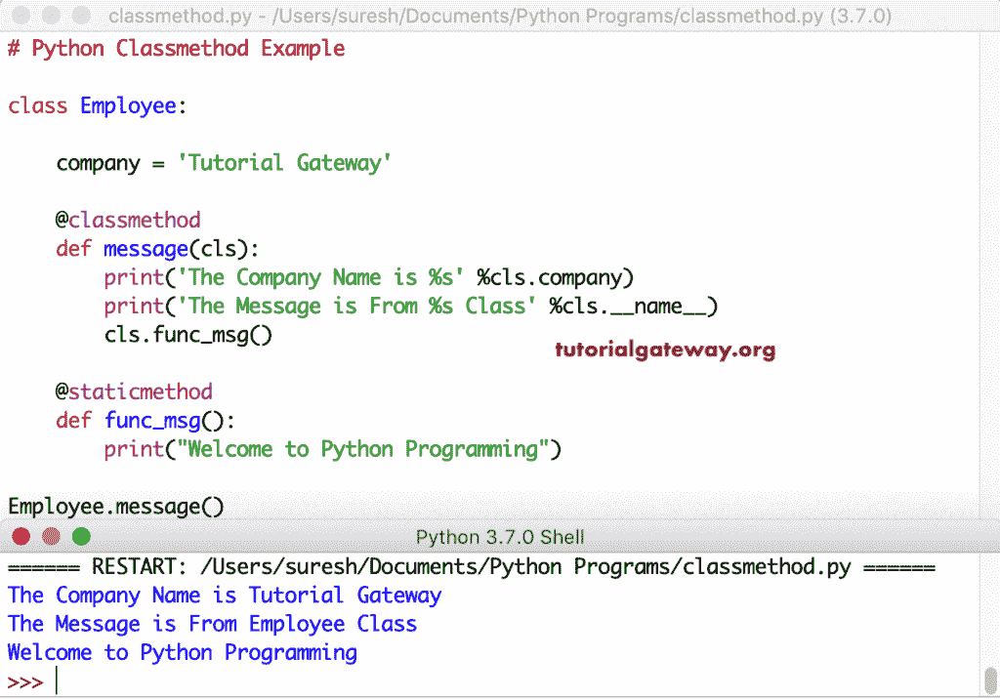

# Python 类方法

> 原文：<https://www.tutorialgateway.org/python-classmethod/>

与静态方法不同，Python 中的类方法绑定到一个类。因此，我们不必创建一个类的实例或对象来调用这个类方法。Python 类方法接收 cls(类)作为隐式的第一个参数，就像标准方法接收 self 作为第一个参数一样。该 cls 允许您访问类变量、方法以及类或实例的静态方法。

您可以使用@classmethod 装饰器或 classmethod()函数将任何方法定义为 Python 类方法。无论哪种方式，它都有效，但选择第一种方式总是明智的。Python 类方法定义的语法是

```py
Class A:
    @classmethod
    def function_name(cls, arg1, arg2,....):
         ........
         ......

Or
Class A:
    def function_name(cls, arg1, arg2,....):
        ........
         ......

A.function_name = classmethod(function_name)
```

您可以使用类名调用类方法。方法名或类名()。MethodName()。两种方法都将返回 classmethod 结果。

在本节中，我们将通过示例展示如何使用@classmethod 和 classmethod()在 Python 编程语言中创建或定义一个类方法。

## 使用 Decorator 的 Python 类方法

在这个例子中，我们使用 Python @classmethod 装饰器创建了一个名为 message 的类方法。在这个方法中。__name__ 返回类名(Employee)，cls.company 返回类变量公司值(Tutorial Gateway)。

```py
class Employee:

    company = 'Tutorial Gateway'

    @classmethod
    def message(cls):
        print('The Message is From %s Class' %cls.__name__)
        print('The Company Name is %s' %cls.company)

Employee.message()

print('-----------')
Employee().message() # Other way of calling classmethod
```

使用装饰器输出的 Python 类方法

```py
The Message is From Employee Class
The Company Name is Tutorial Gateway
-----------
The Message is From Employee Class
The Company Name is Tutorial Gateway
```

### 使用 classmethod()函数

这里，我们使用 Python classmethod()函数来创建一个类方法。从下面的 [Python](https://www.tutorialgateway.org/python-tutorial/) 代码中，employee . print value = class method(employee . print value)语句将函数转换为类方法。

```py
class Employee:

    value = 100

    def printValue(cls):
        print('The Value = %d' %cls.value)

Employee.printValue = classmethod(Employee.printValue)
Employee.printValue()
```

```py
The Value = 100
```

### 在 Python 中从类方法调用静态方法

在这个 classmethod 和 staticmethod 的例子中，我们展示了如何在类方法中调用[静态方法](https://www.tutorialgateway.org/python-static-method/)。在这里，我们创建了一个名为 func_msg()的 staticmethod，它会打印一条欢迎消息。接下来，我们定义了返回类变量 company 和类名的 message 类方法。在同一个函数中，我们使用 cls.methodname 调用 staticmethod。

```py
class Employee:

    company = 'Tutorial Gateway'

    @classmethod
    def message(cls):
        print('The Company Name is %s' %cls.company)
        print('The Message is From %s Class' %cls.__name__)
        cls.func_msg()

    @staticmethod
    def func_msg():
        print("Welcome to Python Programming")

Employee.message()
```



在这里，我们不是打印消息，而是找到总和和平均值。首先，我们创建了一个静态方法，它接受三个参数并返回其中的一些。接下来，我们定义了一个 Python 类方法，它使用 cls 调用静态方法。在函数中，它查找并返回静态方法结果的平均值。

```py
class Employee:

    company = 'Tutorial Gateway'

    @staticmethod
    def add(a, b, c):
        return a + b + c

    @classmethod
    def avg(cls):
        x = cls.add(10, 20, 40)
        return (x / 3)

average = Employee.avg()
print('The Average Of three Numbers = ', average)
```

```py
The Average Of three Numbers =  23.333333333333332
```

### 在 python 中使用 classmethod 更改类变量

在本例中，我们将创建一个 Python classmethod，它接受一个参数并将值赋给类变量。这意味着，当您调用此函数时，它会用您作为参数值提供的新文本替换公司文本。它有助于隐藏类变量，并允许最终用户使用类变量。

```py
class Employee:

    company = 'Tutorial Gateway'

    @classmethod
    def func_newName(cls, new_Name):
        cls.company = new_Name

emp = Employee()

print(Employee.company)
print(emp.company)

print('----------')
Employee.func_newName('Coding')

print(Employee.company)
print(emp.company)
```

```py
Tutorial Gateway
Tutorial Gateway
----------
Coding
Coding
```

## 类方法的实时示例

例如，如果客户端接收到长字符串形式的员工信息，以及由–(或任何其他分隔符)分隔的详细信息。我们可以创建一个 Python 类方法，并允许他们使用它，而不是从他的一端执行拆分操作。

在这个 Python 类方法示例中，我们初始化了全名、年龄、性别和工资。接下来，我们创建了一个 classmethod，它根据–分割给定的字符串并返回这些值。建议大家参考 [Python 拆分字符串](https://www.tutorialgateway.org/python-split/)文章了解拆分功能

```py
class Employee:

    def __init__(self, fullname, age, gender, salary):
        self.fullname = fullname
        self.age = age
        self.gender = gender
        self.salary = salary

    @classmethod
    def func_string_split(cls, employee_str):
        fullname, age, gender, salary = employee_str.split('-')
        return cls(fullname, age, gender, salary)

emp_from_csv1 = 'Suresh-27-Male-120000'
emp_from_csv2 = 'John-29-Male-100000'
emp_from_csv3 = 'Tracy-25-Female-155000'

emp1 = Employee.func_string_split(emp_from_csv1)
print(emp1.fullname)
print(emp1.gender)
print(emp1.salary)
print(emp1.age)

print('----------')
emp3 = Employee.func_string_split(emp_from_csv3)
print(emp3.fullname)
print(emp3.gender)
print(emp3.age)
```

```py
Suresh
Male
120000
27
----------
Tracy
Female
25
```

这是 classmethod 的另一个例子。这里，我们将日期字符串拆分为日、月和年。在这里，我们使用了 [Python 地图函数](https://www.tutorialgateway.org/python-map-function/)进行这种拆分。

```py
class Date:

    def __init__(self, day = 0, month = 0, year = 0):
        self.day = day
        self.month = month
        self.year = year

    @classmethod
    def string_to_Date(cls, string_Date):
        day, month, year = map(int, string_Date.split('-'))
        return cls(day, month, year)

dt = Date.string_to_Date('31-12-2018')
print(dt.day)
print(dt.month)
print(dt.year)
```

```py
31
12
2018
```