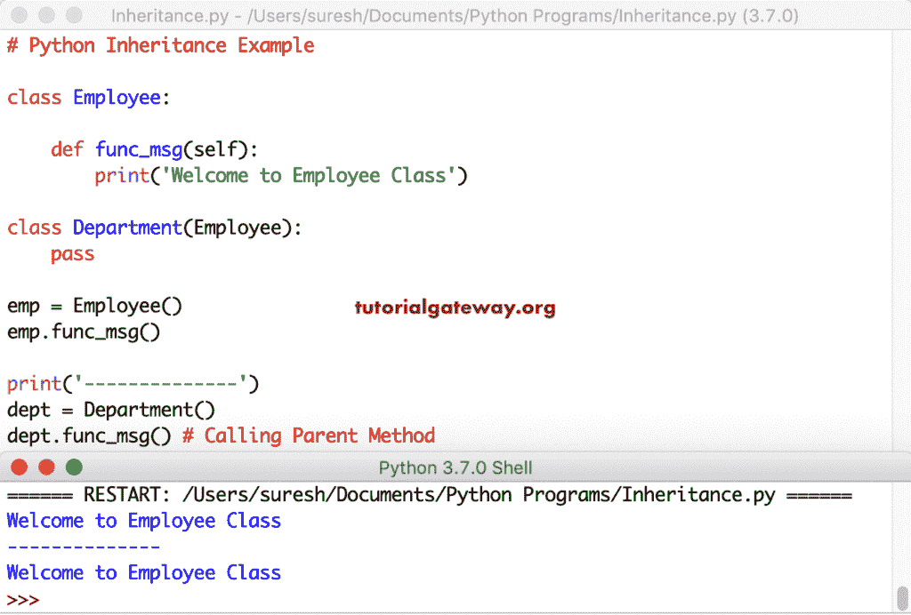
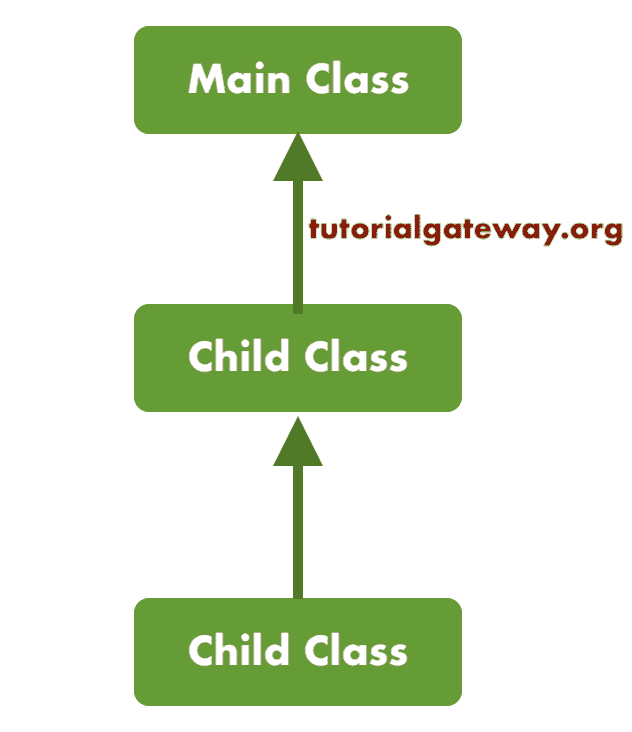
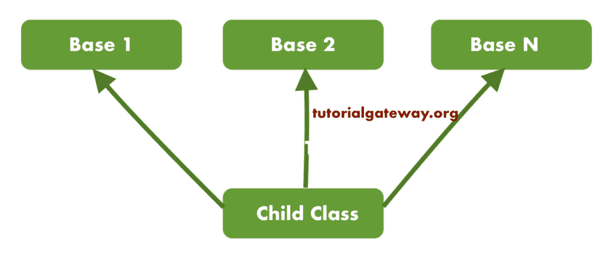

# Python 继承

> 原文：<https://www.tutorialgateway.org/python-inheritance/>

Python 继承是面向对象编程语言中一个有趣而重要的概念。Python 继承意味着创建一个继承父类所有功能的新类，并允许它们添加更多功能。

我们通过继承名为子类(或衍生类或子类)的功能创建的 Python 新类。我们继承的类称为 Python 基类、父类或超级类。

**父类**

这和正常上课是一样的。它包含常见的、多次可重用的属性和方法。例如，在一个组织中，年龄、姓名、雇佣日期、性别等员工详细信息在每个实例中都是相同的。

因此，您可以在父类中声明它们，并在子类中使用它。类似地，像加薪百分比这样的一些计算可能是相同的。因此，我们可以一次在父类中定义一个函数，您可以从多个子类中调用它。

**子班级**

看起来像正常课。它继承了 Python 父类(派生自)中可用的所有属性和方法。除此之外，您还可以创建新的方法来为这个孩子执行所需的计算。

在 Python 中，我们可以通过将父类作为对象传递来创建这个子类。意思是，用括号创建一个孩子。

## Python 继承的优势

以下是在 Python 中使用继承的几个优点或好处。

*   Python 继承提供了代码的可重用性、可读性和可扩展性。
*   它减少了代码重复。您可以将所有标准方法和属性放在父类中。这些可由派生自它的子类访问。
*   通过将代码分成多个类，应用程序看起来更好，错误识别也很容易。

让我们通过多个例子来看看如何在 Python 中使用继承。除此之外，您还可以了解 Python 多重继承、多级继承、issubclass 方法和 isinstance 方法。

## Python 类继承示例

在这个 Python 类继承的例子中，我们简单地用 pass 关键字创建了一个父类和一个子类(从父类派生)。您可以将此视为 Python 类继承的语法。

```
class Employee:
    pass

class Department(Employee):
    pass
```

### Python 中的单一继承

这是 python 中单一继承的一个例子。它意味着从单个父类派生的单个类。首先，我们用变量 x 和 func_msg()方法声明了一个 Employee 类。

接下来，我们创建了一个从员工那里继承的部门。在这个部门[类](https://www.tutorialgateway.org/python-class/)中，我们声明了一个变量 a = 250 和 func_message()。

```
class Employee:
    x = 10 # Parent Variable

    def func_msg() # Parent Method

class Department(Employee):
    a = 250 # Child Variable

    def func_message() # Child Method
```

它是 python 示例中上述单一继承的扩展。我们没有定义空方法，而是使用[打印功能](https://www.tutorialgateway.org/python-print-function/)打印来自员工和部门类的消息。

```
class Employee:
    x = 10 

    def func_msg(self):
         print('Welcome to Employee')

class Department(Employee):
    a = 250

    def func_message(self):
        print('Welcome to Department')
        print('This is inherited from Employee')

emp = Employee()
print(emp.x)
emp.func_msg()

print('--------------')
dept = Department()
print(dept.a)
dept.func_message()
```

Python 单一继承输出

```
10
Welcome to Employee
--------------
250
Welcome to Department
This is inherited from Employee
```

分析

*   emp = Employee()创建 Employee 类的实例或对象。使用这个对象名，我们可以访问雇员的功能和属性。
*   打印(EMP . x)–打印员工变量值 x，即 10。
*   EMP . func _ msg()–打印欢迎员工的消息
*   dept = Department()–它创建部门的一个对象。
*   打印(部门 a)-打印部门变量值 a，即 250。
*   dept . func_message()–打印来自部门方法 func _ message()的消息

### Python 示例 2 中的单一继承

在这个 Python 单继承示例中，我们展示了如何使用子类对象来访问父类函数和属性。对于这个 Python 继承示例，我们用一个打印欢迎消息的方法创建了一个简单的 Employee。接下来，我们使用 [Python](https://www.tutorialgateway.org/python-tutorial/) pass 关键字创建了一个部门子代。

```
class Employee:

    def func_msg(self):
        print('Welcome to Employee Class')

class Department(Employee):
    pass

emp = Employee()
emp.func_msg()

print('--------------')
dept = Department()
dept.func_msg() # Calling Parent Method
```



dept = Department()–它创建部门的一个对象。正如我们已经知道的，它继承自员工。您可以使用此部门对象访问员工和部门类中的变量和方法。

dept . func_msg()–它调用父类中存在的方法 func _ msg()。

### 在 Python 中从子类访问父类变量

实时地，您可能必须从子类访问或更改父类的变量值和方法。要从子类访问父类方法或属性，必须使用类名和点运算符。例如，父类名。变量名或父类名。MethodName()

在这个 Python 继承示例中，我们展示了如何从子对象访问父类变量。以及如何改变变量值。首先，我们声明了一个变量为 x = 10 的员工。接下来，我们声明部门继承自员工。

在 Dept 中，我们声明了一个变量 a = 250。接下来，我们调用 Employee 变量 x，并向其中添加 22 (b = Employee.x + 22)。

```
class Employee:
    x = 10 

    def func_msg(self):
        print('Welcome to Employee')

class Department(Employee):
    a = 250
    b = Employee.x + 22 

    def func_message(self):
        print('Welcome to Department')

    def func_changed(self):
        print('New Value = ', Employee.x + 449)

emp = Employee()
print(emp.x)
emp.func_msg()

print('--------------')
dept = Department()
print(dept.a)
print(dept.b)
dept.func_message()
dept.func_changed()
```

从子输出访问父变量

```
10
Welcome to Employee
--------------
250
32
Welcome to Department
New Value =  459
```

如您所见，从 Employee 对象打印 x 返回 10。但是，来自部门对象的 b 返回 10 (Employee.x))+ 22 = 32。

## Python 继承初始化示例

到目前为止，我们已经创建了继承 Python 父类的方法和变量的派生类。在这个 Python 继承 init 示例中，我们在父类中定义`init()`函数，并在父类函数中使用这些值。这里，我们用 pass 关键字声明了一个孩子。接下来，我们创建了一个部门对象，并调用了这些父函数。

```
class Employee:

    def __init__(self, fullname, age, income):
        self.fullname = fullname
        self.age = age
        self.income = income

    def func_msg(self):
        print('Welcome to Employee')

    def func_information(self):
        print('At age', self.age, self.fullname, 'is earning', self.income)

class Department(Employee):
    pass

emp = Employee('Suresh', '27', '650000')
emp.func_msg()
emp.func_information()

print('--------------')
dept = Department('Jenny', '25', '850005')
dept.func_msg() # Calling Parent Method func_msg(self)
dept.func_information() # Calling Parent Method func_information(self)
```

Python 继承初始化输出

```
Welcome to Employee
At age 27 Suresh is earning 650000
--------------
Welcome to Employee
At age 25 Jenny is earning 850005
```

### Python 继承初始化示例 2

在这个 Python 继承示例中，我们在父类和派生类中都定义了`init()`函数。在派生的员工中。__init__(自我、全名、年龄、收入)继承父类 Employee 的功能。

```
class Employee:

    def __init__(self, fullname, age, income):
        self.fullname = fullname
        self.age = age
        self.income = income

    def func_information(self):
        print('At age', self.age, self.fullname, 'is earning', self.income)

class Department(Employee):

    def __init__(self, fullname, age, income):
         Employee.__init__(self, fullname, age, income)

emp = Employee('John', '27', '650000')
emp.func_information()

print('--------------')
dept = Department('Jenny', '25', '850005')
print(dept.fullname)
dept.func_information()
```

继承初始化示例 2 输出

```
At age 27 John is earning 650000
--------------
Jenny
At age 25 Jenny is earning 850005
```

### Python 继承初始化示例 3

python 继承不是使用现有的函数或属性。您可以扩展或覆盖它们。在这个 Python 继承示例中，我们在部门初始化中添加了另一个名为 dept_name 的参数。

这意味着当您创建雇员类的对象时，您必须提供姓名、年龄和收入。但是，如果创建部门对象，则必须提供姓名、年龄、收入和部门名称。

```
class Employee:

    def __init__(self, fullname, age, income):
        self.fullname = fullname
        self.age = age
        self.income = income

    def func_information(self):
        print('At age', self.age, self.fullname, 'is earning', self.income)

class Department(Employee):

    def __init__(self, fullname, age, income, dept_name):
        Employee.__init__(self, fullname, age, income)
        self.dept_name = dept_name

    def func_info(self):
        print(self.fullname, self.age, 'Working as a',
               self.dept_name, 'is earning', self.income)

emp = Employee('John', '27', '650000')
emp.func_information()

print('--------------')
dept = Department('Jenny', '25', '850005', 'Developer')
dept.func_information()
dept.func_info()
```

```
At age 27 John is earning 650000
--------------
At age 25 Jenny is earning 850005
Jenny 25 Working as a Developer is earning 850005
```

## Python 中的多级继承

Python 允许您创建多级继承。这意味着 Python 子类继承自另一个子类。下面的截图显示了 Python 多级继承的图示。



在这个 Python 多级继承的例子中，首先，我们用一个方法创建了一个 Main。接下来，我们创建了一个继承自 Main 的子类。接下来，我们创建了另一个从 Child 派生的 Child(已经从 Main 继承)。

```
class MainClass:

    def func_message(self):
        print('Welcome to Main')

class Child(MainClass):

    def func_child(self):
        print('Welcome to Child')
        print('This is inherited from Main')

class ChildDerived(Child):

    def func_Derived(self):
        print('Welcome to Derived')
        print('This is inherited from Child')

print('------------')
chldev = ChildDerived()
chldev.func_Derived()

print('------------')
chldev.func_child()

print('------------')
chldev.func_message()
```

多级继承输出

```
------------
Welcome to Derived
This is inherited from Child
------------
Welcome to Child
This is inherited from Main
------------
Welcome to Main
```

## Python 中的多重继承

Python 编程语言支持多种继承。这意味着一个孩子可以同时从多个类继承。让我向您展示 Python 多重继承的图示。



在这个 Python 多重继承的例子中，我们创建了两个超类 MainClass1 和 MainClass2。接下来，我们创建了一个从这两个类继承的子类。

```
class MainClass1:

    def func_main1(self):
        print('This Welcome Message is from Main 1')

class MainClass2:

    def func_main2(self):
        print('This is an another Message coming from Main 2')

class ChildClass(MainClass1, MainClass2):

    def func_child(self):
        print('This is coming from Child')

chd = ChildClass()

chd.func_main1()
chd.func_main2()
chd.func_child()
```

多重继承输出

```
This Welcome Message is from Main 1
This is an another Message coming from Main 2
This is coming from Child
```

## Python 继承中的方法重写

实时地，您可能需要更改在父类或基类中定义的方法的程序逻辑。但是，更改这一点可能会影响从该父级继承的其余类。因此，您可以在子类中定义一个新函数并编写自己的逻辑，而不是更改父类中的逻辑。要覆盖 Python 继承中的方法，您必须在子对象中定义一个具有相同名称和相同参数数量的新方法。

在本例中，我们在员工和部门(子代)中创建了相同的方法 func_message()。接下来，我们为员工和部门类创建了一个对象，并调用了函数名。

如您所见，Employee 对象正在打印欢迎使用 Employee 消息，因为我们没有在父对象中更改任何内容。而 Department 对象是从子级打印消息，而不是打印基类消息。这是因为我们已经覆盖了子级中的 func_message()定义。

```
class Employee:

    def func_message(self):
        print('Welcome to Employee')

class Department(Employee):

    def func_message(self):
        print('Welcome to Department')
        print('This is inherited from Employee')

emp = Employee()
emp.func_message()

print('------------')
dept = Department()
dept.func_message()
```

继承输出中的方法重写

```
Welcome to Employee
------------
Welcome to Department
This is inherited from Employee
```

## Python 问题类方法

Python issubclass 方法接受两个参数，它们是子类(子类)和超类(主类)。Python issubclass 方法是检查子类是否从超类继承，并根据结果返回布尔值 True 或 False。这个 Python issubclass 方法的语法是:issubclass(sub，sup)

```
class MainClass:

    def func_message(self):
        print('Welcome to Main Class')

class Child(MainClass):

    def func_child(self):
        print('This class is inherited from Main Class')

class ChildDerived(Child):

    def func_Derived(self):
        print('This class is inherited from Child Class')

print(issubclass(ChildDerived, Child))
print(issubclass(ChildDerived, MainClass))

print('------------')
print(issubclass(Child, MainClass))

print('------------')
print(issubclass(Child, ChildDerived))
```

Python`issubclass()`函数输出

```
True
True
------------
True
------------
False
```

## Python 是一种实例方法

Python isinstance 方法也接受两个参数，它们是对象名和类名。如果对象(第一个参数)是(第二个参数)的实例，则此 Python isinstance 方法返回 True 否则，它返回 false。这个 Python isinstance 方法的语法是:isinstance(对象，类)。

```
class MainClass:

    def func_message(self):
        print('Welcome to Main')

class Child(MainClass):

    def func_child(self):
        print('This is inherited from Main')

class ChildDerived(Child): 

    def func_Derived(self):
        print('This is inherited from Child')

mn = MainClass()
print(isinstance(mn, MainClass))
mn.func_message()

print('------------')
chd = Child()
print(isinstance(chd, Child))
print(isinstance(chd, MainClass))
print(isinstance(chd, ChildDerived))
chd.func_child()
chd.func_message()

print('------------')
dev = ChildDerived()
print(isinstance(dev, ChildDerived))
print(isinstance(dev, Child))
print(isinstance(dev, MainClass))
dev.func_child()
dev.func_message()
dev.func_Derived()
```

Python 是一个实例方法输出

```
True
Welcome to Main
------------
True
True
False
This is inherited from Main
Welcome to Main
------------
True
True
True
This is inherited from Main
Welcome to Main
This is inherited from Child
```