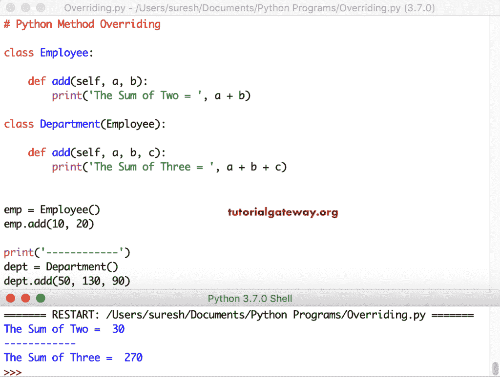

# Python 中的方法重写

> 原文:[https://www . tutorialgateway . org/method-override-in-python/](https://www.tutorialgateway.org/method-overriding-in-python/)

Python 中的方法重写意味着创建两个同名但编程逻辑不同的方法。方法覆盖的概念允许我们改变或覆盖子类中的父类函数。

在 Python 中，要重写一个方法，必须满足某些条件，它们是:

*   不能在同一个类中重写方法。这意味着您必须在子类中使用继承概念来完成。
*   要重写父类方法，必须在子类中创建一个具有相同名称和相同参数数量的方法。

例如，如果您有一个计算组织中所有员工加薪的函数。但是特定的部门或人员得到不同的百分比。在这种情况下，您可以重写 Department 类中的现有方法并编写您的逻辑。

在本节中，我们将通过一个例子讨论如何在 Python 编程语言中执行方法重写。

## Python 方法覆盖示例

在这个例子中，我们创建了一个 employee 类，它包含一个打印消息的 message 方法。接下来，我们创建了一个从 Employee 类继承而来的部门类。在这个类中，我们创建了一个具有相同名称消息和不同打印消息的方法。

这是 Python 方法重写的简单演示。在这里，我们只是覆盖信息。接下来，我们为员工和部门类创建一个对象，并调用该消息函数。

```
# Python Method Overriding

class Employee:

    def message(self):
        print('This message is from Employee Class')

class Department(Employee):

    def message(self):
        print('This Department class is inherited from Employee')

emp = Employee()
emp.message()

print('------------')
dept = Department()
dept.message()
```

```
This message is from Employee Class
------------
This Department class is inherited from Employee
```

如您所见，emp 对象正在打印雇员类消息函数中的一个字符串。而 dept.message()是来自 dept 类的打印测试。

在这个 Python 方法重写示例中，我们又创建了一个从 Employee 类继承的类。接下来，我们也将覆盖这个销售类的消息函数。请参考 [Python 类](https://www.tutorialgateway.org/python-class/)示例。

```
class Employee:

    def message(self):
        print('This message is from Employee Class')

class Department(Employee):

    def message(self):
        print('This Department class inherited from Employee')

class Sales(Employee):

    def message(self):
        print('This Sales class is also inherited from Employee')

emp = Employee()
emp.message()

print('------------')
dept = Department()
dept.message()

print('------------')
sl = Sales()
sl.message()
```

方法覆盖示例输出

```
This message is from Employee Class
------------
This Department class inherited from Employee
------------
This Sales class is also inherited from Employee
```

### 多重继承中的 Python 方法重写

这个 Python 例子展示了如何在多重继承的情况下执行方法重载。参考 [Python](https://www.tutorialgateway.org/python-tutorial/) 中的 [Python 继承](https://www.tutorialgateway.org/python-inheritance/)。

```
class Employee:

    def message(self):
        print('This message is from Employee Class')

class Department(Employee):

    def message(self):
        print('This Department class is inherited from Employee')

class Sales(Department):

    def message(self):
        print('This Sales class is inherited from Employee')

emp = Employee()
emp.message()

print('------------')
dept = Department()
dept.message()

print('------------')
sl = Sales()
sl.message()
```

多重继承输出中的 Python 方法重写

```
This message is from Employee Class
------------
This Department class is inherited from Employee
------------
This Sales class is inherited from Employee
```

### 用参数重写 Python 方法

到目前为止，我们只是更改打印声明。我是说，在没有任何参数的情况下重写方法。在这个例子中，我们创建了一个 add 方法，在父类中有两个参数，在子类中有三个参数。

```
class Employee:

    def add(self, a, b):
        print('The Sum of Two = ', a + b)

class Department(Employee):

    def add(self, a, b, c):
        print('The Sum of Three = ', a + b + c)

emp = Employee()
emp.add(10, 20)

print('------------')
dept = Department()
dept.add(50, 130, 90)
```



### 在 Python 的方法重写中调用父函数

在这个 Python 方法重写示例中，我们从重写方法调用父函数。

```
class Employee:

    def message(self):
        print('This message is from Employee Class')

class Department(Employee):

    def message(self):
        Employee.message(self)
        print('This Department class is inherited from Employee')

emp = Employee()
emp.message()

print('------------')
dept = Department()
dept.message()
```

```
This message is from Employee Class
------------
This message is from Employee Class
This Department class is inherited from Employee
```

从上面的截图来看，两者基于对象给出了不同的结果。在这里，Employee.message(self)调用 print(此消息来自 Employee Class)语句，并在[打印功能](https://www.tutorialgateway.org/python-print-function/)中打印消息。您可以使用 super()函数来调用父类方法，而不是使用类名。

```
class Employee:

    def message(self):
        print('This message is from Employee')

class Department(Employee):

    def message(self):
        super().message()
        print('This Department is inherited from Employee')

emp = Employee()
emp.message()

print('------------')
dept = Department()
dept.message()
```

```
This message is from Employee 
------------
This message is from Employee 
This Department is inherited from Employee
```