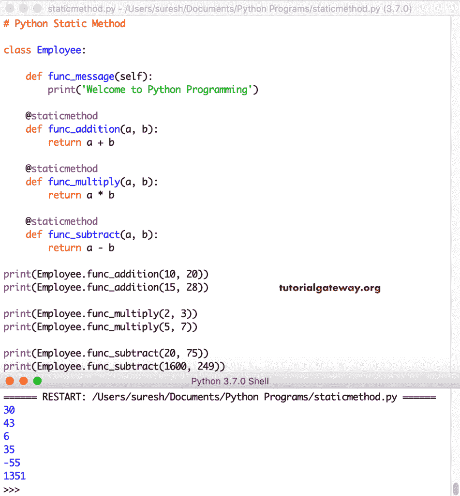

# python 静态方法

> 原文:[https://www.tutorialgateway.org/python-static-method/](https://www.tutorialgateway.org/python-static-method/)

Python 静态方法可以在不创建实例或对象的情况下调用。虽然 staticmethod 属于一个类，但是您可以通过它的名称直接调用。如果您想要一个不需要任何类变量或实例变量来操作的函数，那么您可以将其创建为静态方法。

例如，如果您想要打印欢迎消息，那么您可以将其创建为 staticmethod，因为它不会改变。或者它不需要任何类变量来显示该消息。我们可以使用@staticmethod 装饰器或 static method()函数在 Python 中创建一个静态方法。虽然我们不推荐第二种选择，但我们正在展示您理解的可能性。

在本节中，我们将向您解释如何用 Python 编程语言创建静态方法，以及如何调用 static method。在大多数例子中，我们将静态方法和非静态方法结合起来。起初，它可能会让您感到困惑，但这允许您区分静态和非静态。

## Python 静态方法示例

您可以用一个类编写静态和非静态方法。让我使用@staticmethod 装饰器创建一个非静态 func_message()和一个 staticmethod func_msg()。

提示:参考 [Python 函数](https://www.tutorialgateway.org/functions-in-python/)和[类](https://www.tutorialgateway.org/python-class/)文章创建一个 [Python](https://www.tutorialgateway.org/python-tutorial/) 类。

```
class Employee:

    def func_message(self):
        print('Welcome to Python Programming')

    @staticmethod
    def func_msg():
        print("Welcome to Tutorial Gateway")
```

要显示某个类的内容，您需要从该类创建一个对象或实例。

### 在 Python 中调用@staticmethod

在这个例子中，我们展示了如何调用 Python 静态方法和非静态函数。如前所述，我们不需要创建一个实例来调用 staticmethod。

如果你看看这个例子，雇员。func_msg()表示类名。staicmethod_name。它会自动调用 employee 类中的 func_msg 函数。

接下来，我们创建了 Employee 类的一个实例来调用另一个函数，它是非静态函数。

```
class Employee:

    def func_message(self):
        print('Welcome to Programming')

    @staticmethod
    def func_msg():
        print("Welcome to Tutorial Gateway")

Employee.func_msg()

emp = Employee()
emp.func_message()
```

```
Welcome to Tutorial Gateway
Welcome to Programming
```

### @staticmethod 方法 2

在这个例子中，我们使用 static method()函数创建了一个 Python 静态方法。在类中，首先，我们创建了两个常规的<font color="#000000">函数</font>。接下来，我们使用下面的语句将常规函数转换为 staticmethod。

Employee . func _ addition = static method(Employee。func_addition)。意思是 class_name。method _ name = static method(class _ name。方法名)

```
class Employee:

    def func_message(self):
        print('Welcome to The World')

    def func_addition(a, b):
        return a + b

Employee.func_addition = staticmethod(Employee.func_addition)
print('Total = ', Employee.func_addition(25, 50))

emp = Employee()
emp.func_message()
```

```
Total =  75
Welcome to the World
```

这是使用 static method()函数创建 Python 静态方法的另一个示例。这里，我们创建了两个 func _ 加法()和 func _ 乘法()

```
class Employee:

    def func_message(self):
        print('Welcome to this World')

    def func_addition(a, b):
        return a + b

    def func_multiply(a, b):
        return a * b

emp = Employee()
emp.func_message()

Employee.func_addition = staticmethod(Employee.func_addition)
print('Total = ', Employee.func_addition(25, 50))

Employee.func_multiply = staticmethod(Employee.func_multiply)
print('Multiplication = ', Employee.func_multiply(25, 50))
```

```
Welcome to this World
Total =  75
Multiplication =  1250
```

### Python @staticmethod 带参数示例

在 Python 中，您不必使用 self 或 cls 属性来创建静态方法。就像一个函数，你可以创建它并根据你的需求添加参数。

在这个例子中，我们创建了两个。func_msg()函数打印一条欢迎消息。并且，split_string (message)函数接受一个字符串，并用逗号分隔符分割该字符串。建议大家参考[弦分裂](https://www.tutorialgateway.org/python-split/)篇。

```
class Employee:

    def func_message(self):
        print('Welcome to Python Programming')

    @staticmethod
    def func_msg():
        print("Welcome to Tutorial Gateway")

    @staticmethod
    def split_string(message):
        return message.split(",")

Employee.func_msg()

countries = 'India, China, Japan, USA, UK, Australia, Canada'

print(Employee.split_string(countries))
```

带参数输出的 Python @staticmethod 定义

```
Welcome to Tutorial Gateway
['India', ' China', ' Japan', ' USA', ' UK', ' Australia', ' Canada']
```

这是另一个带有参数的 Python 静态方法的例子。在本例中，我们使用函数用逗号分割消息，并使用替换函数用下划线替换逗号。我建议你参考[字符串替换](https://www.tutorialgateway.org/python-string-replace/)文章。

```
class Employee:

    def func_message(self):
        print('Welcome to Python Programming')

    @staticmethod
    def func_msg():
        print("Welcome to Tutorial Gateway")

    @staticmethod
    def split_string(message):
        return message.split(",")

    @staticmethod
    def replace_string(message):
        return message.replace(",", "_")

Employee.func_msg()

countries = 'India, China, Japan, USA, UK, Australia, Canada'

print(Employee.split_string(countries))
print(Employee.replace_string(countries))
```

带参数输出的 Python @staticmethod

```
Welcome to Tutorial Gateway
['India', ' China', ' Japan', ' USA', ' UK', ' Australia', ' Canada']
India_ China_ Japan_ USA_ UK_ Australia_ Canada
```

### Python 静态方法算术运算

这里，我们创建三个 staticmethod 来执行加法、减法和乘法。

```
class Employee:

    def func_message(self):
        print('Welcome to Python Programming')

    @staticmethod
    def func_addition(a, b):
        return a + b

    @staticmethod
    def func_multiply(a, b):
        return a * b

    @staticmethod
    def func_subtract(a, b):
        return a - b

print(Employee.func_addition(10, 20))
print(Employee.func_addition(15, 28))

print(Employee.func_multiply(2, 3))
print(Employee.func_multiply(5, 7))

print(Employee.func_subtract(20, 75))
print(Employee.func_subtract(1600, 249))
```

