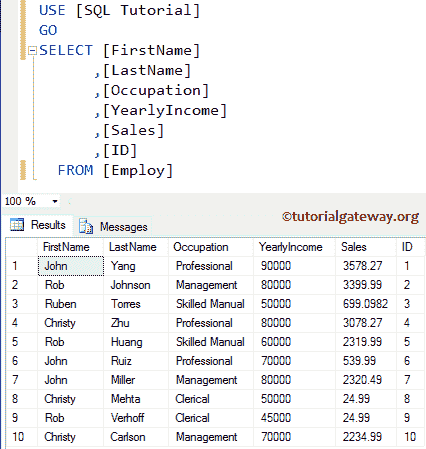

# 连接 Python 和 SQLServer

> 原文：<https://www.tutorialgateway.org/connect-python-and-sql-server/>

互联网上有许多库可以用来在 SQL Server 和 Python 之间建立连接。在本节中，我们将通过一个例子讨论如何使用 pyodbc 库连接 Python 和 SQL Server。

## 连接 Python 和 SQLServer的语法

使用 pyodbc 在 Python 和 SQL Server 之间建立连接的语法如下所示

```
pyodbc.connect("Driver = {SQL Server Native Client 11.0};"               
               "Server = Server_Name;"
               "Database = Database_Name;"
               "username = User_Name;"
               "password = User_Password;"
               "Trusted_Connection = yes;")
```

*   驱动程序:在这里，您必须指定 ODBC 连接或本机客户端。
*   服务器:您必须指定服务器实例名称。
*   数据库名称:您必须指定要从中提取数据的数据库名称。
*   用户名:请指定有权访问数据库的用户名。如果您使用的是 Windows 身份验证，则可以省略用户名和密码。
*   密码:请指定上述用户名的密码。

在我们进入 python 连接到 sql server 示例之前，让我向您展示我们将要提取的数据。



从上面的截图中，您可以看到我们正在选择“雇佣”表中的所有记录。我们在这个 python 连接到 sql server 示例中使用的 [`SELECT`语句](https://www.tutorialgateway.org/sql-select-statement/)如下所示:

```
SELECT [FirstName]
      ,[LastName]
      ,[Occupation]
      ,[YearlyIncome]
      ,[Sales]
      ,[ID]
  FROM [Employ]
```

## 连接 Python 和 SQLServer示例

在这个例子中，我们通过一个实际的例子向您展示了如何使用 pyodbc 库在 Python 和 SQL Server 之间建立连接。

```
import pyodbc
conn = pyodbc.connect("Driver={SQL Server Native Client 11.0};"
                      "Server=SURESH;"
                      "Database=SQL Tutorial;"
                      "Trusted_Connection=yes;")

cursor = conn.cursor()
cursor.execute('SELECT * FROM Employ')

for row in cursor:
    print('row = %r' % (row,))

```


在这个 python 连接到 SQL server 程序中，首先，我们要导入 pyodbc 库。它拥有建立连接所需的所有功能。

如果没有 [Python](https://www.tutorialgateway.org/python-tutorial/) 库，那么以管理员身份打开命令提示符，然后导航到 Python 脚本(可选)，键入 pip install pyodbc。

```
import pyodbc
```

接下来，我们使用连接函数将 Python 连接到 SQL Servers。这里，我们使用的是 windows 身份验证，这就是为什么我们没有指定用户名和密码。但是，在实时情况下，您必须指定用户名和密码来连接到数据库。

```
conn = pyodbc.connect("Driver={SQL Server Native Client 11.0};"
                      "Server=SURESH;"
                      "Database=SQL Tutorial;"
                      "Trusted_Connection=yes;")
```

接下来，我们将从 [SQL Server](https://www.tutorialgateway.org/sql/) 中的雇佣表导入数据。

```
cursor = conn.cursor()
cursor.execute('SELECT * FROM Employ')
```

最后，我们使用 [`for`循环](https://www.tutorialgateway.org/python-for-loop/)来迭代 Employ 表中的每一行，然后打印输出。

```
for row in cursor:
    print('row = %r' % (row,))
```