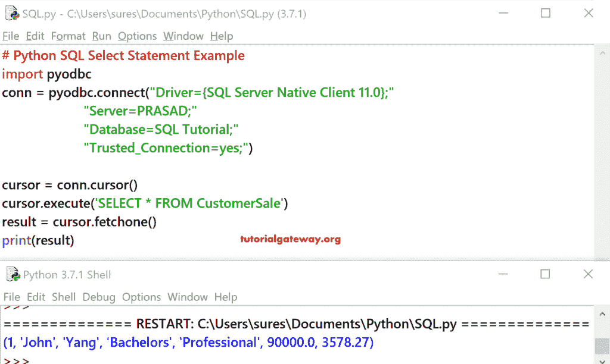

# Python SQL 选择语句

> 原文：<https://www.tutorialgateway.org/python-sql-select-statement/>

在本节中，我们将向您解释如何用 Python 编程语言编写 SQL Select 语句。以及如何从 SQL Server 表中提取或选择记录。

在我们进入 Python SQL Select 语句示例之前，让我向您展示我们将要使用的数据。


## Python SQL Select 语句示例 1

在这个例子中，我们展示了如何使用 [select 语句](https://www.tutorialgateway.org/sql-select-statement/)从 [SQL 表](https://www.tutorialgateway.org/sql-create-table/)中选择记录。

提示:请参考[将 Python 连接到 SQL Server](https://www.tutorialgateway.org/connect-python-and-sql-server/) 文章，了解在 [Python](https://www.tutorialgateway.org/python-tutorial/) 中建立连接所涉及的步骤。

```
# Python SQL Select Statement Example
import pyodbc
conn = pyodbc.connect("Driver={SQL Server Native Client 11.0};"
                      "Server=PRASAD;"
                      "Database=SQL Tutorial;"
                      "Trusted_Connection=yes;")

cursor = conn.cursor()
cursor.execute('SELECT * FROM CustomerSale')

for row in cursor:
    print('row = %r' % (row,))

```


首先，我们从 SQL 教程数据库中的客户销售表中导入或选择数据。

```
cursor = cursor.execute('SELECT * FROM CustomerSale')
```

接下来，我们使用 [`for`循环](https://www.tutorialgateway.org/python-for-loop/)来迭代客户销售表中的每一行。在`for`循环中，我们使用 print 语句来打印行。

```
for row in cursor:
    print('row = %r' % (row,))
```

## Python SQL Select 语句示例 2

您可以选择所需的列，而不是选择所有不必要的列(使用*)。

这个 Python 示例从“客户销售额”表中选择“员工 Id”、“职业”、“年收入”和“销售额”列。

```
# Python SQL Select Statement Example
import pyodbc
conn = pyodbc.connect("Driver={SQL Server Native Client 11.0};"
                      "Server=PRASAD;"
                      "Database=SQL Tutorial;"
                      "Trusted_Connection=yes;")

cursor = conn.cursor()
cursor.execute('SELECT EmpID, Occupation, YearlyIncome, Sales FROM CustomerSale')

for row in cursor:
    print('row = %r' % (row,))

```


## 在 Python 示例 3 中选择数据库记录

在 Python 中，光标有很多功能。您可以使用这些 Python 游标函数来更改 select 语句提供的结果。


例如，Python `fetchone()`函数只从[表](https://www.tutorialgateway.org/sql-create-table/)中获取一行或一条记录

```
# Python SQL Select Statement Example
import pyodbc
conn = pyodbc.connect("Driver={SQL Server Native Client 11.0};"
                      "Server=PRASAD;"
                      "Database=SQL Tutorial;"
                      "Trusted_Connection=yes;")

cursor = conn.cursor()
cursor.execute('SELECT * FROM CustomerSale')
result = cursor.fetchone()
print(result)
```

